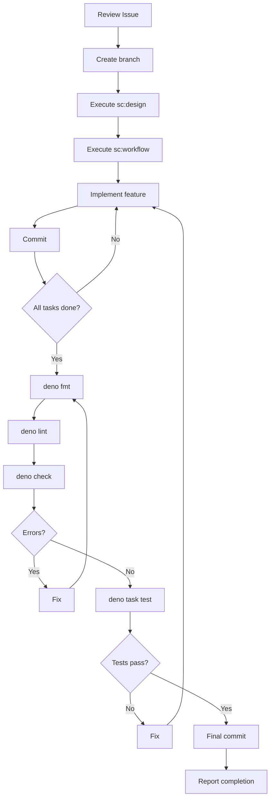

# Claude Command: Implement

Implementation command for Deno CLI projects. Handles design, implementation, static analysis, and testing.

## Usage

```
/implement <issue_number>
```

Example:

```
/implement 1
```

## What This Command Does

### Phase 1: Preparation

1. **Review Issue** - Use `gh issue view` to understand Issue content
2. **Create branch** - Create branch following naming convention
3. **Understand codebase** - Grasp the structure of related code

### Phase 2: Design

4. **Execute sc:design** - Determine architecture and design:
   - Module structure
   - Interface design
   - Type definitions
   - Deno permission design
5. **Execute sc:workflow** - Generate implementation steps:
   - Organize task dependencies
   - Determine implementation order
   - Test strategy

### Phase 3: Implementation

6. **Implement features** - Implement based on design:
   - Follow TypeScript best practices
   - Utilize Deno standard library
   - Proper error handling
7. **Progressive commits** - Commit per task

### Phase 4: Quality Assurance

8. **Run static analysis**:
   - `deno fmt` - Code formatting
   - `deno lint` - Run linter
   - `deno check` - Type checking
9. **Run tests**:
   - `deno task test:unit` - Unit tests
   - `deno task test:integration` - Integration tests (as needed)
10. **Final commit** - Commit fixes
11. **Report results** - Present branch name and Issue number

## Branch Naming Convention

```
{label}/{assignee}/#{issue_number}/{title}
```

- `{label}`: Issue label (feature, bugfix, refactor, docs)
- `{assignee}`: GitHub username
- `{issue_number}`: Issue number (with # prefix)
- `{title}`: kebab-case title

Examples:

- `feature/alice/#123/add-config-loader`
- `bugfix/bob/#456/fix-argument-parsing`

## Leveraging sc:design

Use `/sc:design` to design the following:

```
Module Structure:
  src/
  ├── commands/        # CLI commands
  ├── lib/             # Core logic
  ├── types/           # Type definitions
  └── utils/           # Utilities

Interface Design:
  - Public API design
  - Type definitions (interfaces, types)
  - Error type design

Deno Considerations:
  - Required permission flags
  - Import map updates
  - Standard library selection
```

## Leveraging sc:workflow

Use `/sc:workflow` to generate implementation steps:

```
Implementation Steps:
1. Create type definitions
2. Implement core logic
3. Integrate CLI command
4. Create unit tests
5. Create integration tests
6. Update documentation
```

## Deno Static Analysis Commands

| Command              | Description                     |
| -------------------- | ------------------------------- |
| `deno fmt`           | Code formatting                 |
| `deno fmt --check`   | Format check (no modifications) |
| `deno lint`          | Run linter                      |
| `deno check **/*.ts` | Type checking                   |

## Deno Test Commands

| Command                      | Description            |
| ---------------------------- | ---------------------- |
| `deno task test`             | Run all tests          |
| `deno task test:unit`        | Unit tests only        |
| `deno task test:integration` | Integration tests only |
| `deno task test:coverage`    | Tests with coverage    |

## Commit Strategy

Conventional commit format:

```
feat: add config file loader
fix: resolve CLI argument parsing error
refactor: extract validation logic
test: add unit tests for config module
docs: update CLI usage documentation
```

## Implementation Workflow



## Error Handling

- **Static analysis errors**: Attempt auto-fix, commit fixes
- **Test failures**: Analyze cause, fix implementation
- **Blockers**: Report to user, request guidance

## Output Format

```
Implementation Complete

Branch: feature/username/#123/add-config-loader
Issue: #123

Quality Checks:
- deno fmt: Passed
- deno lint: Passed
- deno check: Passed

Tests:
- Unit tests: 15/15 passed
- Integration tests: 3/3 passed

Commits:
- feat: add Config type definitions
- feat: implement config loader
- test: add config loader tests

Ready for /pr
```

## Best Practices

- **Design First**: Solidify design with sc:design before implementation
- **Incremental Implementation**: Implement and commit in small units
- **Type Safety**: Maximize use of TypeScript's type system
- **Test Coverage**: Always add tests for new features
- **Deno Idioms**: Follow Deno's recommended patterns

## Integration

- **Prerequisite**: Issue created with `/issue`
- **Next step**: Create Pull Request with `/pr`

ARGUMENTS:
$ARGUMENTS
