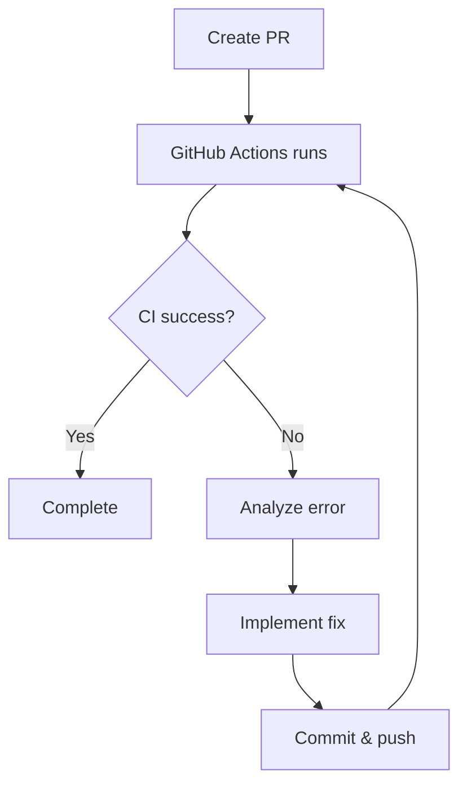

# Claude Command: PR (Pull Request)

Pull Request creation command for Deno CLI projects. Handles code analysis, improvements, PR creation, and CI pass verification.

## Usage

```
/pr
```

Or specify a target branch:

```
/pr main
```

## What This Command Does

### Phase 1: Code Analysis and Improvement

1. **Execute sc:analyze** - Comprehensive code analysis:
   - Code quality
   - Security
   - Performance
   - Architecture
2. **Execute sc:improve** - Fix discovered issues:
   - Code quality improvements
   - Pattern standardization
   - Remove redundant code
3. **Commit improvements** - Commit improvement changes

### Phase 2: Quality Checks

4. **Deno static analysis**:
   - `deno fmt --check` - Format check
   - `deno lint` - Linter
   - `deno check` - Type check
5. **Run tests**:
   - `deno task test` - All tests

### Phase 3: Pull Request Creation

6. **Collect change history** - Analyze commit history and diff
7. **Push to remote** - `git push -u origin <branch>`
8. **Create PR** - Create PR with `gh pr create`

### Phase 4: CI Monitoring and Fix Loop

9. **Monitor GitHub Actions** - Check CI status
10. **Fix loop on CI failure**:
    - Analyze error content
    - Implement fix
    - Commit & push
    - Re-check CI
11. **Report completion** - Present PR URL

## Leveraging sc:analyze

Use `/sc:analyze` for analysis from these perspectives:

```
Analysis Domains:
- Quality: Code readability, maintainability, DRY principle
- Security: Input validation, permission checks
- Performance: Inefficient patterns, memory leaks
- Architecture: Module design, dependencies
```

## Leveraging sc:improve

Use `/sc:improve` to implement these improvements:

```
Improvements:
- Dead code removal
- Code deduplication
- Pattern consistency
- Type safety enhancements
- Error handling improvements
```

## CI Fix Loop



### CI Error Types and Responses

| Error                      | Response                        |
| -------------------------- | ------------------------------- |
| `deno fmt --check` failure | Auto-fix with `deno fmt`        |
| `deno lint` failure        | Manually fix lint errors        |
| `deno check` failure       | Fix type errors                 |
| Unit test failure          | Fix test or implementation      |
| Integration test failure   | Resolve integration test issues |

## Pull Request Format

**Title** (English, Conventional Commit format):

```
{type}: {description}
```

Examples:

- `feat: add configuration file support`
- `fix: resolve CLI argument parsing error`
- `refactor: improve error handling in config module`

**Body**:

```markdown
## Summary

Brief description of changes (1-3 lines)

## Changes

### New Features

- List of new features

### Bug Fixes

- List of fixes

### Improvements

- List of improvements (including sc:improve changes)

## Code Analysis Results

Summary of sc:analyze results:

- Quality: Passed/Warning
- Security: Passed/Warning
- Performance: Passed/Warning

## Testing

- [x] Unit tests pass
- [x] Integration tests pass
- [x] deno fmt --check pass
- [x] deno lint pass
- [x] deno check pass

## Related Issue

Closes #XXX
```

## GitHub Actions Workflow

This project's CI (`deno-ci.yml`) runs the following:

1. **Lint & Type Check**:
   - `deno fmt --check`
   - `deno lint`
   - `deno check **/*.ts`

2. **Unit Tests**:
   - `deno test --allow-read --allow-write tests/unit/`

3. **Integration Tests** (push only):
   - `deno test --allow-read --allow-write tests/integration/`

## Error Handling

- **CI timeout**: Show warning if status unknown after 5 minutes
- **Fix loop limit**: Report to user if still failing after 3 fix attempts
- **Merge conflict**: Notify user and provide resolution instructions

## Output Format

### On Success

```
Pull Request Created

PR: #XX - feat: add configuration file support
URL: https://github.com/owner/repo/pull/XX

Branches:
- Source: feature/username/#123/add-config-loader
- Target: develop

Code Analysis (sc:analyze):
- Quality: No issues
- Security: No issues
- Performance: No issues

Improvements Applied (sc:improve):
- Removed 2 unused imports
- Standardized error handling pattern

CI Status: All checks passed

Related Issue: #123 (will be closed on merge)

Change Summary:
- 5 files changed
- 150 lines added
- 20 lines deleted

Ready for review.
```

### After CI Fix

```
Pull Request Updated

CI Fix Applied:
- Fixed: deno lint error in src/config.ts
- Commit: fix: resolve lint error in config module

CI Status: All checks passed (after 1 fix iteration)
```

## Best Practices

- **Analyze Before PR**: Discover issues early with sc:analyze
- **Improve Proactively**: Enhance quality with sc:improve
- **CI First**: Run same checks as CI locally beforehand
- **Clear Description**: PR description easy for reviewers to understand
- **Issue Linking**: Always link related Issues

## Integration

- **Prerequisite**: Implementation completed with `/implement <issue_number>`
- **CI Workflow**: Integrates with `.github/workflows/deno-ci.yml`

ARGUMENTS:
$ARGUMENTS
