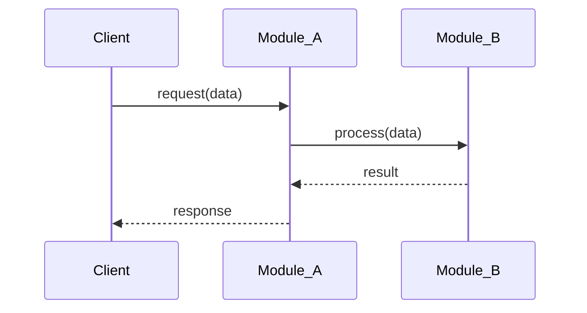
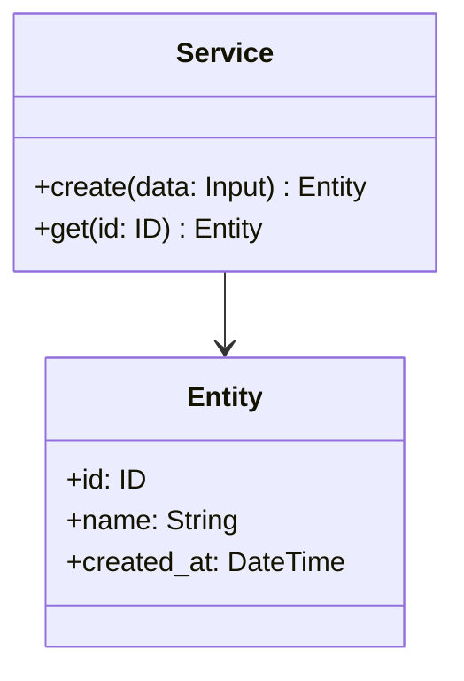
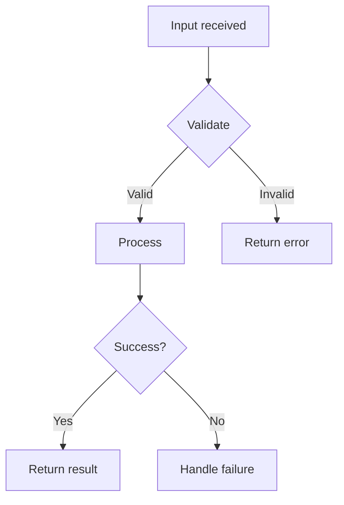

# Skill: Design

Design skill for projects. Handles issue review, branch creation, architecture design, workflow planning, and UML diagram generation.

This skill is the Claude Code projection of `.tarnished/workflows/design.md`. Keep the shared workflow source and this tool-specific entrypoint aligned.

Design artifacts are split across two layers:

- **`docs/design/shared/`** — Cumulative project-wide truth, regenerated as a snapshot on every `/design` invocation. Read by both `/design` and `/implement` to ground new work in the current state.
- **`docs/design/#{issue_number}/`** — Self-contained per-issue delta, frozen after the issue closes. Useful for auditing what a specific issue changed.

This split keeps the read cost of `/design` and `/implement` constant with respect to the number of completed issues, instead of growing linearly.

## Usage

```
/design <issue_number>
```

Example:

```
/design 42
```

## erd Command Invocation

All erd commands in this skill MUST be loaded via the **Read tool** and followed inline:

```
Read(".claude/commands/erd/<command>.md") → follow instructions inline
```

Do NOT use the Skill tool to invoke erd commands. Loading via Read keeps the entire workflow in a single turn, preventing flow interruption between phases.

## What This Skill Does

### Phase 1: Preparation

1. **Review Issue** - Use `gh issue view` to understand Issue content and requirements
2. **Create branch** - Follow `_shared/branch` procedure (Issue mode) with the issue number
   - This handles branch naming, existing branch detection, and checkout/creation
   - See `_shared/branch/SKILL.md` for full procedure
3. **Create per-issue docs directory** - Create `docs/design/#{issue_number}/` directory structure

### Phase 1.5: Migration check (one-shot bootstrap)

4. **Check for missing shared layer** - If `docs/design/shared/` does not exist (or is empty) AND any `docs/design/#{old_issue}/` (or legacy `docs/design/{old_issue}/` without the `#` prefix) directories exist with `design.md` files, follow the procedure in `_shared/design-migration/SKILL.md` to bootstrap the shared layer from existing per-issue artifacts.
   - See `_shared/design-migration/SKILL.md` for full procedure.
   - The migration is idempotent — it may be re-run safely.
   - Existing per-issue files MUST NOT be modified.
   - If no prior `#{old_issue}/` directories exist either, skip the migration. The shared layer will be created lazily during Phase 6 of this issue.

### Phase 2: Load shared layer

5. **Read `docs/design/shared/*` into context** - Read all of the following (skip any that do not yet exist):
   - `docs/design/shared/architecture.md` — Project-wide module structure, layer boundaries, tech choices
   - `docs/design/shared/data-model.md` — Domain entities, type definitions, schemas
   - `docs/design/shared/api-spec.md` — Public API / interface specifications
   - `docs/design/shared/class.md` — Cumulative class diagram (Mermaid)
   - `docs/design/shared/sequence.md` — Cumulative sequence/state diagram (Mermaid)
   - `docs/design/shared/research/*.md` — Cross-cutting external library research (if any)
6. **Load `/erd:index-repo` and follow inline** (optional but recommended) - `Read(".claude/commands/erd/index-repo.md")`:
   - Use this to verify the shared layer matches the actual codebase before designing
   - Skip if the issue scope is small and well-understood

### Phase 3: Research (if needed)

7. **Load `/erd:research` and follow inline** (conditional) - `Read(".claude/commands/erd/research.md")`:
   - When the issue involves unfamiliar libraries or third-party integrations
   - When architectural decisions require understanding of external documentation
   - Skip if the issue scope is well-understood and internal-only
8. **Decide research destination**:
   - **Issue-specific** (the library is only relevant to this issue) → save to `docs/design/#{issue_number}/research.md`
   - **Cross-cutting** (the library is or will be used by multiple issues) → save to `docs/design/shared/research/<library-name>.md`
   - When in doubt, save to the issue-specific location. It can be promoted to shared later.

### Phase 4: Architecture Design

9. **Load `/erd:design` and follow inline** - `Read(".claude/commands/erd/design.md")`:
   - Module structure and organization
   - Interface/API design
   - Type definitions and data models
   - Error handling strategy
10. **Author per-issue design** - **Save to `docs/design/#{issue_number}/design.md`**:
    - Include a self-contained `## Context` section near the top, summarizing the slice of `shared/architecture.md` and `shared/data-model.md` that this issue acts on. Intentional duplication for standalone readability.
    - Describe the **delta** the issue introduces: new modules, changed interfaces, new types, new flows.
    - Reference shared docs by relative path where appropriate (e.g., `../shared/api-spec.md`).
11. **Generate API/Interface Specification** (if applicable):
    - Endpoint or function signatures introduced or changed by this issue
    - Input/output schemas with types and constraints
    - Error response definitions
    - **Save to `docs/design/#{issue_number}/api-spec.md`**

### Phase 5: Workflow Planning

12. **Load `/erd:workflow` and follow inline** - `Read(".claude/commands/erd/workflow.md")`:
    - Organize task dependencies
    - Determine implementation order
    - Test strategy
    - **Save to `docs/design/#{issue_number}/workflow.md`**

### Phase 6: UML Diagram Generation

13. **Auto-detect required diagrams** - Analyze issue complexity to determine which UML diagrams are needed (see "UML Auto-Detection Logic" below).
14. **Generate Mermaid UML diagrams** with proper destination per type:
    - **Sequence diagram** — If the issue introduces or changes a system-wide flow, **update `docs/design/shared/sequence.md`** in snapshot mode (Phase 7 will re-write it). If the flow is purely internal to a single issue's logic, save to `docs/design/#{issue_number}/sequence.md` (rare; usually shared).
    - **Class diagram** — Class additions/changes always belong to the cumulative `docs/design/shared/class.md` (Phase 7 will re-write it).
    - **Flowchart** — Issue-local control flow / decision tree → save to `docs/design/#{issue_number}/flowchart.md`. System-wide state machines belong in `shared/sequence.md` instead.

### Phase 7: Snapshot regeneration of shared layer

15. **Regenerate `docs/design/shared/*` as a complete snapshot** - For each shared file affected by this issue's design, **overwrite** the file with the merged latest state (existing shared content + this issue's contributions):
    - `docs/design/shared/architecture.md`
    - `docs/design/shared/data-model.md`
    - `docs/design/shared/api-spec.md`
    - `docs/design/shared/class.md`
    - `docs/design/shared/sequence.md`
16. **CRITICAL — Snapshot discipline (NFR-1)**:
    - DO **overwrite** each shared file with the fully merged latest content.
    - DO **remove** entries that no longer reflect the current truth (git history retains prior state).
    - DO **NOT** append a `## Issue #N — changes` section. Append-style updates re-introduce the bloat this skill is designed to avoid.
    - DO **NOT** keep stale entries from prior snapshots when they are no longer accurate.

### Phase 8: Commit and Report

17. **Stage design artifacts** — Use explicit paths to avoid pulling in unrelated untracked files (e.g. `.vscode/`, local scratchpads, MCP scratch directories):
    ```bash
    git add docs/design/shared/<files-modified-in-phase-7> \
            docs/design/#{issue_number}/
    ```
    Stage only the `shared/*` files that Phase 7 actually wrote (e.g. omit `class.md` when there were no class-diagram changes), plus the entire per-issue directory. Include `docs/design/shared/research/<lib>.md` if Phase 3 produced cross-cutting research. Avoid `git add -A` and `git add .` — they sweep up unrelated untracked content.

18. **Create commit** — Single commit covering both layers. Use the structure documented in "Commit Strategy" below: `docs:` subject, two-bullet body summarizing each layer's changes, and `Refs #{issue_number}` footer.

19. **Verify post-commit state** — Confirm the commit landed on the expected branch and the design-artifact working tree is clean:
    ```bash
    git log --oneline -1        # confirm subject + commit hash
    git status --short          # only unrelated untracked files (if any) should remain
    git branch --show-current   # confirm we are still on the feature branch
    ```
    If `git status` still shows tracked files modified under `docs/design/`, Phase 7 did not write the snapshot or staging missed a file — investigate before reporting completion.

20. **Report results** - Present branch name, commit hash, files written (per layer), and summary using the "Output Format" template below.

## Branch Naming Convention

```
{label}/{assignee}/#{issue_number}/{title}
```

- `{label}`: Issue label (feature, bugfix, refactor, docs)
- `{assignee}`: GitHub username
- `{issue_number}`: Issue number (with # prefix)
- `{title}`: kebab-case title

Examples:

- `feature/alice/#123/add-config-loader`
- `bugfix/bob/#456/fix-argument-parsing`

**Important**: This branch is shared with `/implement`. The `/implement` command will detect and reuse this branch.

## MCP Tools

Use the following MCP tools for efficient codebase analysis and library research:

- **serena**: `find_symbol`, `get_symbols_overview`, `find_file`, `search_for_pattern`, `list_dir` — for understanding existing architecture, finding related symbols, and navigating the codebase
- **context7**: `resolve-library-id`, `get-library-docs` — for researching external libraries and frameworks referenced in the issue, and for design involving external dependencies

## erd Skills Used

| Skill | Purpose | Output |
| --- | --- | --- |
| `/erd:index-repo` | (optional) Ground shared layer against actual codebase | (none — context only) |
| `/erd:research` | Research external libraries, APIs, patterns (conditional) | `docs/design/#{issue_number}/research.md` or `docs/design/shared/research/<library>.md` |
| `/erd:design` | Architecture and interface design | `docs/design/#{issue_number}/design.md` (delta) + updates to `docs/design/shared/*` (Phase 7) |
| `/erd:workflow` | Implementation step generation | `docs/design/#{issue_number}/workflow.md` |

## Leveraging erd:research

Use `/erd:research` when the issue involves external dependencies:

- Library documentation and best practices
- API integration patterns
- Security considerations for third-party services
- Performance characteristics of candidate solutions

**Decision rule**: If the issue references external libraries, APIs, or patterns that are not already established in the codebase, execute erd:research. Otherwise, skip.

**Destination rule**: If the research is reusable across issues, save to `docs/design/shared/research/<library-name>.md`. Otherwise, save to `docs/design/#{issue_number}/research.md`.

## Leveraging erd:design

Use `/erd:design` to design the issue. Two output destinations:

### Per-issue file: `docs/design/#{issue_number}/design.md`

```markdown
# Design: #{issue_number} {title}

## Context

<Self-contained summary of the slice of shared/architecture.md and shared/data-model.md that this delta acts on. Intentional duplication for standalone readability.>

## Architecture Overview (delta)

<What this issue changes, in 1-3 paragraphs.>

## Module Structure (delta)

<Only the changed/added directories and files.>

## Interface Design (delta)

### Public API / Functions

| Name | Signature | Description |
| --- | --- | --- |
| function_name | (args) -> ReturnType | Description |

### Type Definitions (delta)

- New types, structs, interfaces, enums
- Validation rules and constraints

## Data Flow

<How this issue's logic moves data, with reference to shared sequence diagrams if relevant.>

## Error Handling

<Issue-specific errors; cross-link to shared error policy.>

## Implementation Notes

- Key decisions and rationale
- Edge cases to handle
- Performance considerations
```

### Shared files: `docs/design/shared/*`

Phase 7 regenerates the affected shared files as snapshots. See "Phase 7: Snapshot regeneration" above for the destination schemas. The shared file templates are documented in `_shared/design-migration/SKILL.md`.

## API/Interface Specification Template

Generate the following and **save to `docs/design/#{issue_number}/api-spec.md`** (if the issue involves API or interface changes):

```markdown
# API Specification: #{issue_number} {title}

## Endpoints / Functions (delta)

| Name | Method/Signature | Description |
| --- | --- | --- |
| endpoint_or_func | GET /path or fn(args) | Description |

## Input/Output Schemas

### Input
| Field | Type | Required | Description |
| --- | --- | --- | --- |

### Output
| Field | Type | Description |
| --- | --- | --- |

## Error Handling

| Error | Code/Type | Description |
| --- | --- | --- |
```

The cumulative project-wide API spec lives in `docs/design/shared/api-spec.md` and is regenerated in Phase 7.

## Leveraging erd:workflow

Use `/erd:workflow` to generate implementation steps and **save to `docs/design/#{issue_number}/workflow.md`**:

```markdown
# Workflow: #{issue_number} {title}

## Implementation Steps

1. Define types and data models
2. Implement core logic
3. Integrate with existing modules
4. Create unit tests
5. Create integration tests
6. Run quality checks

## Task Dependencies

- Step 2 depends on Step 1
- Step 4-5 depend on Step 2-3

## Test Strategy

- Unit tests: what to test
- Integration tests: what to test
- Edge cases to cover
```

## UML Auto-Detection Logic

Analyze the issue content and determine which diagrams are needed:

| Diagram | Destination | When to Generate |
| --- | --- | --- |
| **Sequence** | `docs/design/shared/sequence.md` (snapshot) | Multi-component interactions, system-wide flows, request/response, state transitions |
| **Class** | `docs/design/shared/class.md` (snapshot) | New types, data models, entity relationships |
| **Flowchart** | `docs/design/#{issue_number}/flowchart.md` | Issue-local branching logic, decision trees, complex algorithms |

**Rules**:
- Always generate at least one diagram
- For XS/S issues: typically 1 diagram (most relevant)
- For M issues: typically 1-2 diagrams
- For L/XL issues: typically 2-3 diagrams

## Mermaid Diagram Format

All UML diagrams use Mermaid format for GitHub native rendering.

### Sequence Diagram (in `shared/sequence.md`)

````markdown
# Sequence Diagram (System-wide)

## <Flow Name>


````

Each named flow is a top-level `##` section. State-machine-like flows belong here too.

### Class Diagram (in `shared/class.md`)

````markdown
# Class Diagram (Project-wide)


````

### Flowchart (in `#{issue_number}/flowchart.md`)

````markdown
# Flowchart: #{issue_number} {title}


````

## docs/ Directory Structure

```
docs/design/
├── shared/                          # Cumulative project truth (snapshot, NFR-1)
│   ├── architecture.md              # Project-wide module structure
│   ├── data-model.md                # Project-wide types/entities/schemas
│   ├── api-spec.md                  # Project-wide API spec
│   ├── class.md                     # Cumulative class diagram (Mermaid)
│   ├── sequence.md                  # Cumulative sequence/state diagrams (Mermaid)
│   └── research/
│       └── <library-name>.md        # Cross-cutting research (per library, not per issue)
└── #{issue_number}/                 # Per-issue delta (frozen on close)
    ├── design.md                    # Self-contained delta description (option b)
    ├── api-spec.md                  # API delta (if applicable)
    ├── workflow.md                  # Implementation steps and plan
    ├── flowchart.md                 # Issue-local control flow (if applicable)
    └── research.md                  # Issue-specific external research (if applicable)
```

## Design Workflow

```mermaid
graph TD
    A[Review Issue] --> B0{Existing branch for issue?}
    B0 -->|Yes| B1[Checkout or merge existing branch]
    B0 -->|No| B[Create new branch]
    B1 --> C[Create #{issue}/ directory]
    B --> C
    C --> M{shared/ missing AND<br/>prior #{issue}/ exist?}
    M -->|Yes| M1[Run _shared/design-migration<br/>to bootstrap shared/]
    M1 --> P2
    M -->|No| P2[Read shared/* into context]
    P2 --> D{External dependencies?}
    D -->|Yes| D1[Run erd:research]
    D1 --> D2{Reusable across issues?}
    D2 -->|Yes| D3[Save shared/research/<lib>.md]
    D2 -->|No| D4[Save #{issue}/research.md]
    D3 --> E
    D4 --> E
    D -->|No| E[Run erd:design]
    E --> E2[Save #{issue}/design.md - self-contained delta]
    E2 --> E3{API/interface changes?}
    E3 -->|Yes| E4[Save #{issue}/api-spec.md]
    E3 -->|No| F
    E4 --> F[Run erd:workflow]
    F --> F2[Save #{issue}/workflow.md]
    F2 --> G[Auto-detect UML types]
    G --> G2[Generate diagrams<br/>class -> shared/class.md<br/>sequence -> shared/sequence.md<br/>flowchart -> #{issue}/flowchart.md]
    G2 --> S[Phase 7: Regenerate shared/* snapshots<br/>NFR-1: overwrite, never append]
    S --> K[Single commit: shared/* + #{issue}/*]
    K --> L[Report completion]
```

## Commit Strategy

Single commit covers both `docs/design/shared/*` (snapshot regeneration) and `docs/design/#{issue_number}/*` (new delta). Atomicity is intentional — the snapshot regeneration must never land without its triggering delta.

**Message structure**:

```
docs: add design documents for #{issue_number}

- Per-issue delta (docs/design/#{issue_number}/): <one bullet per file authored,
  naming the files and what they describe>
- Shared snapshot (docs/design/shared/): <one bullet per shared file updated and
  what was added/changed; explicitly note files left unchanged if relevant>

Refs #{issue_number}
```

- **Subject** MUST be `docs: add design documents for #{issue_number}` so downstream automation (PR linkage, changelog) can recognize it.
- **Body** MUST contain both the "Per-issue delta" and "Shared snapshot" summary lines so reviewers can audit the snapshot regeneration without diffing every shared file.
- **Footer** MUST be `Refs #{issue_number}` — NOT `Closes #{issue_number}`. `/design` only writes documentation; the issue is closed when the PR created by `/pr` merges (via `Closes #XXX` in the PR body).

## Output Format

```
Design Complete

Branch: refactor/username/#257/separate-shared-and-issue-specific-design
Issue: #257

Per-issue artifacts:
  docs/design/#257/design.md       — Self-contained delta description
  docs/design/#257/api-spec.md     — API/interface delta (if applicable)
  docs/design/#257/workflow.md     — Implementation steps
  docs/design/#257/flowchart.md    — Issue-local control flow (if applicable)
  docs/design/#257/research.md     — Issue-specific research (if applicable)

Shared layer (snapshot):
  docs/design/shared/architecture.md     — Updated
  docs/design/shared/data-model.md       — Updated
  docs/design/shared/api-spec.md         — Updated
  docs/design/shared/class.md            — Updated
  docs/design/shared/sequence.md         — Updated
  docs/design/shared/research/<lib>.md   — Updated (if applicable)

Summary:
- Migration: <ran/skipped>
- Shared layer read at start (Phase 2): N files
- Shared layer regenerated at end (Phase 7): M files
- Per-issue artifacts: K files
- UML diagrams: <list>

Ready for /implement 257
```

## Best Practices

- **Issue Understanding**: Thoroughly read and understand the issue before designing
- **Read Shared First**: Always read `docs/design/shared/*` before designing — this grounds the new work in current truth and prevents reinventing existing structure
- **Self-contained `#{issue}/design.md`**: Each issue's `design.md` should be readable on its own (option b). Some duplication with `shared/*` is intentional.
- **Snapshot Discipline (NFR-1)**: Always overwrite `shared/*` files. Never append `## Issue #N` sections.
- **Research Promotion**: When research becomes reusable across issues, move it from `#{issue}/research.md` to `shared/research/<library>.md`.
- **UML Destination**: Class and system-wide sequence diagrams go to `shared/`. Issue-local flowcharts stay in `#{issue}/`.
- **Single Commit**: Both layers committed together to keep the snapshot atomic with the delta.
- **Branch Reuse**: The branch created here will be reused by `/implement`.

## Integration

- **Prerequisite**: Issue created with `/issue`
- **Next step**: Start implementation with `/implement <issue_number>`
- **Typical workflow**: `/issue` → **`/design`** → `/implement` → `/review` → `/pr`

ARGUMENTS:
$ARGUMENTS
