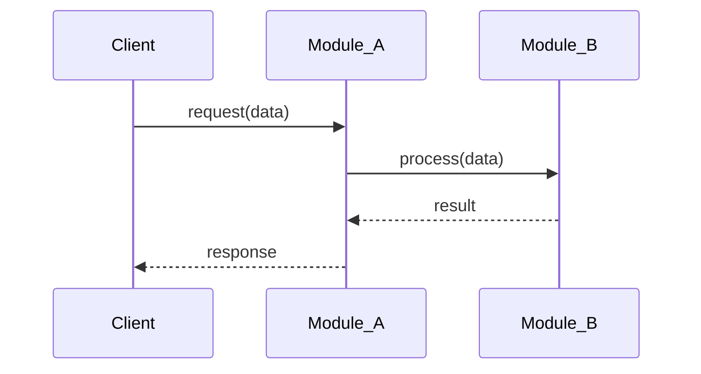
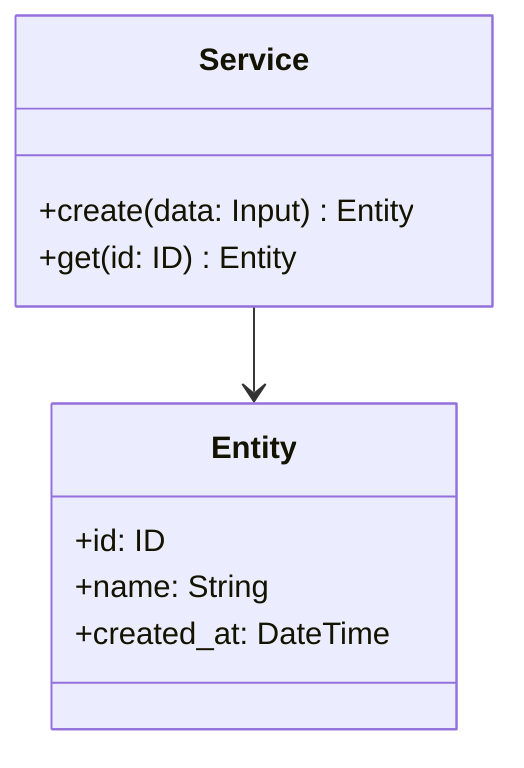
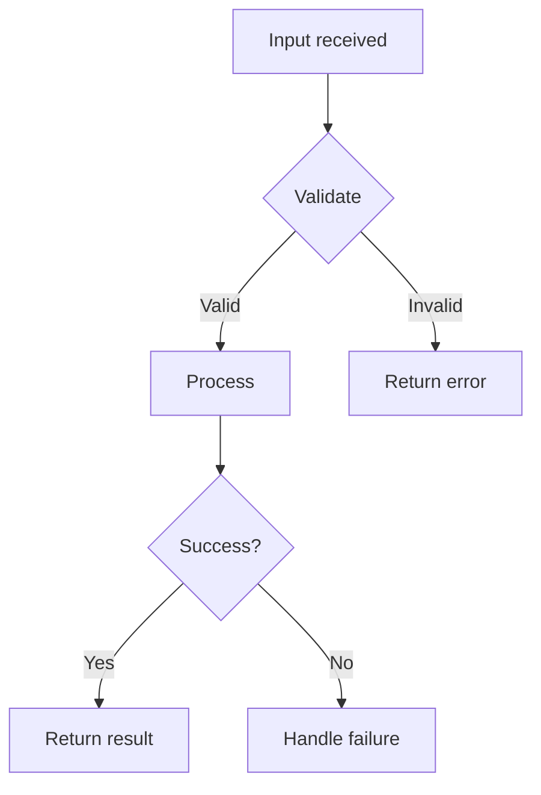

# Skill: Design

Design skill for projects. Handles issue review, branch creation, architecture design, workflow planning, and UML diagram generation.

This skill is the Claude Code projection of `.tarnished/workflows/design.md`. Keep the shared workflow source and this tool-specific entrypoint aligned.

Design artifacts are split across two layers:

- **`docs/design/shared/`** — Cumulative project-wide truth, regenerated as a snapshot on every `/design` invocation. Read by both `/design` and `/implement` to ground new work in the current state.
- **`docs/design/#{issue_number}/`** — Self-contained per-issue delta, frozen after the issue closes. Useful for auditing what a specific issue changed.

This split keeps the read cost of `/design` and `/implement` constant with respect to the number of completed issues, instead of growing linearly.

## Usage

```
/design <issue_number>              # branch from develop
/design <issue_number> --base main  # branch from main instead
```

`--base` defaults to `develop` and is passed through to `_shared/branch`, so branch creation uses the same base that later stages target.

## Roles

Read `.claude/skills/_shared/delegation/SKILL.md` for the role vocabulary and the routing table. Architecture and interface decisions are judgment and stay with the orchestrator; repository survey and indexing are mechanical and can be delegated.

## erd Command Invocation

Invoke each erd command by the first available route:

1. `Skill(erd:<command>)` — loads the instructions into the current turn
2. `Read(".claude/commands.local/erd/<command>.md")` — the project's overlay, when one exists
3. `Read(".claude/commands/erd/<command>.md")` — the base copy

Check for the overlay before falling back to the base copy: a project that customizes an erd command does so in `commands.local/`, and reading the base copy directly would silently ignore it.

## What This Skill Does

### Phase 1: Preparation

1. **Review Issue** - Use `gh issue view` to understand Issue content and requirements
2. **Create branch** - Follow `_shared/branch` procedure (Issue mode) with the issue number and the resolved `base`. Branch naming, existing-branch detection, and checkout rules are defined in `_shared/branch/SKILL.md`. The branch created here is shared with `/implement`.
3. **Create per-issue docs directory** - Create `docs/design/#{issue_number}/` directory structure

### Phase 1.5: Migration check (one-shot bootstrap)

4. **Check for missing shared layer** - If `docs/design/shared/` does not exist (or is empty) AND any `docs/design/#{old_issue}/` (or legacy `docs/design/{old_issue}/` without the `#` prefix) directories exist with `design.md` files, follow the procedure in `_shared/design-migration/SKILL.md` to bootstrap the shared layer from existing per-issue artifacts.
   - The migration is idempotent — it may be re-run safely.
   - Existing per-issue files MUST NOT be modified.
   - If no prior `#{old_issue}/` directories exist either, skip the migration. The shared layer will be created lazily during Phase 6 of this issue.

### Phase 2: Load shared layer

5. **Read `docs/design/shared/*` into context** - Read all of the following (skip any that do not yet exist):
   - `docs/design/shared/architecture.md` — Project-wide module structure, layer boundaries, tech choices
   - `docs/design/shared/data-model.md` — Domain entities, type definitions, schemas
   - `docs/design/shared/api-spec.md` — Public API / interface specifications
   - `docs/design/shared/class.md` — Cumulative class diagram (Mermaid)
   - `docs/design/shared/sequence.md` — Cumulative sequence/state diagram (Mermaid)
   - `docs/design/shared/research/*.md` — Cross-cutting external library research (if any)
6. **Load `/erd:index-repo`** (optional but recommended):
   - Use this to verify the shared layer matches the actual codebase before designing
   - Skip if the issue scope is small and well-understood

### Phase 3: Research (if needed)

7. **Load `/erd:research`** (conditional):
   - **Decision rule**: If the issue references external libraries, APIs, or patterns that are not already established in the codebase, execute erd:research. Otherwise, skip.
8. **Decide research destination**:
   - **Issue-specific** (the library is only relevant to this issue) → save to `docs/design/#{issue_number}/research.md`
   - **Cross-cutting** (the library is or will be used by multiple issues) → save to `docs/design/shared/research/<library-name>.md`
   - When in doubt, save to the issue-specific location. It can be promoted to shared later.

### Phase 4: Architecture Design

9. **Advisor consult** (conditional) - When the issue's estimated size is M or larger, launch the `advisor` subagent (`.claude/agents/advisor.md`) once with the architecture you intend to adopt, the alternatives you considered, and the constraints that bound the choice. Read its objections before authoring `design.md`; you still decide. Skip when the issue is smaller than M, when the advisor definition is absent, or when read-only subagents are unavailable — and note the skip in the report. The trigger is the size estimate, not a feeling of uncertainty; see `_shared/delegation/SKILL.md`.
10. **Load `/erd:design`**:
   - Module structure, interface/API design, type definitions, error handling strategy
11. **Author per-issue design** - **Save to `docs/design/#{issue_number}/design.md`** using the "Per-issue design.md template" below:
    - Include a self-contained `## Context` section near the top, summarizing the slice of `shared/architecture.md` and `shared/data-model.md` that this issue acts on. Intentional duplication for standalone readability.
    - Describe the **delta** the issue introduces: new modules, changed interfaces, new types, new flows.
    - Reference shared docs by relative path where appropriate (e.g., `../shared/api-spec.md`).
12. **Generate API/Interface Specification** (if applicable) - Endpoint or function signatures introduced or changed by this issue, input/output schemas, error definitions. **Save to `docs/design/#{issue_number}/api-spec.md`** using the "API/Interface Specification template" below.

### Phase 5: Workflow Planning

13. **Load `/erd:workflow`**:
    - Task dependencies, implementation order, test strategy
    - **Save the erd:workflow output to `docs/design/#{issue_number}/workflow.md`**, titled `# Workflow: #{issue_number} {title}`

### Phase 6: UML Diagram Generation

14. **Auto-detect required diagrams** - Analyze issue complexity to determine which UML diagrams are needed (see "UML Auto-Detection Logic" below).
15. **Generate Mermaid UML diagrams** with proper destination per type:
    - **Sequence diagram** — If the issue introduces or changes a system-wide flow, **update `docs/design/shared/sequence.md`** in snapshot mode (Phase 7 will re-write it). If the flow is purely internal to a single issue's logic, save to `docs/design/#{issue_number}/sequence.md` (rare; usually shared).
    - **Class diagram** — Class additions/changes always belong to the cumulative `docs/design/shared/class.md` (Phase 7 will re-write it).
    - **Flowchart** — Issue-local control flow / decision tree → save to `docs/design/#{issue_number}/flowchart.md`. System-wide state machines belong in `shared/sequence.md` instead.

### Phase 7: Snapshot regeneration of shared layer

16. **Regenerate `docs/design/shared/*` as a complete snapshot** - For each shared file affected by this issue's design, **overwrite** the file with the merged latest state (existing shared content + this issue's contributions):
    - `docs/design/shared/architecture.md`
    - `docs/design/shared/data-model.md`
    - `docs/design/shared/api-spec.md`
    - `docs/design/shared/class.md`
    - `docs/design/shared/sequence.md`
17. **Snapshot discipline (NFR-1)** — this one is irreversible in effect, because an append-style shared layer cannot be un-bloated later:
    - Overwrite each shared file with the fully merged latest content.
    - Remove entries that no longer reflect current truth; git history retains the prior state.
    - Never append a `## Issue #N — changes` section, and never carry forward stale entries.

### Phase 8: Commit and Report

18. **Stage design artifacts** — Use explicit paths to avoid pulling in unrelated untracked files (e.g. `.vscode/`, local scratchpads, MCP scratch directories):
    ```bash
    git add docs/design/shared/<files-modified-in-phase-7> \
            docs/design/#{issue_number}/
    ```
    Stage only the `shared/*` files that Phase 7 actually wrote (e.g. omit `class.md` when there were no class-diagram changes), plus the entire per-issue directory. Include `docs/design/shared/research/<lib>.md` if Phase 3 produced cross-cutting research. Avoid `git add -A` and `git add .` — they sweep up unrelated untracked content.

19. **Create commit** — Single commit covering both layers. Use the structure documented in "Commit Strategy" below: `docs:` subject, two-bullet body summarizing each layer's changes, and `Refs #{issue_number}` footer.

20. **Verify post-commit state** — Confirm the commit landed on the expected branch and the design-artifact working tree is clean:
    ```bash
    git log --oneline -1        # confirm subject + commit hash
    git status --short          # only unrelated untracked files (if any) should remain
    git branch --show-current   # confirm we are still on the feature branch
    ```
    If `git status` still shows tracked files modified under `docs/design/`, Phase 7 did not write the snapshot or staging missed a file — investigate before reporting completion.

21. **Report results** - See "Reporting" below.
22. **Sign-off gate** - Present the design for approval before implementation begins. `/implement` is a separate invocation; when running under `/flow`, this is the approval gate that must clear before the implement stage starts.

## MCP Tools

Use the following MCP tools for efficient codebase analysis and library research:

- **serena**: `find_symbol`, `get_symbols_overview`, `find_file`, `search_for_pattern`, `list_dir` — for understanding existing architecture, finding related symbols, and navigating the codebase
- **context7**: `resolve-library-id`, `get-library-docs` — for researching external libraries and frameworks referenced in the issue, and for design involving external dependencies

If a listed MCP server is unavailable in the current environment, fall back to the agent's built-in code search, file reading, and web search tools — do not stop or ask for installation.

## erd Commands Used

| Command | Purpose | Output |
| --- | --- | --- |
| `/erd:index-repo` | (optional) Ground shared layer against actual codebase | (none — context only) |
| `/erd:research` | Research external libraries, APIs, patterns (conditional) | `docs/design/#{issue_number}/research.md` or `docs/design/shared/research/<library>.md` |
| `/erd:design` | Architecture and interface design | `docs/design/#{issue_number}/design.md` (delta) + updates to `docs/design/shared/*` (Phase 7) |
| `/erd:workflow` | Implementation step generation | `docs/design/#{issue_number}/workflow.md` |

## Per-issue design.md template

Save to `docs/design/#{issue_number}/design.md`:

```markdown
# Design: #{issue_number} {title}

## Context

<Self-contained summary of the slice of shared/architecture.md and shared/data-model.md that this delta acts on. Intentional duplication for standalone readability.>

## Architecture Overview (delta)

<What this issue changes, in 1-3 paragraphs.>

## Module Structure (delta)

<Only the changed/added directories and files.>

## Interface Design (delta)

### Public API / Functions

| Name | Signature | Description |
| --- | --- | --- |
| function_name | (args) -> ReturnType | Description |

### Type Definitions (delta)

- New types, structs, interfaces, enums
- Validation rules and constraints

## Data Flow

<How this issue's logic moves data, with reference to shared sequence diagrams if relevant.>

## Error Handling

<Issue-specific errors; cross-link to shared error policy.>

## Implementation Notes

- Key decisions and rationale
- Edge cases to handle
- Performance considerations
```

The shared file templates are documented in `_shared/design-migration/SKILL.md`.

## API/Interface Specification template

Save to `docs/design/#{issue_number}/api-spec.md` (if the issue involves API or interface changes):

```markdown
# API Specification: #{issue_number} {title}

## Endpoints / Functions (delta)

| Name | Method/Signature | Description |
| --- | --- | --- |
| endpoint_or_func | GET /path or fn(args) | Description |

## Input/Output Schemas

### Input
| Field | Type | Required | Description |
| --- | --- | --- | --- |

### Output
| Field | Type | Description |
| --- | --- | --- |

## Error Handling

| Error | Code/Type | Description |
| --- | --- | --- |
```

The cumulative project-wide API spec lives in `docs/design/shared/api-spec.md` and is regenerated in Phase 7.

## UML Auto-Detection Logic

Analyze the issue content and determine which diagrams are needed:

| Diagram | Destination | When to Generate |
| --- | --- | --- |
| **Sequence** | `docs/design/shared/sequence.md` (snapshot) | Multi-component interactions, system-wide flows, request/response, state transitions |
| **Class** | `docs/design/shared/class.md` (snapshot) | New types, data models, entity relationships |
| **Flowchart** | `docs/design/#{issue_number}/flowchart.md` | Issue-local branching logic, decision trees, complex algorithms |

Generate a diagram where it aids comprehension of something the prose does not already carry — a branch structure, an interaction order, an entity relationship. There is no minimum: when no diagram would add anything, state in one line that none was needed and why.

## Mermaid Diagram Format

All UML diagrams use Mermaid format for GitHub native rendering.

### Sequence Diagram (in `shared/sequence.md`)

````markdown
# Sequence Diagram (System-wide)

## <Flow Name>


````

Each named flow is a top-level `##` section. State-machine-like flows belong here too.

### Class Diagram (in `shared/class.md`)

````markdown
# Class Diagram (Project-wide)


````

### Flowchart (in `#{issue_number}/flowchart.md`)

````markdown
# Flowchart: #{issue_number} {title}


````

## docs/ Directory Structure

```
docs/design/
├── shared/                          # Cumulative project truth (snapshot, NFR-1)
│   ├── architecture.md              # Project-wide module structure
│   ├── data-model.md                # Project-wide types/entities/schemas
│   ├── api-spec.md                  # Project-wide API spec
│   ├── class.md                     # Cumulative class diagram (Mermaid)
│   ├── sequence.md                  # Cumulative sequence/state diagrams (Mermaid)
│   └── research/
│       └── <library-name>.md        # Cross-cutting research (per library, not per issue)
└── #{issue_number}/                 # Per-issue delta (frozen on close)
    ├── design.md                    # Self-contained delta description (option b)
    ├── api-spec.md                  # API delta (if applicable)
    ├── workflow.md                  # Implementation steps and plan
    ├── flowchart.md                 # Issue-local control flow (if applicable)
    └── research.md                  # Issue-specific external research (if applicable)
```

## Commit Strategy

Single commit covers both `docs/design/shared/*` (snapshot regeneration) and `docs/design/#{issue_number}/*` (new delta). Atomicity is intentional — the snapshot regeneration must never land without its triggering delta.

**Message structure**:

```
docs: add design documents for #{issue_number}

- Per-issue delta (docs/design/#{issue_number}/): <one bullet per file authored,
  naming the files and what they describe>
- Shared snapshot (docs/design/shared/): <one bullet per shared file updated and
  what was added/changed; explicitly note files left unchanged if relevant>

Refs #{issue_number}
```

- **Subject**: `docs: add design documents for #{issue_number}`, which is the form downstream automation (PR linkage, changelog) recognizes.
- **Body**: include both the "Per-issue delta" and "Shared snapshot" summary lines, so reviewers can audit the snapshot regeneration without diffing every shared file.
- **Footer**: `Refs #{issue_number}`, never `Closes #{issue_number}`. `/design` only writes documentation, and closing the issue here would close it before any code lands. The issue is closed when the PR created by `/pr` merges.

## Reporting

Report, in whatever shape fits the issue:

- Branch and issue number
- Per-issue artifacts written, each with a one-line description of what it covers
- Shared files regenerated in Phase 7, and shared files deliberately left unchanged
- Whether the migration ran or was skipped
- Diagrams generated, or a line stating none was needed
- Whether the advisor was consulted or skipped, and what changed as a result
- Commit hash
- The next command

## Best Practices

- **Issue Understanding**: Thoroughly read and understand the issue before designing
- **Read Shared First**: Always read `docs/design/shared/*` before designing — this grounds the new work in current truth and prevents reinventing existing structure
- **Self-contained `#{issue}/design.md`**: Each issue's `design.md` should be readable on its own (option b). Some duplication with `shared/*` is intentional.
- **Snapshot Discipline (NFR-1)**: Always overwrite `shared/*` files. Never append `## Issue #N` sections.
- **Research Promotion**: When research becomes reusable across issues, move it from `#{issue}/research.md` to `shared/research/<library>.md`.
- **UML Destination**: Class and system-wide sequence diagrams go to `shared/`. Issue-local flowcharts stay in `#{issue}/`.
- **Single Commit**: Both layers committed together to keep the snapshot atomic with the delta.
- **Branch Reuse**: The branch created here will be reused by `/implement`.

## Integration

- **Prerequisite**: Issue created with `/issue`
- **Next step**: Start implementation with `/implement <issue_number>`
- **Typical workflow**: `/issue` → **`/design`** → `/implement` → `/review` → `/pr`

ARGUMENTS:
$ARGUMENTS
