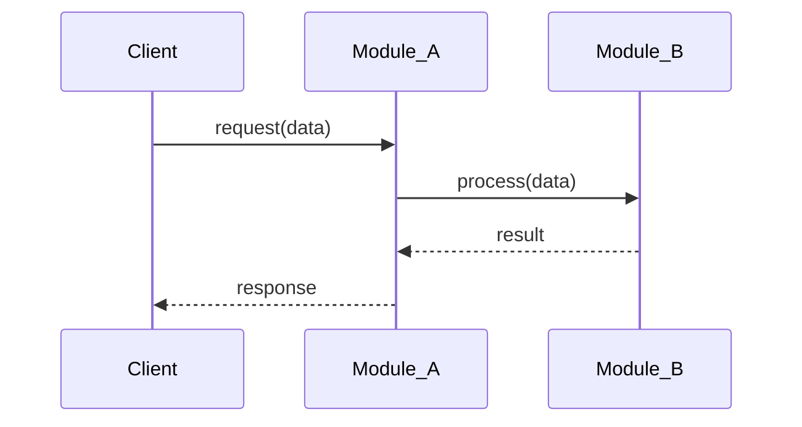
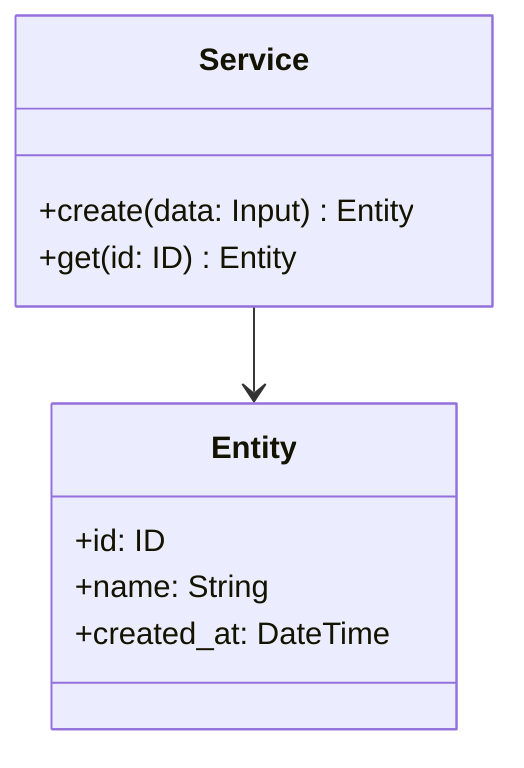
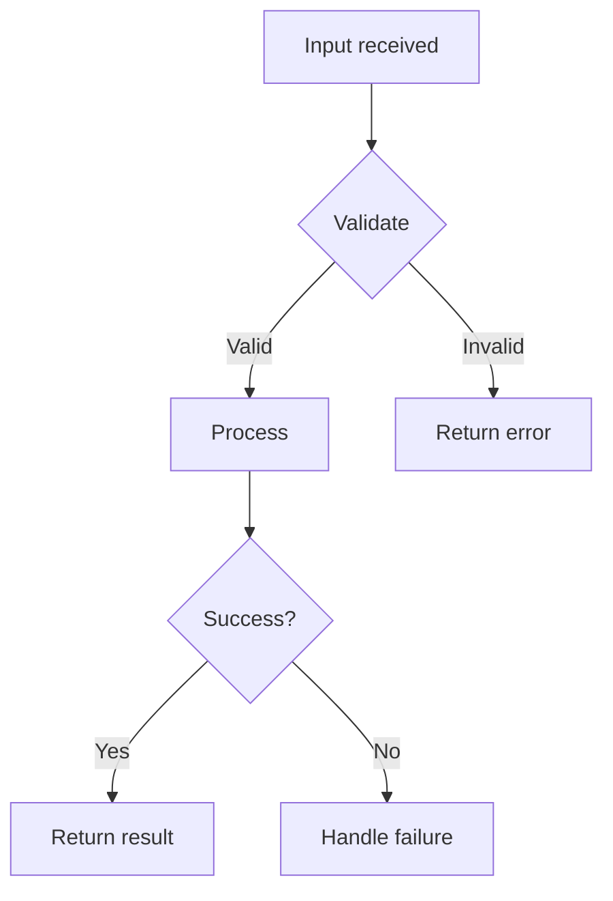
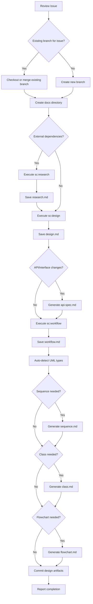

# Skill: Design

Design skill for projects. Handles issue review, branch creation, architecture design, workflow planning, and UML diagram generation. All design artifacts are persisted to `docs/design/#{issue_number}/` for traceability.

## Usage

```
/design <issue_number>
```

Example:

```
/design 42
```

## What This Skill Does

### Phase 1: Preparation

1. **Review Issue** - Use `gh issue view` to understand Issue content and requirements
2. **Create branch** - Create branch following naming convention (shared with `/implement`)
   - **Important: Check for existing branches first.** Before creating a new branch, search for any existing branches for the same issue number:
     ```bash
     git branch -a | grep "#{issue_number}"
     ```
   - If a branch already exists (e.g., from `/metrics`), either:
     - **Checkout and reuse** the existing branch directly, OR
     - **Create a new branch** and immediately **merge the existing branch** into it so that all prior artifacts are available
   - This ensures that artifacts from prior workflow steps are accessible on the design branch
3. **Create docs directory** - Create `docs/design/#{issue_number}/` directory structure

### Phase 2: Research (if needed)

4. **Execute `/sc:research`** (conditional) - Research external libraries, APIs, or patterns:
   - When the issue involves unfamiliar libraries or third-party integrations
   - When architectural decisions require understanding of external documentation
   - Skip if the issue scope is well-understood and internal-only
   - **Save findings to `docs/design/#{issue_number}/research.md`** (if executed)

### Phase 3: Architecture Design

5. **Execute `/sc:design`** - Determine architecture and design:
   - Module structure and organization
   - Interface/API design
   - Type definitions and data models
   - Error handling strategy
   - **Save output to `docs/design/#{issue_number}/design.md`**
6. **Generate API/Interface Specification** (if applicable):
   - Endpoint or function signatures
   - Input/output schemas with types and constraints
   - Error response definitions
   - **Save output to `docs/design/#{issue_number}/api-spec.md`**

### Phase 4: Workflow Planning

7. **Execute `/sc:workflow`** - Generate implementation steps:
   - Organize task dependencies
   - Determine implementation order
   - Test strategy
   - **Save output to `docs/design/#{issue_number}/workflow.md`**

### Phase 5: UML Diagram Generation

8. **Auto-detect required diagrams** - Analyze issue complexity to determine which UML diagrams are needed:
   - **Sequence diagram**: When the issue involves multi-component interactions or complex workflows
   - **Class diagram**: When the issue involves new types, data models, or entity relationships
   - **Flowchart**: When the issue involves branching logic, decision trees, or state transitions
9. **Generate Mermaid UML diagrams** - Create diagrams in Mermaid format:
   - **Save to `docs/design/#{issue_number}/sequence.md`** (if applicable)
   - **Save to `docs/design/#{issue_number}/class.md`** (if applicable)
   - **Save to `docs/design/#{issue_number}/flowchart.md`** (if applicable)

### Phase 6: Commit and Report

10. **Commit design artifacts** - Commit all generated docs
11. **Report results** - Present branch name, docs location, and summary

## Branch Naming Convention

```
{label}/{assignee}/#{issue_number}/{title}
```

- `{label}`: Issue label (feature, bugfix, refactor, docs)
- `{assignee}`: GitHub username
- `{issue_number}`: Issue number (with # prefix)
- `{title}`: kebab-case title

Examples:

- `feature/alice/#123/add-config-loader`
- `bugfix/bob/#456/fix-argument-parsing`

**Important**: This branch is shared with `/implement`. The `/implement` command will detect and reuse this branch.

## MCP Tools

Use the following MCP tools for efficient codebase analysis and library research:

- **serena**: `find_symbol`, `get_symbols_overview`, `find_file`, `search_for_pattern`, `list_dir` — for understanding existing architecture, finding related symbols, and navigating the codebase
- **context7**: `resolve-library-id`, `query-docs` — for researching external libraries and frameworks referenced in the issue

## SuperClaude Skills Used

| Skill | Purpose | Output |
| --- | --- | --- |
| `/sc:research` | Research external libraries, APIs, patterns (conditional) | `docs/design/#{issue_number}/research.md` |
| `/sc:design` | Architecture and interface design | `docs/design/#{issue_number}/design.md` |
| `/sc:workflow` | Implementation step generation | `docs/design/#{issue_number}/workflow.md` |

## Leveraging sc:research

Use `/sc:research` when the issue involves external dependencies:

- Library documentation and best practices
- API integration patterns
- Security considerations for third-party services
- Performance characteristics of candidate solutions

**Decision rule**: If the issue references external libraries, APIs, or patterns that are not already established in the codebase, execute sc:research. Otherwise, skip.

## Leveraging sc:design

Use `/sc:design` to design the following and **save to `docs/design/#{issue_number}/design.md`**:

```markdown
# Design: #{issue_number} {title}

## Architecture Overview

Brief description of the overall approach.

## Module Structure

project/
├── existing/        # Existing module (modified)
│   └── file.ext     # Changes: <brief description>
└── new_module/      # New module
    ├── mod.ext      # Module entry point
    └── types.ext    # Type definitions

## Interface Design

### Public API / Functions

| Name | Signature | Description |
| --- | --- | --- |
| function_name | (args) -> ReturnType | Description |

### Type Definitions

- New types, structs, interfaces, enums
- Validation rules and constraints

## Data Flow

How data moves through the system.

## Error Handling

- Error types and hierarchy
- Recovery strategies

## Implementation Notes

- Key decisions and rationale
- Edge cases to handle
- Performance considerations
```

## API/Interface Specification Template

Generate the following and **save to `docs/design/#{issue_number}/api-spec.md`** (if the issue involves API or interface changes):

```markdown
# API Specification: #{issue_number} {title}

## Endpoints / Functions

| Name | Method/Signature | Description |
| --- | --- | --- |
| endpoint_or_func | GET /path or fn(args) | Description |

## Input/Output Schemas

### Input
| Field | Type | Required | Description |
| --- | --- | --- | --- |

### Output
| Field | Type | Description |
| --- | --- | --- |

## Error Handling

| Error | Code/Type | Description |
| --- | --- | --- |
```

## Leveraging sc:workflow

Use `/sc:workflow` to generate implementation steps and **save to `docs/design/#{issue_number}/workflow.md`**:

```markdown
# Workflow: #{issue_number} {title}

## Implementation Steps

1. Define types and data models
2. Implement core logic
3. Integrate with existing modules
4. Create unit tests
5. Create integration tests
6. Run quality checks

## Task Dependencies

- Step 2 depends on Step 1
- Step 4-5 depend on Step 2-3

## Test Strategy

- Unit tests: what to test
- Integration tests: what to test
- Edge cases to cover
```

## UML Auto-Detection Logic

Analyze the issue content and determine which diagrams are needed:

| Diagram | When to Generate |
| --- | --- |
| **Sequence** | Multi-component interactions, API calls, request/response flows |
| **Class** | New types, data models, entity relationships |
| **Flowchart** | Branching logic, decision trees, state transitions, complex algorithms |

**Rules**:
- Always generate at least one diagram
- For XS/S issues: typically 1 diagram (most relevant)
- For M issues: typically 1-2 diagrams
- For L/XL issues: typically 2-3 diagrams

## Mermaid Diagram Format

All UML diagrams use Mermaid format for GitHub native rendering.

### Sequence Diagram Example

````markdown
# Sequence Diagram: #{issue_number} {title}


````

### Class Diagram Example

````markdown
# Class Diagram: #{issue_number} {title}


````

### Flowchart Example

````markdown
# Flowchart: #{issue_number} {title}


````

## docs/ Directory Structure

```
docs/design/#{issue_number}/
├── research.md      # External research findings (sc:research, if applicable)
├── design.md        # Architecture and interface design (sc:design output)
├── api-spec.md      # API/interface specification (if applicable)
├── workflow.md       # Implementation steps and plan (sc:workflow output)
├── sequence.md       # Mermaid sequence diagram (if applicable)
├── class.md          # Mermaid class diagram (if applicable)
└── flowchart.md      # Mermaid flowchart (if applicable)
```

## Design Workflow



## Commit Strategy

```
docs: add design documents for #{issue_number}
```

## Output Format

```
Design Complete

Branch: feature/username/#123/add-feature
Issue: #123

Design Artifacts:
  docs/design/#123/research.md    - External research findings (if applicable)
  docs/design/#123/design.md      - Architecture and interface design
  docs/design/#123/api-spec.md    - API/interface specification (if applicable)
  docs/design/#123/workflow.md    - Implementation steps and plan
  docs/design/#123/sequence.md    - Sequence diagram
  docs/design/#123/class.md       - Class diagram

Summary:
- Research: Libraries and patterns documented (if applicable)
- Design: Module structure and interfaces documented
- Implementation workflow: N steps planned
- UML diagrams generated

Ready for /implement 123
```

## Best Practices

- **Issue Understanding**: Thoroughly read and understand the issue before designing
- **Research First**: Investigate external dependencies before making design decisions
- **Design Completeness**: Address all aspects relevant to the issue scope
- **UML Clarity**: Diagrams should be clear and focused on the specific issue scope
- **Branch Reuse**: The branch created here will be reused by `/implement`
- **Existing Branch Detection**: Always check for existing branches for the same issue and merge them to avoid orphaned artifacts
- **Artifact Co-location**: All design artifacts for an issue are stored together

## Integration

- **Prerequisite**: Issue created with `/issue`
- **Next step**: Start implementation with `/implement <issue_number>`
- **Typical workflow**: `/issue` → **`/design`** → `/implement` → `/review` → `/pr`

ARGUMENTS:
$ARGUMENTS
