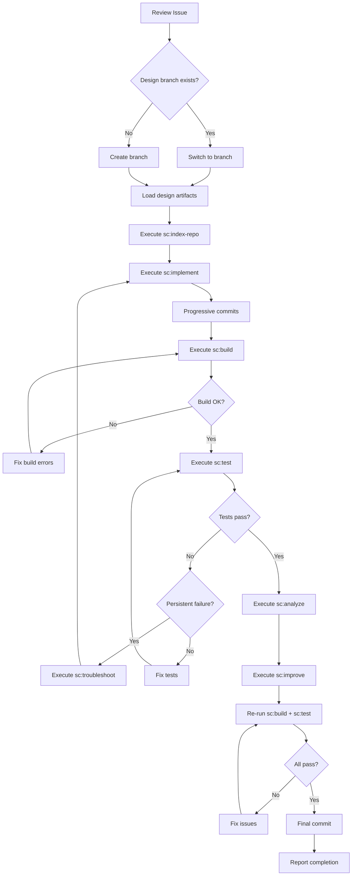

# Skill: Implement

Implementation skill for projects. Handles codebase understanding, feature implementation, build verification, testing, code analysis, and quality improvement.

## Usage

```
/implement <issue_number>
```

Example:

```
/implement 42
```

## What This Skill Does

### Phase 1: Preparation

1. **Review Issue** - Use `gh issue view` to understand Issue content
2. **Detect or create branch** - Check if `/design` already created a branch for this issue. If yes, switch to it. If no, create a new branch following naming convention.
3. **Load design artifacts** (if exists) - Read `docs/design/#{issue_number}/` for design decisions, API spec, and workflow
4. **Execute `/sc:index-repo`** - Efficient repository indexing for codebase understanding:
   - Map relevant modules and their relationships
   - Identify files that need modification
   - Understand existing patterns and conventions

### Phase 2: Implementation

5. **Execute `/sc:implement`** - Feature implementation with persona activation:
   - Follow design artifacts from `/design` (if available)
   - Follow language best practices
   - Proper error handling
   - Type safety
6. **Progressive commits** - Commit per logical unit of work

### Phase 3: Build and Test

7. **Execute `/sc:build`** - Build verification with error handling:
   - Run language-specific linters and formatters
   - Run type checkers
   - Fix build errors iteratively
8. **Execute `/sc:test`** - Test execution with coverage analysis:
   - Unit tests
   - Integration tests (if applicable)
   - E2E tests (if applicable)
   - Analyze coverage and add missing tests

### Phase 4: Quality Assurance

9. **Execute `/sc:analyze`** - Comprehensive code analysis:
   - Code quality: readability, maintainability, DRY
   - Security: input validation, injection risks, auth checks
   - Performance: inefficient patterns, unnecessary allocations
   - Architecture: module design, layer separation
10. **Execute `/sc:improve`** - Fix discovered issues:
    - Code quality improvements
    - Pattern standardization
    - Type safety enhancements
    - Error handling improvements
11. **Re-run `/sc:build`** and **`/sc:test`** - Verify improvements don't break anything

### Phase 5: Error Recovery (if needed)

12. **Execute `/sc:troubleshoot`** (conditional) - When build or test failures persist:
    - Diagnose root cause of failures
    - Identify dependency issues
    - Resolve configuration problems
    - Apply targeted fixes

### Phase 6: Final Commit and Report

13. **Final commit** - Commit all remaining changes
14. **Report results** - Present branch name, quality metrics, and test results

## Branch Naming Convention

```
{label}/{assignee}/#{issue_number}/{title}
```

- `{label}`: Issue label (feature, bugfix, refactor, docs)
- `{assignee}`: GitHub username
- `{issue_number}`: Issue number (with # prefix)
- `{title}`: kebab-case title

Examples:

- `feature/alice/#123/add-config-loader`
- `bugfix/bob/#456/fix-argument-parsing`

**Important**: If `/design` has already created a branch, reuse it. Do not create a duplicate.

## MCP Tools

Use the following MCP tools during implementation:

- **serena**: `find_symbol`, `get_symbols_overview`, `find_file`, `search_for_pattern`, `list_dir`, `replace_symbol_body`, `insert_after_symbol`, `insert_before_symbol` — for codebase navigation, understanding existing patterns, and semantic code editing
- **context7**: `resolve-library-id`, `query-docs` — for looking up library documentation when implementing with external dependencies

## SuperClaude Skills Used

| Skill | Purpose | Phase |
| --- | --- | --- |
| `/sc:index-repo` | Repository indexing for efficient codebase understanding | Phase 1 |
| `/sc:implement` | Feature implementation with persona activation | Phase 2 |
| `/sc:build` | Build verification with intelligent error handling | Phase 3 |
| `/sc:test` | Test execution with coverage analysis and quality reporting | Phase 3 |
| `/sc:analyze` | Comprehensive code analysis (quality, security, performance, architecture) | Phase 4 |
| `/sc:improve` | Systematic code quality improvements | Phase 4 |
| `/sc:troubleshoot` | Diagnose and resolve persistent build/test failures (conditional) | Phase 5 |

## Leveraging sc:index-repo

Use `/sc:index-repo` for efficient codebase understanding:

- Significant token reduction compared to reading full files
- Map module relationships and dependencies
- Identify patterns and conventions already in use
- Focus on files relevant to the current issue

## Leveraging sc:implement

Use `/sc:implement` for the actual coding work:

- Follow design artifacts from `/design` phase (if available)
- Activate appropriate persona for the language/framework
- Implement with proper type annotations and error handling
- Create progressive commits per logical unit

## Leveraging sc:build

Use `/sc:build` to verify the build:

- Run language-specific linters and formatters
- Run type checkers (mypy, tsc, cargo check, etc.)
- Fix errors iteratively until build passes
- Language detection is automatic based on project files

## Leveraging sc:test

Use `/sc:test` to run and analyze tests:

- Execute the project's test suite
- Analyze test coverage
- Identify and add missing test cases
- Run integration/E2E tests if applicable

## Leveraging sc:analyze and sc:improve

Use `/sc:analyze` then `/sc:improve` as a feedback loop:

```
sc:analyze findings → sc:improve fixes → sc:build verify → sc:test verify
```

Analysis domains:
- **Quality**: Code readability, maintainability, DRY principle
- **Security**: Input validation, permission checks, injection risks
- **Performance**: Inefficient patterns, unnecessary allocations
- **Architecture**: Module design, layer separation, API contracts

## Commit Strategy

Conventional commit format with progressive commits:

```
feat: add config type definitions
feat: implement config file loader
test: add unit tests for config module
fix: resolve edge case in config parsing
refactor: extract validation logic (sc:improve)
```

## Implementation Workflow



## Error Handling

- **Build errors**: Attempt auto-fix with linters/formatters, retry build
- **Test failures**: Analyze cause, fix implementation, re-run tests
- **Persistent failures**: Escalate to `/sc:troubleshoot` for root cause analysis
- **Blockers**: Report to user, request guidance

## Output Format

```
Implementation Complete

Branch: feature/username/#123/add-config-loader
Issue: #123

Codebase Analysis (sc:index-repo):
  - Indexed N modules, identified M relevant files

Quality Checks (sc:build):
  - Linting: Passed
  - Formatting: Passed
  - Type Check: Passed

Tests (sc:test):
  - Unit tests: 15/15 passed
  - Integration tests: 3/3 passed

Code Analysis (sc:analyze):
  - Quality: No issues
  - Security: No issues
  - Performance: No issues

Improvements Applied (sc:improve):
  - Standardized error handling pattern
  - Enhanced type safety in 2 modules

Commits:
- feat: add Config type definitions
- feat: implement config loader
- test: add config loader tests
- refactor: improve error handling (sc:improve)

Ready for /review or /pr
```

## Best Practices

- **Design First**: Load and follow design artifacts from `/design` if available
- **Codebase Understanding**: Use `/sc:index-repo` before jumping into implementation
- **Incremental Implementation**: Implement and commit in small logical units
- **Type Safety**: Maximize use of type systems where available
- **Test Coverage**: Always add tests for new features
- **Quality Loop**: analyze → improve → build → test as a feedback cycle

## Integration

- **Prerequisite**: Issue created with `/issue`, optionally designed with `/design`
- **Next step**: Review with `/review` or create Pull Request with `/pr`
- **Typical workflow**: `/issue` → `/design` → **`/implement`** → `/review` → `/pr`

ARGUMENTS:
$ARGUMENTS
