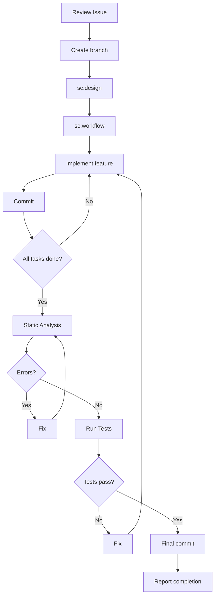

# Implementation Skill

Implementation skill for CLI projects. Handles design, implementation, static analysis, and testing.

## Issue Context

!`gh issue view $ARGUMENTS --json title,body,labels,assignees 2>/dev/null || echo "Issue not found or no arguments provided"`

## What This Skill Does

### Phase 1: Preparation

1. **Review Issue** - Understand Issue content from the context above
2. **Check for existing branch/design** - Look for branches and design artifacts:
   ```bash
   git branch -a | grep "#{issue_number}"
   ```
   - If a branch exists (e.g., from `/design`), checkout and reuse it
   - Check for design docs in `docs/design/#{issue_number}/`
3. **Create branch** (if not reusing) - Create branch following naming convention
4. **Understand codebase** - Grasp the structure of related code

### Phase 2: Design (skip if design docs exist from `/design`)

5. **Execute `/sc:design`** - Determine architecture and design:
   - Module structure
   - Interface design
   - Type definitions
6. **Execute `/sc:workflow`** - Generate implementation steps:
   - Organize task dependencies
   - Determine implementation order
   - Test strategy

### Phase 3: Implementation

6. **Implement features** - Implement based on design:
   - Follow language best practices
   - Proper error handling
7. **Progressive commits** - Commit per task

### Phase 4: Quality Assurance

8. **Run static analysis** - Language-specific linters and formatters
9. **Run tests** - Unit and integration tests
10. **Final commit** - Commit fixes
11. **Report results** - Present branch name and Issue number

## SuperClaude Skills Used

| Skill | Purpose |
| --- | --- |
| `/sc:design` | Architecture and interface design (if no design docs exist) |
| `/sc:workflow` | Implementation step generation (if no workflow docs exist) |

## Branch Naming Convention

```
{label}/{assignee}/#{issue_number}/{title}
```

- `{label}`: Issue label (feature, bugfix, refactor, docs)
- `{assignee}`: GitHub username
- `{issue_number}`: Issue number (with # prefix)
- `{title}`: kebab-case title

Examples:

- `feature/alice/#123/add-config-loader`
- `bugfix/bob/#456/fix-argument-parsing`

## Commit Strategy

Conventional commit format:

```
feat: add config file loader
fix: resolve CLI argument parsing error
refactor: extract validation logic
test: add unit tests for config module
docs: update CLI usage documentation
```

## Implementation Workflow



## Error Handling

- **Static analysis errors**: Attempt auto-fix, commit fixes
- **Test failures**: Analyze cause, fix implementation
- **Blockers**: Report to user, request guidance

## Output Format

```
Implementation Complete

Branch: feature/username/#123/add-config-loader
Issue: #123

Quality Checks:
- Formatting: Passed
- Linting: Passed
- Type Check: Passed

Tests:
- Unit tests: 15/15 passed
- Integration tests: 3/3 passed

Commits:
- feat: add Config type definitions
- feat: implement config loader
- test: add config loader tests

Ready for /pr
```

## Best Practices

- **Design First**: Solidify design before implementation
- **Incremental Implementation**: Implement and commit in small units
- **Type Safety**: Maximize use of type systems where available
- **Test Coverage**: Always add tests for new features

## Integration

- **Prerequisite**: Issue created with `/issue`, optionally designed with `/design`
- **Next step**: Review with `/review` or create Pull Request with `/pr`
- **Typical workflow**: `/issue` → `/design` → **`/implement`** → `/review` → `/pr`

ARGUMENTS:
$ARGUMENTS
