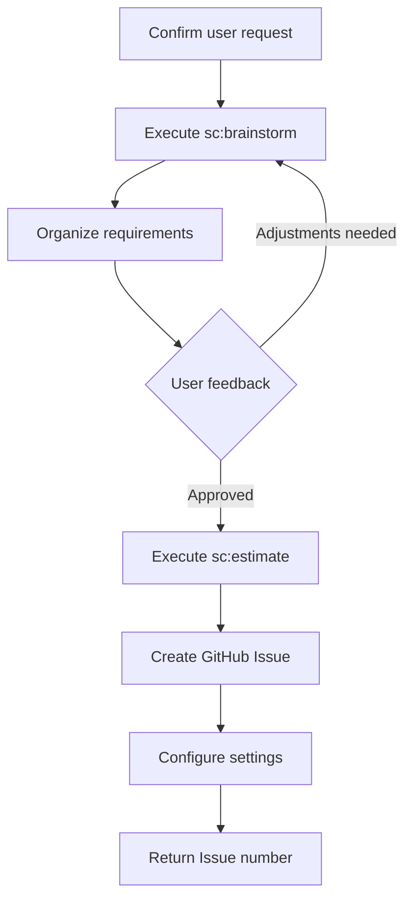

# Skill: Issue

GitHub Issue creation skill for projects. Handles requirement discovery through brainstorming, expert review, estimation, and Issue creation.

## Usage

```
/issue
```

## MCP Tools

Use the following MCP tools for requirement analysis:

- **sequential-thinking**: `sequentialthinking` — for structured requirement discovery: break down complex requests, identify hidden requirements, explore edge cases, and evaluate implementation trade-offs step by step

## What This Skill Does

### Phase 1: Requirement Understanding and Discovery

1. **Confirm user request** - Understand what the user wants to accomplish
2. **Execute `/sc:brainstorm`** - Use SuperClaude's brainstorm feature to dig deeper into requirements:
   - Discover hidden requirements through Socratic dialogue
   - Identify edge cases and boundary conditions
   - Confirm technical constraints
   - Explore non-functional requirements (performance, security, maintainability)
3. **Organize requirements** - Structure and summarize discovered requirements

### Phase 2: Estimation

4. **Execute `/sc:estimate`** - Development estimation with intelligent analysis:
   - Determine Size (XS/S/M/L/XL) based on scope and complexity
   - Determine Priority (High/Medium/Low) based on impact and urgency
   - Identify risks and dependencies
   - Estimate affected layers

### Phase 3: Issue Creation and Configuration

5. **Create GitHub Issue** - English title with detailed description using `gh issue create`
6. **Configure Issue settings** - Set Labels, Milestone, Assignee
7. **Set Project fields** - Automatically set Size and Priority (if project.yml exists)
8. **Return Issue number**

## SuperClaude Skills Used

| Skill | Purpose | Phase |
| --- | --- | --- |
| `/sc:brainstorm` | Interactive requirements discovery through Socratic dialogue | Phase 1 |
| `/sc:estimate` | Development estimates with intelligent analysis | Phase 2 |

## Leveraging sc:brainstorm

Use `/sc:brainstorm` to explore requirements from these perspectives:

- **Functional requirements**: What to achieve, acceptance criteria
- **Non-functional requirements**: Performance, security, maintainability
- **Architecture**: Which layer(s) are affected
- **User experience**: UI/UX considerations, accessibility
- **Data model**: New or modified entities, relationships, migrations

## Leveraging sc:estimate

Use `/sc:estimate` to produce a structured estimation:

- **Size**: Based on file count, module span, and complexity
- **Priority**: Based on impact, urgency, and dependencies
- **Risk factors**: Technical unknowns, external dependencies
- **Breakdown**: Per-layer effort distribution

## Issue Description Format

**Title**: Written in English

**Body**:

```markdown
## Overview

Summary of implementation

## Background

Context and purpose

## Requirements

### Functional Requirements

- Functional requirements list
- Acceptance criteria

### Non-Functional Requirements

- Performance requirements
- Security considerations

## Implementation Approach

- Proposed implementation approach
- Architecture considerations

## Tasks

- [ ] Main task
  - [ ] Subtask
- [ ] Create tests
- [ ] Update documentation

## Estimation

- **Size**: XS/S/M/L/XL
- **Priority**: High/Medium/Low
- **Affected Layers**: Brief description
- **Risk Factors**: Brief description
- **Estimated Complexity**: Brief reasoning
```

## Size Criteria

| Size   | Criteria                                         |
| ------ | ------------------------------------------------ |
| **XS** | Config-only changes, minor fixes within 1 file   |
| **S**  | 1-2 files, single feature addition               |
| **M**  | 3-5 files, changes spanning multiple modules     |
| **L**  | Multiple components, new major feature            |
| **XL** | Architecture changes, major refactoring          |

## Priority Criteria

| Priority   | Criteria                                 |
| ---------- | ---------------------------------------- |
| **High**   | Bug fix, security-related, blocker       |
| **Medium** | Normal feature addition, improvement     |
| **Low**    | Documentation, refactoring, nice-to-have |

## Workflow



## Completion Output

```
Issue Created: #XX

Settings:
- Label: feature
- Milestone: v1.0
- Assignee: @username

Estimation (sc:estimate):
- Size: M (3-5 files, spanning multiple modules)
- Priority: Medium (normal feature addition)
- Affected Layers: ...
- Risk: Low

Ready for /design XX
```

## Integration

- **Next step**: Design with `/design <issue_number>`
- **Typical workflow**: **`/issue`** → `/design` → `/implement` → `/review` → `/pr`

ARGUMENTS:
$ARGUMENTS
