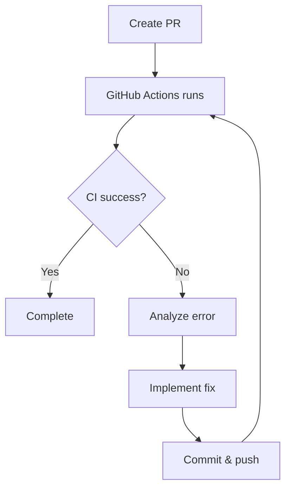

# Pull Request Creation Skill

Pull Request creation skill for CLI projects. Handles code analysis, improvements, PR creation, and CI pass verification.

## Current Branch Context

!`git branch --show-current`
!`git log --oneline develop..HEAD 2>/dev/null | head -20`

## What This Skill Does

### Phase 1: Code Analysis and Improvement

1. **Execute `/sc:analyze`** - Comprehensive code analysis:
   - Code quality
   - Security
   - Performance
   - Architecture
2. **Execute `/sc:improve`** - Fix discovered issues:
   - Code quality improvements
   - Pattern standardization
   - Remove redundant code
3. **Commit improvements** - Commit improvement changes

### Phase 2: Quality Checks

4. **Static analysis** - Language-specific linters and formatters
5. **Run tests** - All tests

### Phase 3: Pull Request Creation

6. **Collect change history** - Analyze commit history and diff
7. **Push to remote** - `git push -u origin <branch>`
8. **Create PR** - Create PR with `gh pr create`

### Phase 4: CI Monitoring and Fix Loop

9. **Monitor GitHub Actions** - Check CI status
10. **Fix loop on CI failure**:
    - Analyze error content
    - Implement fix
    - Commit & push
    - Re-check CI
11. **Report completion** - Present PR URL

## MCP Tools

Use the following MCP tools for code analysis:

- **serena**: `find_symbol`, `get_symbols_overview` — for understanding code structure during analysis and improvement phases

## SuperClaude Skills Used

| Skill | Purpose |
| --- | --- |
| `/sc:analyze` | Comprehensive code analysis (quality, security, performance, architecture) |
| `/sc:improve` | Code quality improvements and pattern standardization |

## CI Fix Loop



## Pull Request Format

**Title** (English, Conventional Commit format):

```
{type}: {description}
```

Examples:

- `feat: add configuration file support`
- `fix: resolve CLI argument parsing error`
- `refactor: improve error handling in config module`

**Body**:

```markdown
## Summary

Brief description of changes (1-3 lines)

## Changes

### New Features

- List of new features

### Bug Fixes

- List of fixes

### Improvements

- List of improvements

## Code Analysis Results

Summary of analysis results:

- Quality: Passed/Warning
- Security: Passed/Warning
- Performance: Passed/Warning

## Testing

- [x] Unit tests pass
- [x] Integration tests pass
- [x] Formatting check pass
- [x] Linting pass
- [x] Type check pass

## Related Issue

Closes #XXX
```

## Error Handling

- **CI timeout**: Show warning if status unknown after 5 minutes
- **Fix loop limit**: Report to user if still failing after 3 fix attempts
- **Merge conflict**: Notify user and provide resolution instructions

## Output Format

### On Success

```
Pull Request Created

PR: #XX - feat: add configuration file support
URL: https://github.com/owner/repo/pull/XX

Branches:
- Source: feature/username/#123/add-config-loader
- Target: develop

Code Analysis:
- Quality: No issues
- Security: No issues
- Performance: No issues

Improvements Applied:
- Removed 2 unused imports
- Standardized error handling pattern

CI Status: All checks passed

Related Issue: #123 (will be closed on merge)

Change Summary:
- 5 files changed
- 150 lines added
- 20 lines deleted

Ready for review.
```

### After CI Fix

```
Pull Request Updated

CI Fix Applied:
- Fixed: lint error in src/config.ts
- Commit: fix: resolve lint error in config module

CI Status: All checks passed (after 1 fix iteration)
```

## Best Practices

- **Analyze Before PR**: Discover issues early with `/sc:analyze`
- **Improve Proactively**: Enhance quality with `/sc:improve` before submitting
- **CI First**: Run same checks as CI locally beforehand
- **Clear Description**: PR description easy for reviewers to understand
- **Issue Linking**: Always link related Issues

## Integration

- **Prerequisite**: Implementation completed with `/implement <issue_number>`, optionally reviewed with `/review`
- **CI Workflow**: Integrates with GitHub Actions workflows
- **Typical workflow**: `/issue` → `/design` → `/implement` → `/review` → **`/pr`**

ARGUMENTS:
$ARGUMENTS
