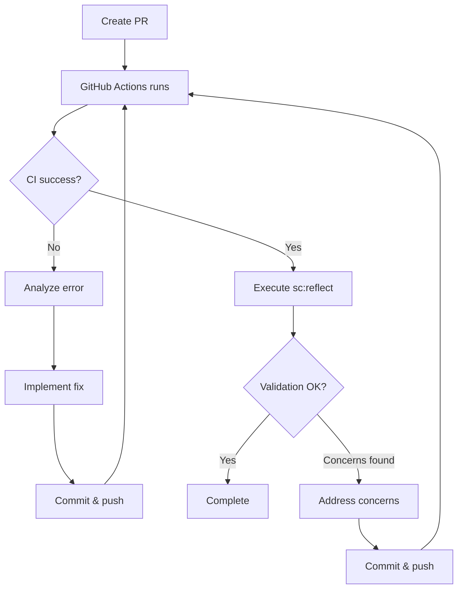
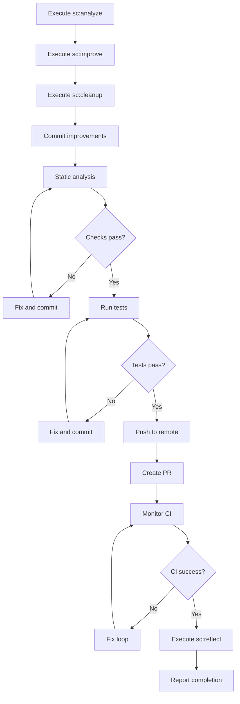

# Skill: PR (Pull Request)

Pull Request creation skill for projects. Handles code analysis, improvements, cleanup, PR creation, CI monitoring, and validation.

## Usage

```
/pr [target_branch]
```

Default target branch: `develop`

Examples:

```
/pr
/pr develop
/pr main
```

## MCP Tools

Use the following MCP tools for code analysis:

- **serena**: `find_symbol`, `get_symbols_overview` — for understanding code structure during analysis and improvement phases

## What This Skill Does

### Phase 1: Code Analysis and Improvement

1. **Execute `/sc:analyze`** - Comprehensive code analysis:
   - Code quality: readability, maintainability, DRY
   - Security: input validation, injection risks, auth checks
   - Performance: inefficient patterns, unnecessary allocations
   - Architecture: module design, layer separation
2. **Execute `/sc:improve`** - Fix discovered issues:
   - Code quality improvements
   - Pattern standardization
   - Type safety enhancements
   - Error handling improvements
3. **Execute `/sc:cleanup`** - Final code cleanup:
   - Remove dead code and unused imports
   - Optimize import ordering
   - Clean up commented-out code
   - Ensure consistent formatting
4. **Commit improvements** - Commit all improvement and cleanup changes

### Phase 2: Quality Checks

5. **Static analysis** - Run language-specific linters and formatters
6. **Run tests** - All test suites
7. **Fix and re-commit** - If any checks fail, fix and commit

### Phase 3: Pull Request Creation

8. **Collect change history** - Analyze commit history and diff against target branch
9. **Push to remote** - `git push -u origin <branch>`
10. **Create PR** - Create PR with `gh pr create` targeting the specified branch

### Phase 4: CI Monitoring and Validation

11. **Monitor GitHub Actions** - Wait for CI completion using `gh run watch <run_id> --exit-status` with `run_in_background: true`. Do NOT use `sleep` to poll — it is blocked by the runtime. After the background task completes, check results with `gh pr checks <pr_number>`.
12. **Execute `/sc:reflect`** - Validate CI results and overall PR quality:
    - Analyze CI pass/fail results
    - Reflect on test coverage adequacy
    - Validate that implementation matches issue requirements
    - Identify any remaining risks or concerns
13. **Fix loop on CI failure**:
    - Analyze error content from CI logs
    - Implement fix
    - Commit & push
    - Re-check CI
    - Re-run `/sc:reflect` after fix
14. **Report completion** - Present PR URL and validation summary

## SuperClaude Skills Used

| Skill | Purpose | Phase |
| --- | --- | --- |
| `/sc:analyze` | Comprehensive code analysis (quality, security, performance, architecture) | Phase 1 |
| `/sc:improve` | Systematic code quality improvements | Phase 1 |
| `/sc:cleanup` | Dead code removal, import optimization, final cleanup | Phase 1 |
| `/sc:reflect` | CI result validation and overall PR quality assessment | Phase 4 |

## Leveraging sc:analyze

Use `/sc:analyze` for analysis from these perspectives:

```
Analysis Domains:
- Quality: Code readability, maintainability, DRY principle
- Security: Input validation, permission checks, injection risks
- Performance: Inefficient patterns, unnecessary allocations
- Architecture: Module design, layer separation, API contracts
```

## Leveraging sc:improve

Use `/sc:improve` to implement these improvements:

```
Improvements:
- Dead code removal
- Code deduplication
- Pattern consistency
- Type safety enhancements
- Error handling improvements
```

## Leveraging sc:cleanup

Use `/sc:cleanup` for final polish before PR:

```
Cleanup:
- Remove unused imports and variables
- Clean up commented-out code
- Ensure consistent formatting
- Optimize file organization
```

## Leveraging sc:reflect

Use `/sc:reflect` after CI results are available:

```
Validation:
- CI result analysis: interpret pass/fail and identify flaky tests
- Coverage assessment: is test coverage sufficient for the changes?
- Requirement matching: does the implementation satisfy the issue requirements?
- Risk identification: any remaining concerns before merge?
```

## CI Fix Loop



## Pull Request Format

**Title** (English, Conventional Commit format):

```
{type}: {description}
```

**IMPORTANT**: Do NOT include the Issue number `(#XXX)` in the PR title. GitHub's squash merge automatically appends the PR number `(#N)` to the commit message. If the Issue number is also in the title, the commit message becomes `feat: ... (#issue) (#pr)`, which breaks auto-tag workflows.

The Issue number should only appear in the PR body as `Closes #XXX`.

Examples:

- `feat: add configuration file support`
- `fix: resolve CLI argument parsing error`
- `refactor: improve error handling in config module`

**Body**:

```markdown
## Summary

Brief description of changes (1-3 lines)

## Changes

- List of changes organized by module/layer

## Code Analysis Results (sc:analyze)

- Quality: Passed/Warning
- Security: Passed/Warning
- Performance: Passed/Warning

## Improvements Applied (sc:improve + sc:cleanup)

- List of improvements and cleanup actions

## Testing

- [x] Unit tests pass
- [x] Integration tests pass
- [x] Linting pass
- [x] Formatting pass
- [x] Type check pass

## Validation (sc:reflect)

- CI Status: Passed/Failed
- Coverage: Adequate/Needs improvement
- Requirements: Fully met / Partially met

## Related Issue

Closes #XXX
```

## Error Handling

- **CI timeout**: Show warning if status unknown after 5 minutes
- **Fix loop limit**: Report to user if still failing after 3 fix attempts
- **Merge conflict**: Notify user and provide resolution instructions

## Output Format

### On Success

```
Pull Request Created

PR: #XX - feat: add configuration file support
URL: https://github.com/owner/repo/pull/XX

Branches:
- Source: feature/username/#123/add-config-loader
- Target: develop

Code Analysis (sc:analyze):
- Quality: No issues
- Security: No issues
- Performance: No issues

Improvements Applied (sc:improve):
- Removed 2 unused imports
- Standardized error handling pattern

Cleanup Applied (sc:cleanup):
- Removed 3 commented-out code blocks
- Optimized import ordering in 4 files

CI Status: All checks passed

Validation (sc:reflect):
- CI: All green
- Coverage: Adequate (85% on changed files)
- Requirements: Fully met per Issue #123
- Risks: None identified

Related Issue: #123 (will be closed on merge)

Change Summary:
- 5 files changed
- 150 lines added
- 20 lines deleted

Ready for review.
```

### After CI Fix

```
Pull Request Updated

CI Fix Applied:
- Fixed: lint error in src/config.rs
- Commit: fix: resolve lint error in config module

CI Status: All checks passed (after 1 fix iteration)

Validation (sc:reflect):
- All concerns resolved
```

## PR Workflow



## Best Practices

- **Analyze Before PR**: Discover issues early with `/sc:analyze`
- **Improve Proactively**: Enhance quality with `/sc:improve`
- **Clean Up Last**: Use `/sc:cleanup` for final polish
- **CI First**: Run same checks as CI locally beforehand
- **Validate Results**: Use `/sc:reflect` to ensure CI results are meaningful
- **Clear Description**: PR description easy for reviewers to understand
- **Issue Linking**: Always link related Issues in body, never in title

## Integration

- **Prerequisite**: Implementation completed with `/implement <issue_number>`, optionally reviewed with `/review`
- **CI Workflow**: Integrates with GitHub Actions workflows
- **Typical workflow**: `/issue` → `/design` → `/implement` → `/review` → **`/pr`**

ARGUMENTS:
$ARGUMENTS
