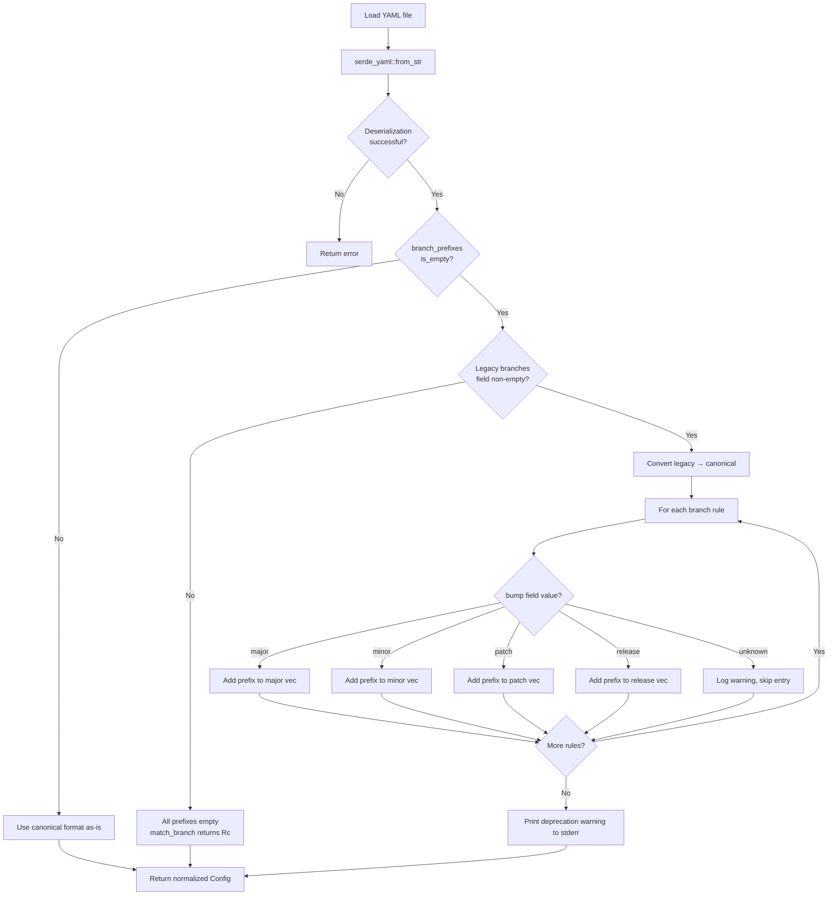
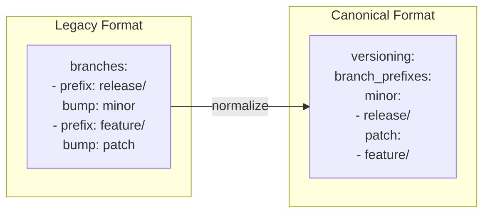

# Flowchart: #228 Config Normalization Logic

```mermaid
graph TD
    A[Load YAML file] --> B[serde_yaml::from_str]
    B --> C{Deserialization<br/>successful?}
    C -->|No| ERR[Return error]
    C -->|Yes| D{branch_prefixes<br/>is_empty?}

    D -->|No| CANON[Use canonical format as-is]
    D -->|Yes| E{Legacy branches<br/>field non-empty?}

    E -->|No| DEFAULT[All prefixes empty<br/>match_branch returns Rc]
    E -->|Yes| F[Convert legacy → canonical]

    F --> G[For each branch rule]
    G --> H{bump field value?}
    H -->|major| I[Add prefix to major vec]
    H -->|minor| J[Add prefix to minor vec]
    H -->|patch| K[Add prefix to patch vec]
    H -->|release| L[Add prefix to release vec]
    H -->|unknown| M[Log warning, skip entry]

    I --> N{More rules?}
    J --> N
    K --> N
    L --> N
    M --> N

    N -->|Yes| G
    N -->|No| O[Print deprecation warning to stderr]
    O --> P[Return normalized Config]

    CANON --> P
    DEFAULT --> P
```

## Legacy-to-Canonical Conversion Example

```mermaid
graph LR
    subgraph Legacy Format
        A["branches:<br/>- prefix: release/<br/>  bump: minor<br/>- prefix: feature/<br/>  bump: patch"]
    end

    subgraph Canonical Format
        B["versioning:<br/>  branch_prefixes:<br/>    minor:<br/>      - release/<br/>    patch:<br/>      - feature/"]
    end

    A -->|normalize| B
```
