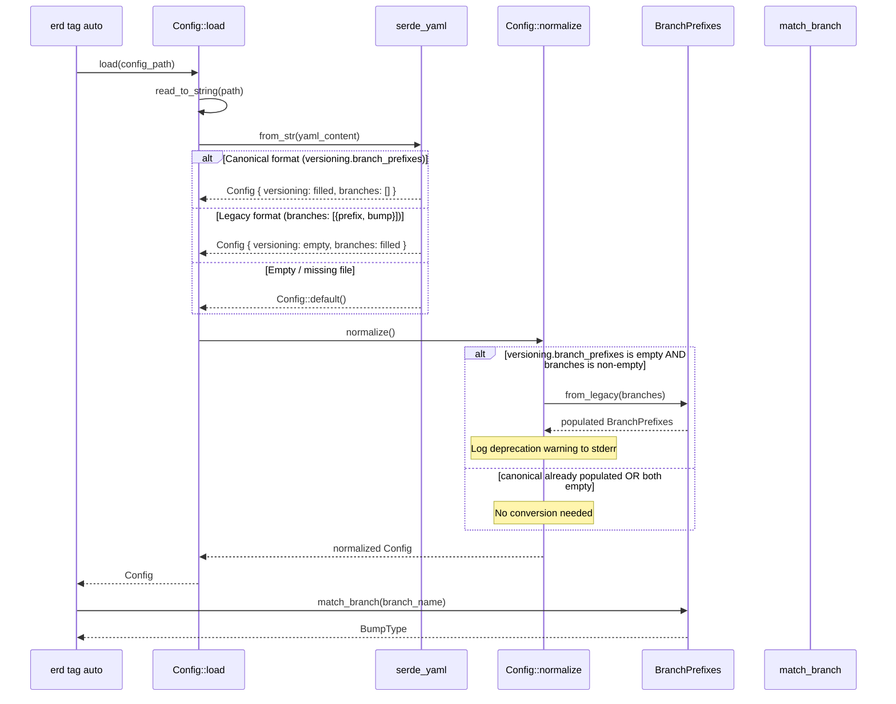

# Sequence Diagram: #228 Config Loading with Dual-Format Support

```mermaid
sequenceDiagram
    participant CLI as erd tag auto
    participant Config as Config::load
    participant Serde as serde_yaml
    participant Normalize as Config::normalize
    participant BP as BranchPrefixes
    participant Match as match_branch

    CLI->>Config: load(config_path)
    Config->>Config: read_to_string(path)
    Config->>Serde: from_str(yaml_content)

    alt Canonical format (versioning.branch_prefixes)
        Serde-->>Config: Config { versioning: filled, branches: [] }
    else Legacy format (branches: [{prefix, bump}])
        Serde-->>Config: Config { versioning: empty, branches: filled }
    else Empty / missing file
        Serde-->>Config: Config::default()
    end

    Config->>Normalize: normalize()

    alt versioning.branch_prefixes is empty AND branches is non-empty
        Normalize->>BP: from_legacy(branches)
        BP-->>Normalize: populated BranchPrefixes
        Note over Normalize: Log deprecation warning to stderr
    else canonical already populated OR both empty
        Note over Normalize: No conversion needed
    end

    Normalize-->>Config: normalized Config
    Config-->>CLI: Config

    CLI->>BP: match_branch(branch_name)
    BP-->>CLI: BumpType
```
