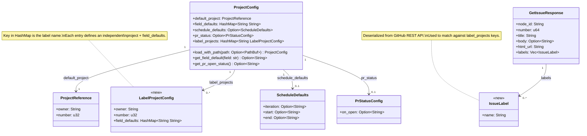
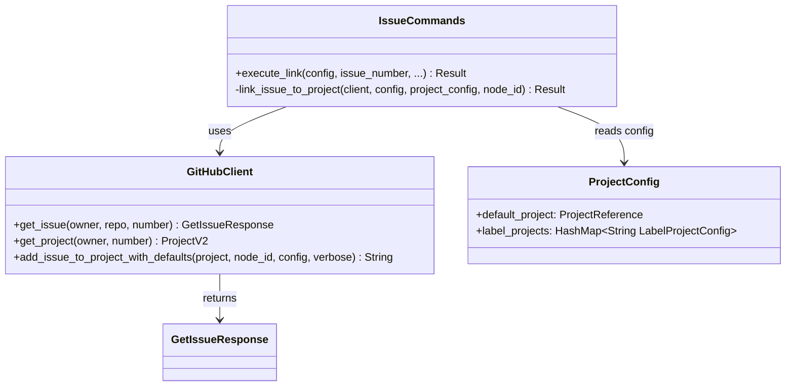

# Class Diagram: #230 Label-Based Project Routing

## Type Relationships

```mermaid
classDiagram
    class ProjectConfig {
        +default_project: ProjectReference
        +field_defaults: HashMap~String String~
        +schedule_defaults: Option~ScheduleDefaults~
        +pr_status: Option~PrStatusConfig~
        +label_projects: HashMap~String LabelProjectConfig~
        +load_with_path(path: Option~PathBuf~) ProjectConfig
        +get_field_default(field: str) Option~String~
        +get_pr_open_status() Option~String~
    }

    class ProjectReference {
        +owner: String
        +number: u32
    }

    class LabelProjectConfig {
        <<new>>
        +owner: String
        +number: u32
        +field_defaults: HashMap~String String~
    }

    class ScheduleDefaults {
        +iteration: Option~String~
        +start: Option~String~
        +end: Option~String~
    }

    class PrStatusConfig {
        +on_open: Option~String~
    }

    class GetIssueResponse {
        +node_id: String
        +number: u64
        +title: String
        +body: Option~String~
        +html_url: String
        +labels: Vec~IssueLabel~
    }

    class IssueLabel {
        <<new>>
        +name: String
    }

    ProjectConfig "1" --> "1" ProjectReference : default_project
    ProjectConfig "1" --> "0..*" LabelProjectConfig : label_projects
    ProjectConfig "1" --> "0..1" ScheduleDefaults : schedule_defaults
    ProjectConfig "1" --> "0..1" PrStatusConfig : pr_status
    GetIssueResponse "1" --> "0..*" IssueLabel : labels

    note for LabelProjectConfig "Key in HashMap is the label name.\nEach entry defines an independent\nproject + field_defaults."
    note for IssueLabel "Deserialized from GitHub REST API.\nUsed to match against label_projects keys."
```

## Config-to-Action Mapping

```mermaid
classDiagram
    class IssueCommands {
        +execute_link(config, issue_number, ...) Result
        -link_issue_to_project(client, config, project_config, node_id) Result
    }

    class GitHubClient {
        +get_issue(owner, repo, number) GetIssueResponse
        +get_project(owner, number) ProjectV2
        +add_issue_to_project_with_defaults(project, node_id, config, verbose) String
    }

    class ProjectConfig {
        +default_project: ProjectReference
        +label_projects: HashMap~String LabelProjectConfig~
    }

    IssueCommands --> GitHubClient : uses
    IssueCommands --> ProjectConfig : reads config
    GitHubClient --> GetIssueResponse : returns
```
