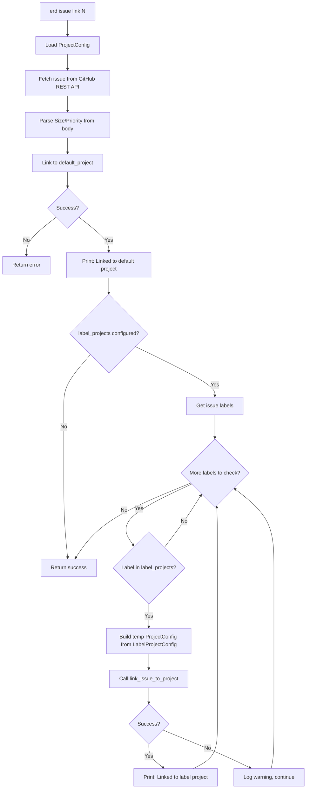
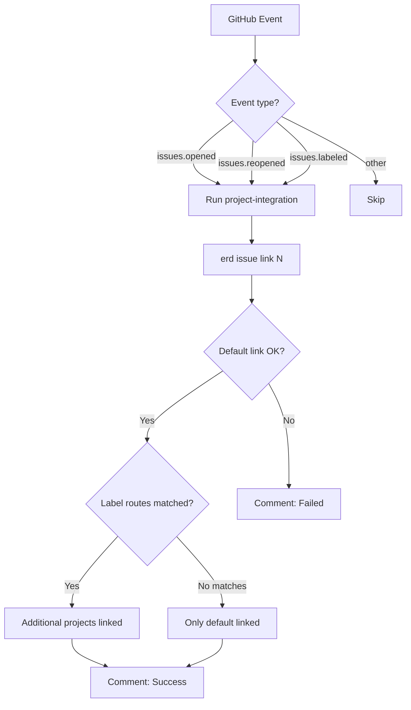

# Flowchart: #230 Label-Based Project Routing

## `execute_link` Decision Flow

```mermaid
graph TD
    A[erd issue link N] --> B[Load ProjectConfig]
    B --> C[Fetch issue from GitHub REST API]
    C --> D[Parse Size/Priority from body]
    D --> E[Link to default_project]
    E --> F{Success?}
    F -->|No| G[Return error]
    F -->|Yes| H[Print: Linked to default project]
    H --> I{label_projects configured?}
    I -->|No| Z[Return success]
    I -->|Yes| J[Get issue labels]
    J --> K{More labels to check?}
    K -->|No| Z
    K -->|Yes| L{Label in label_projects?}
    L -->|No| K
    L -->|Yes| M[Build temp ProjectConfig from LabelProjectConfig]
    M --> N[Call link_issue_to_project]
    N --> O{Success?}
    O -->|Yes| P[Print: Linked to label project]
    O -->|No| Q[Log warning, continue]
    P --> K
    Q --> K
    Z[Return success]
```

## Workflow Trigger Decision

```mermaid
graph TD
    A[GitHub Event] --> B{Event type?}
    B -->|issues.opened| C[Run project-integration]
    B -->|issues.reopened| C
    B -->|issues.labeled| C
    B -->|other| D[Skip]
    C --> E[erd issue link N]
    E --> F{Default link OK?}
    F -->|Yes| G{Label routes matched?}
    F -->|No| H[Comment: Failed]
    G -->|Yes| I[Additional projects linked]
    G -->|No matches| J[Only default linked]
    I --> K[Comment: Success]
    J --> K
```
