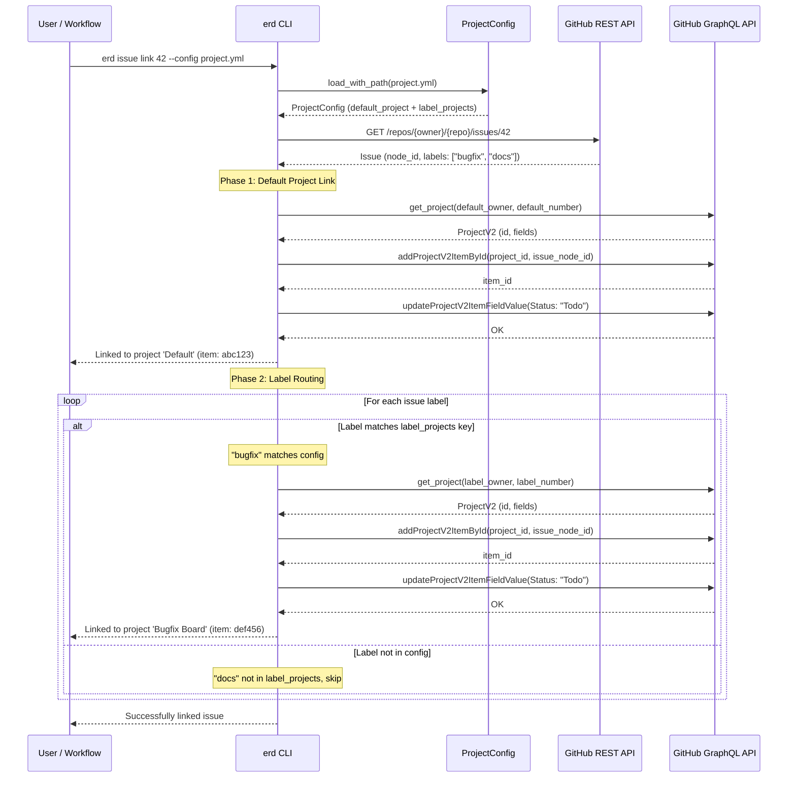
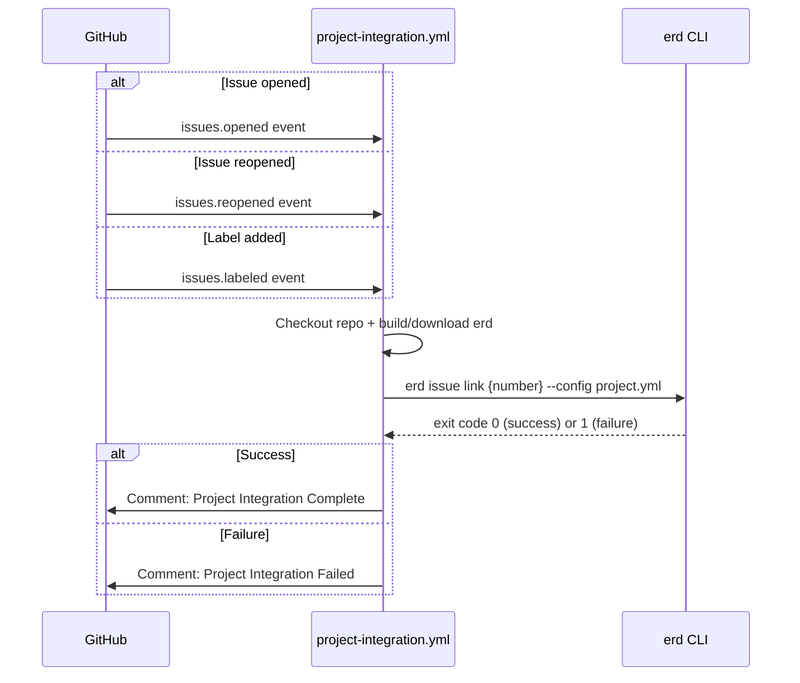

# Sequence Diagram: #230 Label-Based Project Routing

## Issue Link Flow (with Label Routing)

```mermaid
sequenceDiagram
    participant User as User / Workflow
    participant CLI as erd CLI
    participant Config as ProjectConfig
    participant API as GitHub REST API
    participant GQL as GitHub GraphQL API

    User->>CLI: erd issue link 42 --config project.yml
    CLI->>Config: load_with_path(project.yml)
    Config-->>CLI: ProjectConfig (default_project + label_projects)

    CLI->>API: GET /repos/{owner}/{repo}/issues/42
    API-->>CLI: Issue (node_id, labels: ["bugfix", "docs"])

    Note over CLI: Phase 1: Default Project Link
    CLI->>GQL: get_project(default_owner, default_number)
    GQL-->>CLI: ProjectV2 (id, fields)
    CLI->>GQL: addProjectV2ItemById(project_id, issue_node_id)
    GQL-->>CLI: item_id
    CLI->>GQL: updateProjectV2ItemFieldValue(Status: "Todo")
    GQL-->>CLI: OK
    CLI-->>User: Linked to project 'Default' (item: abc123)

    Note over CLI: Phase 2: Label Routing
    loop For each issue label
        alt Label matches label_projects key
            Note over CLI: "bugfix" matches config
            CLI->>GQL: get_project(label_owner, label_number)
            GQL-->>CLI: ProjectV2 (id, fields)
            CLI->>GQL: addProjectV2ItemById(project_id, issue_node_id)
            GQL-->>CLI: item_id
            CLI->>GQL: updateProjectV2ItemFieldValue(Status: "Todo")
            GQL-->>CLI: OK
            CLI-->>User: Linked to project 'Bugfix Board' (item: def456)
        else Label not in config
            Note over CLI: "docs" not in label_projects, skip
        end
    end

    CLI-->>User: Successfully linked issue #42 to project
```

## Workflow Trigger Flow

```mermaid
sequenceDiagram
    participant GH as GitHub
    participant WF as project-integration.yml
    participant ERD as erd CLI

    alt Issue opened
        GH->>WF: issues.opened event
    else Issue reopened
        GH->>WF: issues.reopened event
    else Label added
        GH->>WF: issues.labeled event
    end

    WF->>WF: Checkout repo + build/download erd
    WF->>ERD: erd issue link {number} --config project.yml
    ERD-->>WF: exit code 0 (success) or 1 (failure)

    alt Success
        WF->>GH: Comment: Project Integration Complete
    else Failure
        WF->>GH: Comment: Project Integration Failed
    end
```
