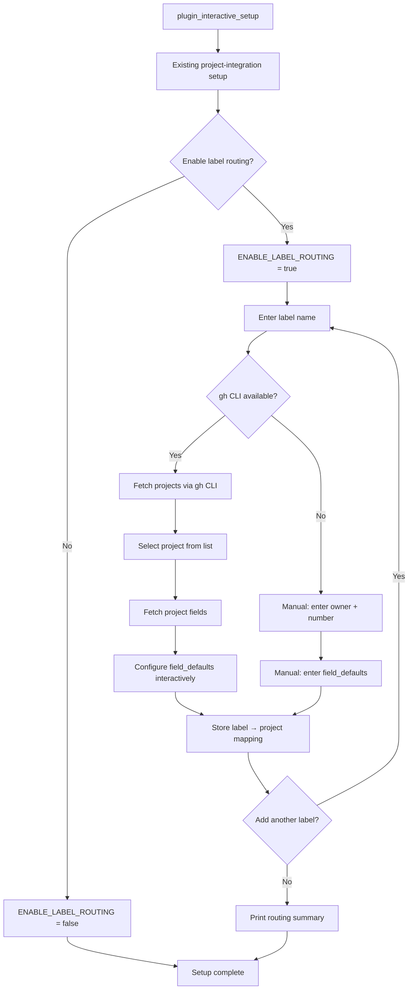
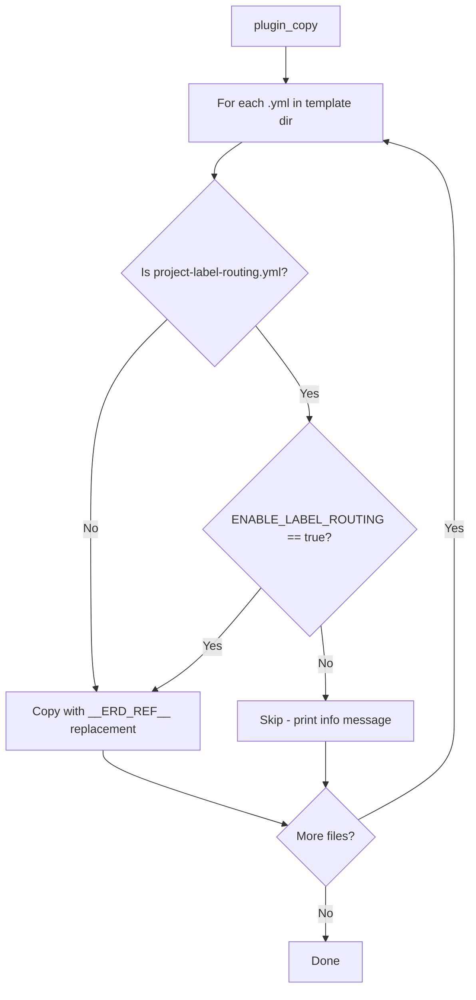
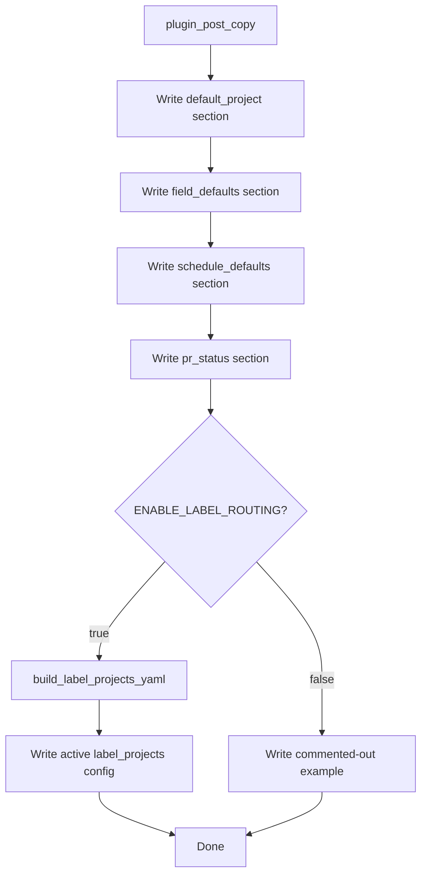

# Flowchart: #244 Label Routing Setup Flow

## Interactive Setup Flow

```mermaid
graph TD
    A[plugin_interactive_setup] --> B[Existing project-integration setup]
    B --> C{Enable label routing?}
    C -->|No| D[ENABLE_LABEL_ROUTING = false]
    D --> Z[Setup complete]
    C -->|Yes| E[ENABLE_LABEL_ROUTING = true]
    E --> F[Enter label name]
    F --> G{gh CLI available?}
    G -->|Yes| H[Fetch projects via gh CLI]
    H --> I[Select project from list]
    G -->|No| J[Manual: enter owner + number]
    I --> K[Fetch project fields]
    J --> L[Manual: enter field_defaults]
    K --> M[Configure field_defaults interactively]
    M --> N[Store label → project mapping]
    L --> N
    N --> O{Add another label?}
    O -->|Yes| F
    O -->|No| P[Print routing summary]
    P --> Z
```

## plugin_copy Flow

```mermaid
graph TD
    A[plugin_copy] --> B[For each .yml in template dir]
    B --> C{Is project-label-routing.yml?}
    C -->|No| D[Copy with __ERD_REF__ replacement]
    C -->|Yes| E{ENABLE_LABEL_ROUTING == true?}
    E -->|Yes| D
    E -->|No| F[Skip - print info message]
    D --> G{More files?}
    F --> G
    G -->|Yes| B
    G -->|No| H[Done]
```

## plugin_post_copy: project.yml Generation

```mermaid
graph TD
    A[plugin_post_copy] --> B[Write default_project section]
    B --> C[Write field_defaults section]
    C --> D[Write schedule_defaults section]
    D --> E[Write pr_status section]
    E --> F{ENABLE_LABEL_ROUTING?}
    F -->|true| G[build_label_projects_yaml]
    G --> H[Write active label_projects config]
    F -->|false| I[Write commented-out example]
    H --> J[Done]
    I --> J
```
