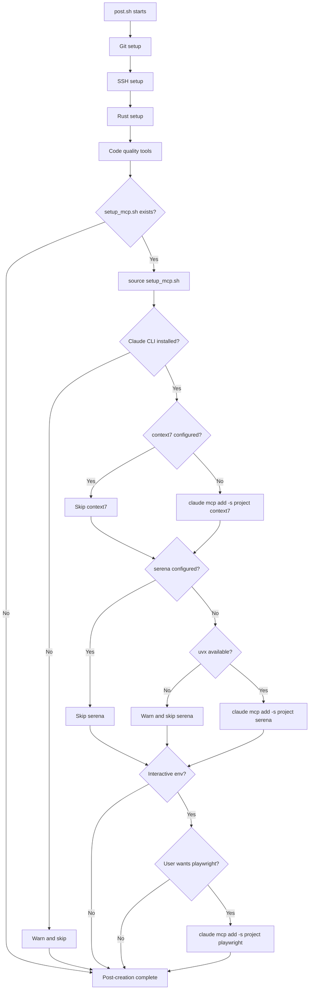

# Flowchart: #249 Change MCP Server Installation Scope

## post.sh MCP Setup Flow (After Refactoring)

```mermaid
graph TD
    A[post.sh starts] --> B[Git setup]
    B --> C[SSH setup]
    C --> D[Rust setup]
    D --> E[Code quality tools]
    E --> F{setup_mcp.sh exists?}
    F -->|No| Z[Post-creation complete]
    F -->|Yes| G[source setup_mcp.sh]
    G --> H{Claude CLI installed?}
    H -->|No| I[Warn and skip]
    I --> Z
    H -->|Yes| J{context7 configured?}
    J -->|Yes| K[Skip context7]
    J -->|No| L["claude mcp add -s project context7"]
    K --> M{serena configured?}
    L --> M
    M -->|Yes| N[Skip serena]
    M -->|No| O{uvx available?}
    O -->|No| P[Warn and skip serena]
    O -->|Yes| Q["claude mcp add -s project serena"]
    N --> R{Interactive env?}
    P --> R
    Q --> R
    R -->|No| Z
    R -->|Yes| S{User wants playwright?}
    S -->|No| Z
    S -->|Yes| T["claude mcp add -s project playwright"]
    T --> Z
```
