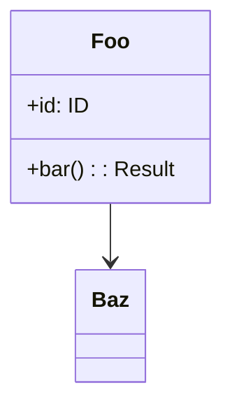
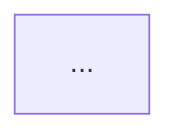

# API Specification: #257 Design artifact file contracts

This is the file-level contract between `/design`, `/implement`, and the user. Each entry defines what a file MUST contain, who writes it, and who reads it.

## File Inventory

| File | Owner (writer) | Consumers (readers) | Lifecycle |
| --- | --- | --- | --- |
| `docs/design/shared/architecture.md` | `/design` (Phase 6) | `/design`, `/implement`, humans | Snapshot — overwritten every `/design` |
| `docs/design/shared/data-model.md` | `/design` (Phase 6) | `/design`, `/implement`, humans | Snapshot |
| `docs/design/shared/api-spec.md` | `/design` (Phase 6) | `/design`, `/implement`, humans | Snapshot |
| `docs/design/shared/class.md` | `/design` (Phase 6) | `/design`, `/implement`, humans | Snapshot (Mermaid) |
| `docs/design/shared/sequence.md` | `/design` (Phase 6) | `/design`, `/implement`, humans | Snapshot (Mermaid) |
| `docs/design/shared/research/<library>.md` | `/design` (Phase 3) | `/design`, `/implement`, humans | Append (per library, not per issue) |
| `docs/design/#{issue}/design.md` | `/design` (Phase 4) | `/implement`, humans (audit) | Frozen on issue close |
| `docs/design/#{issue}/workflow.md` | `/design` (Phase 5) | `/implement`, humans | Frozen |
| `docs/design/#{issue}/flowchart.md` | `/design` (Phase 4 UML) | `/implement`, humans | Frozen (Mermaid) |
| `docs/design/#{issue}/research.md` | `/design` (Phase 3) | `/implement`, humans | Frozen |

## Schemas

### `shared/architecture.md`

```markdown
# Architecture

## Overview
<Project-wide one-paragraph description>

## Module Structure
<Directory tree of the entire project, with a one-line role description per dir>

## Layer Boundaries
<Layered/hexagonal/etc. layout. Which layer may depend on which>

## Technology Choices
<Languages, frameworks, infra. With rationale where non-obvious>

## Cross-cutting Concerns
<Logging, config, error handling, observability strategy at the project level>
```

### `shared/data-model.md`

```markdown
# Data Model

## Entities
| Entity | Fields | Description |
| --- | --- | --- |

## Type Definitions
<New shared types/structs/enums, with their invariants>

## Relationships
<Mermaid `erDiagram` or prose>

## Schemas / Migrations
<Persistent storage shape; migration history is a brief list, not full SQL>
```

### `shared/api-spec.md`

```markdown
# API Specification (Project-wide)

## Public Endpoints / Functions
| Name | Method/Signature | Description |
| --- | --- | --- |

## Input/Output Schemas
<Per endpoint or per function group>

## Error Responses
| Error | Code/Type | When |
| --- | --- | --- |

## Versioning Policy
<If applicable>
```

### `shared/class.md`

````markdown
# Class Diagram (Project-wide)


````

### `shared/sequence.md`

````markdown
# Sequence Diagram (System-wide)

## <Flow Name 1>
```mermaid
sequenceDiagram
    ...
```

## <Flow Name 2>
```mermaid
sequenceDiagram
    ...
```
````

Each named flow is a top-level `##` section. State-machine-like flows belong here too (under their own section).

### `shared/research/<library-name>.md`

```markdown
# Research: <library-name>

## Purpose in this project
<Why this library is used>

## Key APIs / Patterns
<What we rely on>

## Pitfalls / Gotchas
<Known issues, version constraints>

## References
<Links to docs, RFCs, blog posts>
```

### `#{issue}/design.md`

```markdown
# Design: #{issue} {title}

## Context
<Self-contained summary of the slice of shared/* this delta acts on. Intentional duplication for standalone readability — option (b)>

## Architecture Overview
<What this issue changes, in 1-3 paragraphs>

## Module Structure (delta)
<Only the changed/added directories and files>

## Interface Design (delta)
<New or changed interfaces. May reference shared/api-spec.md>

## Data Flow
<How this issue's logic moves data, with reference to shared sequence diagrams if relevant>

## Error Handling
<Issue-specific errors; cross-link to shared error policy>

## Implementation Notes
<Decisions, edge cases, performance, security considerations specific to this issue>
```

### `#{issue}/workflow.md`

```markdown
# Workflow: #{issue} {title}

## Implementation Steps
1. ...

## Task Dependencies
- ...

## Test Strategy
- Unit: ...
- Integration: ...
- Edge cases: ...
```

### `#{issue}/flowchart.md`

````markdown
# Flowchart: #{issue} {title}


````

Issue-local control flow only. System-wide state machines belong in `shared/sequence.md`.

### `#{issue}/research.md`

```markdown
# Research: #{issue} {title}

<Issue-specific external research. If the research generalizes, promote to shared/research/<library>.md instead>
```

## Read Contract

| Reader | Files MUST be read |
| --- | --- |
| `/design` Phase 2 (load shared) | All files under `docs/design/shared/` |
| `/design` Phase 6 (snapshot) | All files under `docs/design/shared/` (re-read in case of out-of-band edits) |
| `/implement` Phase 1 | All files under `docs/design/shared/` AND all files under `docs/design/#{issue}/` |
| Humans auditing issue X | `docs/design/#{X}/design.md` is sufficient (option **b** — self-contained) |
| Humans understanding "current state" | `docs/design/shared/*` is authoritative |

## Write Contract

| Writer | Files MAY be written |
| --- | --- |
| `/design` Phase 6 | `docs/design/shared/*` (snapshot regeneration only — never append a `## Issue #N` section) |
| `/design` Phase 3-5 | `docs/design/#{issue}/*` |
| `/design` Phase 1.5 (migration) | Initial seed of `docs/design/shared/*`. Existing `#{issue}/*` MUST NOT be modified. |
| `/implement` | (none — read-only with respect to docs/design) |

## Backward Compatibility

This change has **no backward compatibility requirements** (per Constraints in the Issue). After the migration runs once, the new structure is canonical. The pre-existing `#{issue}/design.md` files remain readable in their old form but are no longer the primary source of cumulative truth.

## Versioning

Not applicable — these are skill-internal contracts, not external APIs. Skill changes are versioned through git history.
