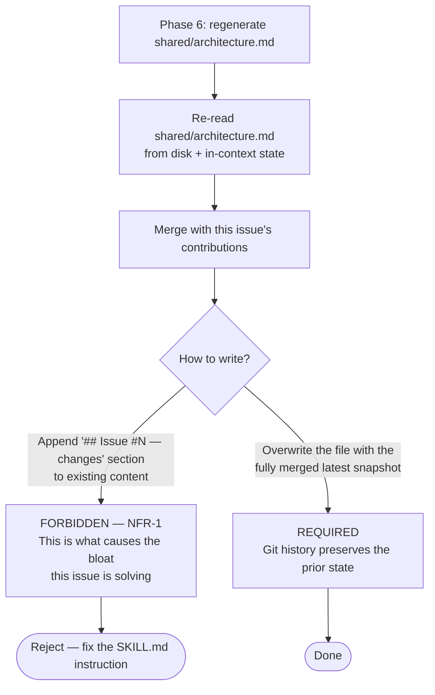

# Flowchart: #257 Separate shared and issue-specific design artifacts

## Content placement decision (where does this content go?)

When authoring or updating a piece of design content, use this flowchart to decide whether it belongs in `shared/`, `#{issue}/`, or both.

```mermaid
graph TD
    Start[New / changed design content] --> Q1{Is the content a reusable<br/>fact about the project<br/>as a whole?}

    Q1 -->|No, only this issue| IssueOnly[Write to docs/design/#{issue}/ only]
    Q1 -->|Yes| Q2{What kind?}

    Q2 -->|Module / layer boundary| ARCH[Update shared/architecture.md<br/>+ note in #{issue}/design.md]
    Q2 -->|Entity / type / schema| DATA[Update shared/data-model.md<br/>+ note in #{issue}/design.md]
    Q2 -->|Public API / interface| API[Update shared/api-spec.md<br/>+ note in #{issue}/design.md]
    Q2 -->|Class structure| CLASS[Update shared/class.md<br/>+ note in #{issue}/design.md]
    Q2 -->|System-wide sequence<br/>or state machine| SEQ[Update shared/sequence.md only]
    Q2 -->|Library research<br/>reusable across issues| RESEARCH[Write shared/research/<lib>.md]
    Q2 -->|Issue-local control flow<br/>or decision tree| FLOW[Write #{issue}/flowchart.md only]

    IssueOnly --> Done([Done])
    ARCH --> Snapshot
    DATA --> Snapshot
    API --> Snapshot
    CLASS --> Snapshot
    SEQ --> Snapshot
    RESEARCH --> Done
    FLOW --> Done

    Snapshot[Phase 6 regenerates the affected<br/>shared/*.md as a full snapshot.<br/>NO append-style sections.] --> Done
```

## Migration trigger logic

This is the decision performed at the start of every `/design` invocation to determine whether the one-shot migration must run.

```mermaid
graph TD
    Start[/design <issue> invoked] --> A{shared/ exists?}
    A -->|Yes| Continue[Proceed with normal Phase 2:<br/>Load shared/* into context]
    A -->|No| B{Any prior #{issue}/<br/>directories exist?}

    B -->|No| LazyInit[Skip migration.<br/>shared/* will be created lazily<br/>during Phase 6 of THIS issue.]
    B -->|Yes| Migrate[Run _shared/design-migration<br/>to bootstrap shared/* from existing artifacts]

    Migrate --> Verify{All 5 shared files<br/>created successfully?}
    Verify -->|Yes| Continue
    Verify -->|No| Error[Report error to user.<br/>Do NOT proceed.]

    LazyInit --> Continue
    Continue --> Done([Phase 3 onward])
```

## Snapshot regeneration discipline

Phase 6 of `/design` regenerates `shared/*`. This flowchart shows the **forbidden** vs **required** patterns.


