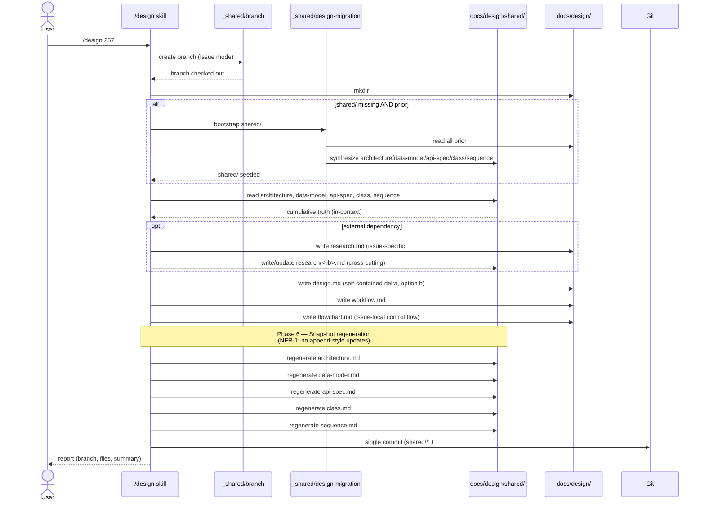
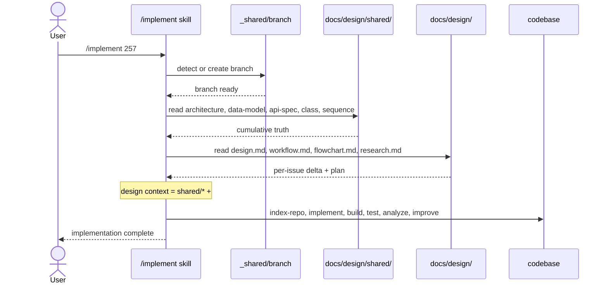

# Sequence Diagram: #257 Separate shared and issue-specific design artifacts

## `/design` Flow with shared/ layer



## `/implement` Flow (input contract)



## Migration (one-shot bootstrap)

```mermaid
sequenceDiagram
    participant Design as /design skill
    participant Migration as _shared/design-migration
    participant Issue as docs/design/#{old}/
    participant Shared as docs/design/shared/

    Design->>Migration: shared/ missing, but #{old_issue}/ exist — bootstrap
    Migration->>Issue: list directories (#NNN and NNN forms)
    Migration->>Issue: read design.md from each (chronological order)
    Issue-->>Migration: cumulative content

    Migration->>Migration: synthesize shared layers
    Migration->>Shared: write architecture.md
    Migration->>Shared: write data-model.md
    Migration->>Shared: write api-spec.md
    Migration->>Shared: write class.md
    Migration->>Shared: write sequence.md

    Note over Migration,Issue: existing #{old}/ files are PRESERVED unchanged (FR-5)

    Migration-->>Design: shared/ seeded; proceed with normal /design flow
```
