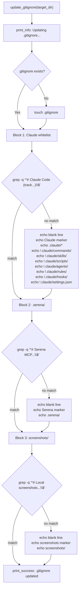
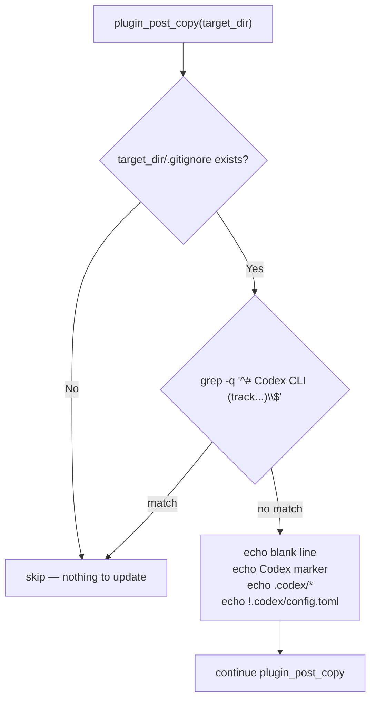

# Flowchart: #259 `update_gitignore()` per-block branching

Issue-local control flow inside `update_gitignore()` (and the analogous Codex plugin gitignore step). Each block is independently marker-guarded; partial application is supported by design.

## `update_gitignore()` — three blocks

## Codex plugin gitignore step — single block

The Codex block is gated by `[[ -f "$gitignore" ]]`, not by `touch` — `update_gitignore()` runs first in the `setup.sh` pipeline and is responsible for creating the file. The Codex plugin only appends.
