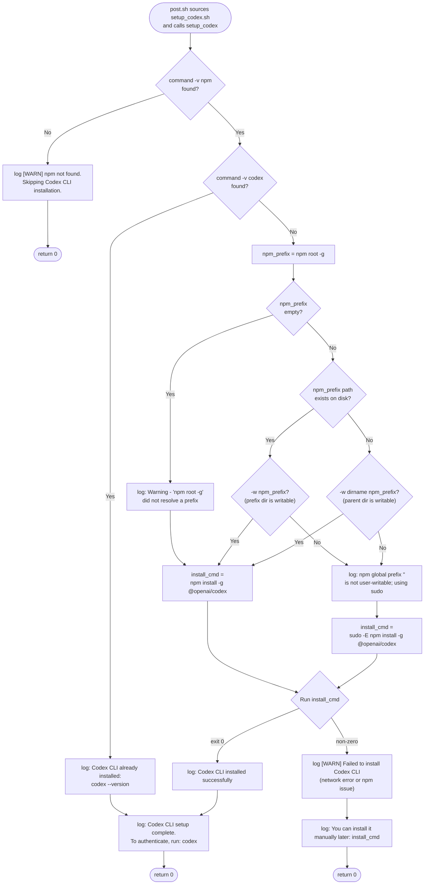

# Flowchart: #261 `setup_codex()` install decision tree

The `setup_codex()` function in `.devcontainer/scripts/setup_codex.sh` makes its install decisions based on three runtime signals — whether `npm` is available, whether `codex` is already installed, and whether the npm global prefix can be written by the current user. The branching matters because the wrong choice (no sudo where sudo is needed) is the exact failure that the original `templates/codex/setup_codex.sh` exhibits under the `claude-code:1.0` devcontainer feature.

## Decision rationale

The two-pronged write check (existing dir vs. parent dir) is necessary because `npm install -g` writes **into** the prefix when it already exists, but creates the prefix if it does not. Writability requirements differ between those two cases — checking only `-w "$npm_prefix"` would falsely report "needs sudo" for a soon-to-be-created prefix whose parent is writable, while checking only the parent would falsely report "no sudo" for an existing root-owned prefix.

Empty `npm_prefix` (the third branch) is treated optimistically — we attempt the install without sudo and let `npm` itself report the EACCES if it happens. Returning `0` from a failed install is intentional: post.sh runs under `set -e`, and we do not want a Codex install hiccup to abort the entire devcontainer post-create. The user can rerun `npm install -g @openai/codex` manually later — the WARN log makes that path discoverable.

All three return points (`Return 0a/b/c`) are intentional: this function is contractually idempotent and non-fatal under `set -e` in `post.sh`, matching the `setup_plugins.sh` invariant documented in `shared/api-spec.md::Setup / Plugin Surface`.
