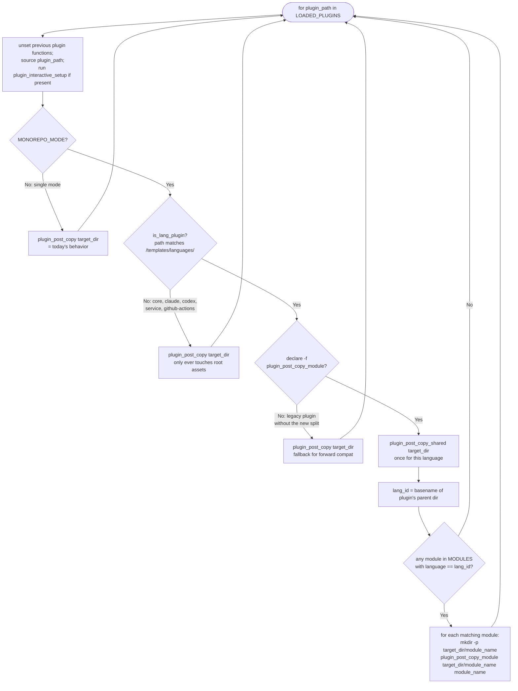

# Flowchart: #263 setup.sh main flow with monorepo / add-module branching

The decision tree inside `setup.sh::main()` after argument parsing and project-name resolution. Captures how the script chooses among three operating modes (single, monorepo init, add-module) and how the post-copy dispatcher then differs by mode. Single-mode path (the leftmost branch) is byte-identical to today's behavior (NFR-1).

## Mode selection

```mermaid
flowchart TD
    Start([main: parsed args, PROJECT_NAME resolved]) --> A{IS_ADD_MODULE_MODE<br/>(--add-module given)?}
    A -->|Yes| AM1{detect_existing_monorepo<br/>cwd?}
    AM1 -->|No: no modules.json| ERR1[print_error: 'Run with --monorepo first']
    ERR1 --> Exit1([exit 1])
    AM1 -->|Yes| AM2{ADD_MODULE_NAME +<br/>ADD_MODULE_LANG given via CLI?}
    AM2 -->|Yes| AM3[set MODULES = (name:lang)]
    AM2 -->|No, but TTY| AM4[prompt_add_module → MODULES]
    AM2 -->|No TTY| ERR2[print_error: required in non-interactive]
    ERR2 --> Exit1
    AM3 --> AM5
    AM4 --> AM5

    A -->|No| B{MONOREPO_MODE<br/>(--monorepo or --module)?}
    B -->|Yes| MI1{any --module flags?}
    MI1 -->|Yes| MI2[MODULES already populated by parser]
    MI1 -->|No, TTY| MI3[prompt_module_loop → MODULES]
    MI1 -->|No TTY| ERR3[print_error: --monorepo requires --module in non-interactive]
    ERR3 --> Exit1
    MI2 --> MI4
    MI3 --> MI4

    B -->|No| C{detect_existing_monorepo<br/>cwd?}
    C -->|Yes, TTY| C1{prompt: 'Existing monorepo<br/>detected. Add a module? y/n'}
    C1 -->|y| C2[prompt_add_module → set IS_ADD_MODULE_MODE=true,<br/>MODULES = (name:lang)]
    C1 -->|n| Exit0a([exit 0])
    C -->|Yes, no TTY| Exit0b([exit 0: nothing to do])
    C -->|No, TTY| C3{prompt_monorepo_mode<br/>'Monorepo? y/n [n]'}
    C3 -->|y| C4[prompt_module_loop → MODULES,<br/>set MONOREPO_MODE=true]
    C3 -->|n| SINGLE
    C -->|No, no TTY| SINGLE[Single-mode flow<br/>existing behavior]
    C2 --> AM5
    C4 --> MI4

    AM5[derive SELECTED_LANGUAGES from MODULES]
    MI4[derive SELECTED_LANGUAGES from MODULES]

    AM5 --> SVCa{prompt_service_selection<br/>filtered by list_existing_<br/>compose_services<br/>FR-10}
    MI4 --> SVCb[prompt_service_selection<br/>full AVAILABLE_SERVICES]

    SVCa --> CONF
    SVCb --> CONF
    SINGLE --> CONF

    CONF[Confirm + load_selected_plugins +<br/>execute_plugin_copies +<br/>execute_plugin_dockerfiles] --> POST{Mode?}

    POST -->|Single| POST_S[execute_plugin_post_copies in single mode<br/>= today's behavior]
    POST -->|Monorepo init| POST_M[execute_plugin_post_copies in monorepo mode<br/>see 'Per-plugin dispatch' below]
    POST -->|Add module| POST_A[same as monorepo mode<br/>but MODULES has 1 entry,<br/>and core plugin appends to existing modules.json]

    POST_S --> END[replace_placeholders +<br/>update_gitignore +<br/>GitHub repo setup]
    POST_M --> END
    POST_A --> END
    END --> Done([Setup complete])
```

## Per-plugin post-copy dispatch (in `execute_plugin_post_copies`)



## Add-module conflict resolution (FR-9)

```mermaid
flowchart TD
    AM([add-module flow: MODULES has 1 new entry]) --> CHK{find_module_by_name<br/>cwd, name?}
    CHK -->|Not present| WRITE[execute_plugin_post_copies<br/>+ core plugin appends to modules.json]
    CHK -->|Present| OW{--overwrite flag set?}
    OW -->|Yes| WRITE
    OW -->|No, TTY| PROMPT{prompt: 'Module already exists.<br/>Overwrite? y/n [n]'}
    PROMPT -->|n| SKIP[print_info 'Skipped'; exit 0]
    PROMPT -->|y| WRITE
    OW -->|No, no TTY| FAIL[print_error 'Module exists; use --overwrite']
    FAIL --> X([exit 1])
    SKIP --> Y([exit 0])
    WRITE --> Z([continue with normal completion])
```

## Notes

- The leftmost branch in the mode-selection chart (no `--add-module`, no `--monorepo`, no existing `modules.json`) reaches `SINGLE` directly with no new prompts and runs the unchanged single-mode flow — this is the behavioral guarantee for NFR-1.
- The "auto-detect on existing modules.json" path (interactive only) is the implicit add-module ergonomic that the user prioritized in Q6a (i): a fresh `./setup.sh` run inside an existing monorepo offers to add a new module without requiring the user to remember `--add-module`. In a non-TTY environment, the same condition results in a clean exit 0 (nothing to do without explicit `--add-module`), which avoids accidentally re-running init in CI.
- The dispatcher's "fallback for forward compat" (`D5: declare -f plugin_post_copy_module → No`) ensures that if an older language plugin is still present (e.g., a third-party plugin not migrated to the split), it continues to work in single mode and runs in monorepo mode against the project root (not per-module). This is suboptimal for that specific plugin's monorepo behavior but does not break the orchestrator.
- Service plugins reach `D4` in both modes — they only touch root assets (`docker-compose.yml`, `.devcontainer/devcontainer.json`, `post.sh`) and rely on `{{PROJECT_NAME}}` substitution to produce monorepo-correct service names.
