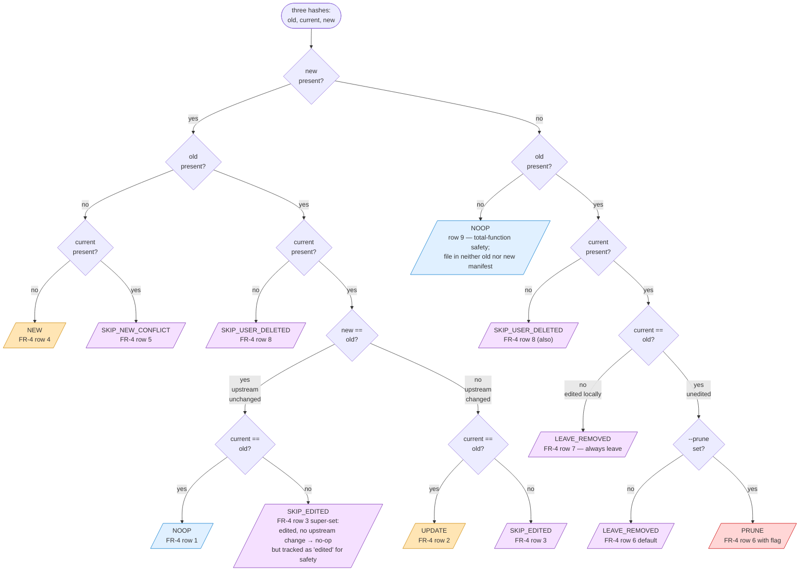

# Flowchart: #265 manifest lifecycle decision

The `manifest_decide` function takes three hashes — `old` (from the existing manifest), `current` (sha256 of the user's current file, or `-` if absent), and `new` (sha256 of the staging-area file produced by re-running plugins, or `-` if absent) — and emits exactly one of 8 lifecycle decisions. This is the single place where "did the user edit this file" is interpreted: the predicate is `current == old`.

The flowchart below mirrors the state table in `design.md` :: "manifest_decide state table". It is intended for the implementer building Step 3.4 and the test author writing the FR-4 row coverage.



## Notes on the SKIP_EDITED1 case

When `new == old` (upstream unchanged) but the user has edited the file (`current != old`), the formal lifecycle is "no upstream change to apply" — i.e. no overwrite happens regardless of user edits. The decision could be `NOOP`. We deliberately classify it as `SKIP_EDITED` (with a special "no upstream change" sub-flag in the summary) so:

1. The user is *informed* that they have local edits to a tracked file (useful diagnostic).
2. The summary's "Skipped (edited)" bucket gives a complete audit of every file the upgrade declined to touch *because* of edits.

In `manifest_apply` both `SKIP_EDITED1` and `SKIP_EDITED2` produce identical filesystem behavior (no change) but the diff-summary line indicates `(=)` for the unchanged-upstream case so the user knows there was nothing to lose.

## How this maps onto `setup.sh --upgrade`'s outer loop

```text
for each path in OLD ∪ NEW:
    old_h     = OLD.files[path]                  # "" if absent
    new_h     = NEW.files[path]                  # "" if absent (no entry in staged manifest)
    current_h = sha256_file(target/path) or ""   # "" if user deleted

    decision = manifest_decide old_h current_h new_h
    manifest_apply decision staging/path target/path
```

`manifest_apply` is the only function that touches the filesystem (when `DRY_RUN=false`). Tally counters and per-decision file-list arrays are updated inside `manifest_apply` so `manifest_summary_print` has everything it needs at the end of the loop.
