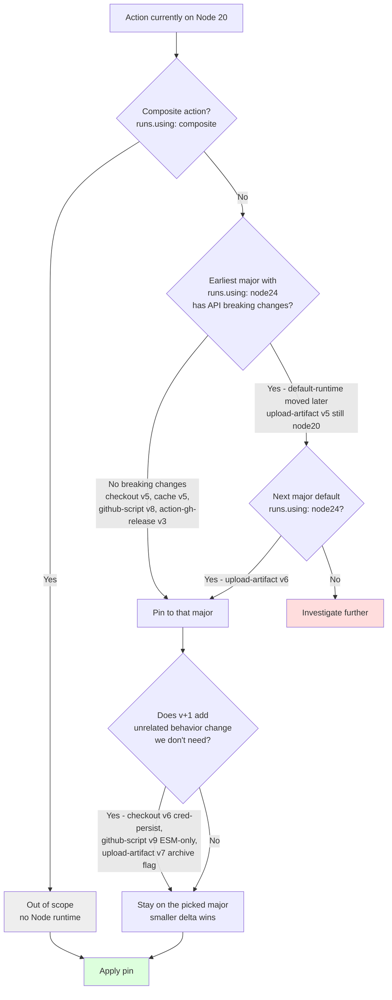
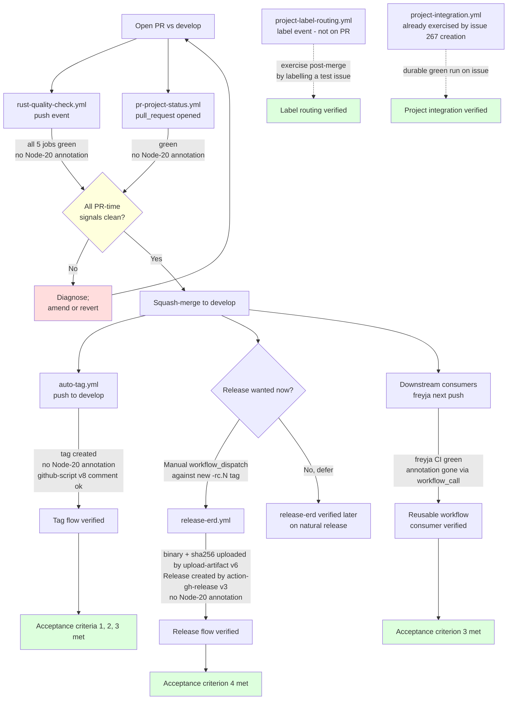

# Flowchart: #267 — Node 24 migration decision + verification

Two diagrams. Issue-local control flow / decision tree (per `_shared/design` UML auto-detection); class and system-wide sequence diagrams have no delta for this issue and live in `../shared/`.

## Per-action target selection

For each affected JS action, follow the same rule: **pin to the earliest major whose `action.yml` declares `runs.using: node24`**. The `research.md` per-action verification feeds directly into this tree.

Concrete outcomes (verified in `research.md` :: Question 2):

| Action | Composite? | Earliest Node-24 major (default) | v+1 quirk | Final pin |
| --- | --- | --- | --- | --- |
| `dtolnay/rust-toolchain` | Yes | n/a | n/a | unchanged (`@stable`) |
| `taiki-e/install-action` | Yes | n/a | n/a | unchanged |
| `actions/checkout` | No | `v5` | `v6` adds cred-persist | `@v5` |
| `actions/cache` | No | `v5` | n/a observed | `@v5` |
| `actions/github-script` | No | `v8` | `v9` ESM-only `@actions/github` | `@v8` |
| `actions/upload-artifact` | No | `v6` (v5 default still node20) | `v7` adds `archive: false` | `@v6` |
| `softprops/action-gh-release` | No | `v3` | n/a observed | `@v3` |

## Migration → verification signal mapping

Where each acceptance criterion gets its evidence. Branches show parallelism: PR-time signals fire concurrently; post-merge signals fan out from the squash-merge commit.

Six workflows, six independent verification signals. Two (`project-integration.yml`, `project-label-routing.yml`) need a manual nudge or are already covered by the issue's own lifecycle; the other four are exercised naturally by the PR + merge flow.
