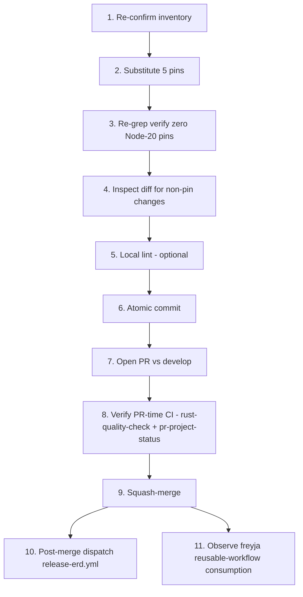

# Workflow: #267 — GitHub Actions Node 24 migration

Implementation steps for the version-pin refresh described in `design.md`. Linear, single-PR delivery.

## Implementation Steps

1. **Re-confirm the inventory on HEAD.** Run a single grep on `.github/workflows/*.yml` to enumerate every `uses: <owner>/<action>@<ref>` line and its file/line, using the regex `^\s*-?\s*uses:\s*[A-Za-z0-9._/-]+@[A-Za-z0-9._-]+`. This catches drift since the issue was filed (≈the current count is 37 substitutable lines per `design.md` vs 33 quoted in the issue body — most likely from the project-label-routing workflow not being counted in the issue's inventory). Save the count for the commit message.

2. **Substitute the five action pins.** Across all 6 root workflow files, perform these literal-string replacements:

   | From | To |
   | --- | --- |
   | `actions/checkout@v4` | `actions/checkout@v5` |
   | `actions/cache@v4` | `actions/cache@v5` |
   | `actions/github-script@v7` | `actions/github-script@v8` |
   | `actions/upload-artifact@v4` | `actions/upload-artifact@v6` |
   | `softprops/action-gh-release@v2` | `softprops/action-gh-release@v3` |

   Implementation tactic: 5 separate `Edit … replace_all=true` calls per file (or a single `sed -i` invocation across all six files). Either approach is byte-equivalent. Do not touch `dtolnay/rust-toolchain@stable` or `taiki-e/install-action@cargo-llvm-cov` — both are composite actions and are not affected by the deprecation.

3. **Re-grep to verify zero remaining Node-20 pins.** Re-run the same regex from Step 1 on the modified tree; confirm the only `@v...` references are the new majors plus the two composite actions. The exact assertion: `grep -nE 'actions/(checkout|cache|github-script|upload-artifact)@v(4|7)|softprops/action-gh-release@v2' .github/workflows/*.yml` returns no lines.

4. **Re-render the diff for review.** Inspect with `git diff .github/workflows/` to confirm only version-pin lines changed. There should be **no** YAML structural changes — same indentation, same `with:` blocks, same `if:` guards. Anything else would indicate an editor or sed mishap.

5. **Run any local validation that the repo provides.** Tarnished does not currently lint workflow YAML in CI itself (no `actionlint` job), but a local `actionlint .github/workflows/*.yml` if available would catch typos. Skip if the tool is not installed.

6. **Commit the change set.** One atomic commit, message: `chore(ci): migrate GitHub Actions to Node.js 24-native versions`. Body: short summary of the five bumps + the count + reference to issue #267 (e.g., `Refs #267`).

7. **Open the PR against `develop`.** Title: `chore(ci): migrate GitHub Actions off Node.js 20 (#267)`. Body covers:
   - Why (deprecation timeline; `research.md` :: Question 1).
   - What (the five bumps, version-table copy from `design.md`).
   - Verification plan (PR-time signals + post-merge plan).
   - Downstream impact note (no freyja-side change required).

8. **Verify PR-time CI.** Three workflows fire on the PR open + push:
   - `rust-quality-check.yml` (push event on the branch) — must be green.
   - `pr-project-status.yml` (PR opened) — must be green; comments on the PR.
   - `project-integration.yml` is **issue**-event-only, so it does not fire on the PR. (Already exercised by issue #267's own creation; the green run on the issue is durable evidence.)
   
   For each of the workflows that ran, confirm in the workflow run logs that **the Node.js 20 deprecation annotation is gone**. This is the primary acceptance criterion.

9. **Merge to `develop`.** After approval, squash-merge. The squash commit then triggers `auto-tag.yml`, completing the fourth verification signal (the auto-tag flow exercises both `actions/checkout@v5`, `actions/cache@v5`, and `actions/github-script@v8` on the merge commit).

10. **Post-merge: smoke-test `release-erd.yml`.** Manually `gh workflow run release-erd.yml --field tag=<some-rc-tag>` against the resulting auto-tag (`-rc.N`). Confirm the binary uploads, the sha256 file is generated by `actions/upload-artifact@v6`, and the GitHub Release is created by `softprops/action-gh-release@v3`. This is the fifth signal — the only one not exercised by the natural PR-merge flow.

11. **Post-merge: confirm freyja's reusable-workflow consumption.** On freyja's next push to its development branch, confirm the consumed reusable workflows (`auto-tag.yml`, `pr-project-status.yml`, `project-integration.yml`) are green and free of the Node-20 deprecation annotation. No freyja-side change is required; this is a passive observation.

## Task Dependencies

- Steps 1-6 are local; no CI involvement.
- Step 7 opens the PR (the first action visible to GitHub).
- Step 8 is the primary gate before merge — every checked workflow must show no Node-20 annotation.
- Steps 10 and 11 run in parallel after merge; neither blocks the other.

## Test Strategy

The change is a configuration-only delta with no logic, so there is no unit / integration test to write. Verification is observational:

### What to verify (per workflow)

| Workflow | Trigger that exercises it during the change set | Pass criterion |
| --- | --- | --- |
| `rust-quality-check.yml` | Push to the feature branch (on PR open), and on develop after merge | All five jobs (`check`, `clippy`, `fmt`, `unit-test`, `integration-test`) pass, **no Node-20 deprecation annotation** on any job |
| `pr-project-status.yml` | PR opened against `develop` | Green; comments on PR; **no Node-20 deprecation annotation** |
| `project-integration.yml` | Issue creation (already happened for #267) | Green run from issue creation is durable evidence |
| `project-label-routing.yml` | Adding a label to an existing issue | Manually exercise post-merge by adding/removing a `bugfix` label on a throwaway test issue, OR rely on natural label events from subsequent issue activity |
| `auto-tag.yml` | Squash-merge of this PR to `develop` | Auto-tag job creates a new `-rc.N` tag; **no Node-20 deprecation annotation** |
| `release-erd.yml` | Manual `workflow_dispatch` post-merge against the new `-rc.N` tag | Binary + sha256 uploaded; Release created with v3 of `action-gh-release`; **no Node-20 deprecation annotation** |

### Edge cases to cover

- **Reusable-workflow caller vs. callee runtime semantics** — confirmed in `research.md` :: Question 6 that the callee's pins are what execute. No edge case beyond observation: freyja's CI run after our merge.
- **Cache compatibility v4 → v5** — confirmed compatible. No edge case.
- **`softprops/action-gh-release@v3` input compatibility** — confirmed all our inputs supported. Verified by Step 10 (manual release dispatch).
- **Self-hosted runner regression** — none of our consumers (freyja, tarnished itself) use self-hosted runners. If a future consumer did, the failure mode would be a clear runner-version error message that is self-diagnosable.

### Roll-back

If post-merge any workflow regresses with a hard failure attributable to the upgrade:

1. `git revert <merge-commit>` on develop.
2. Open a follow-up issue documenting the regression and the specific action that misbehaved.
3. Either pin that one action to its v4/v7/v2 + `FORCE_JAVASCRIPT_ACTIONS_TO_NODE24=true` (transitional) until upstream fixes, or wait for an upstream patch.

The roll-back is purely textual — six files restored — with no data implications.
