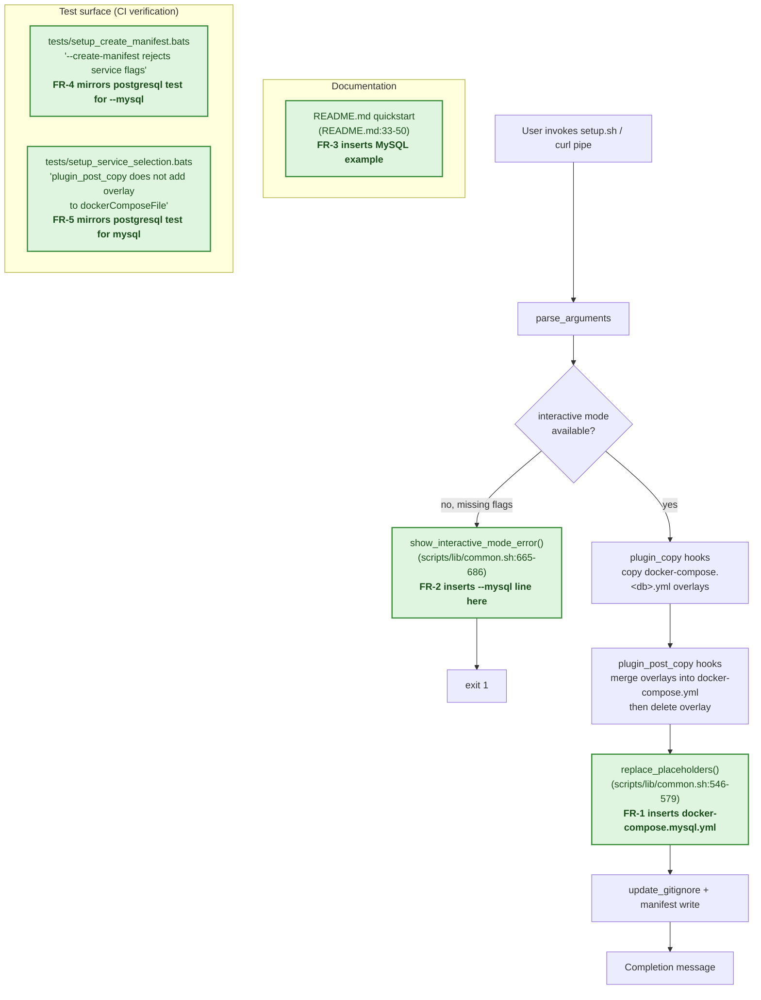

# Flowchart: #269 MySQL parity insertion points

This flowchart maps each FR to the existing setup.sh / test pipeline location
where the insertion happens. The diagram is read-only annotation of an
existing pipeline — no new branching is introduced.

Legend: green nodes are existing locations where this issue inserts a single
new line, block, or test mirroring the postgresql equivalent. No node is
removed or restructured.

## Per-FR insertion summary

| FR | File | Anchor | Insertion |
| --- | --- | --- | --- |
| FR-1 | `scripts/lib/common.sh` | `replace_placeholders()` `files=()` array (line ~558) | `"${target_dir}/docker-compose.mysql.yml"` |
| FR-2 | `scripts/lib/common.sh` | `show_interactive_mode_error()` help block (line ~679) | `echo "  --mysql               Include MySQL database support"` |
| FR-3 | `README.md` | Monorepo quickstart block (line ~40-46) | MySQL alternative example or inline annotation |
| FR-4 | `tests/setup_create_manifest.bats` | After existing postgresql rejection test (line ~109) | `@test "--create-manifest rejects --mysql"` block |
| FR-5 | `tests/setup_service_selection.bats` | Inside `# MySQL plugin_post_copy Integration Tests` section (line ~471-473), before existing test | `@test "plugin_post_copy does not add docker-compose.mysql.yml to dockerComposeFile"` block |
