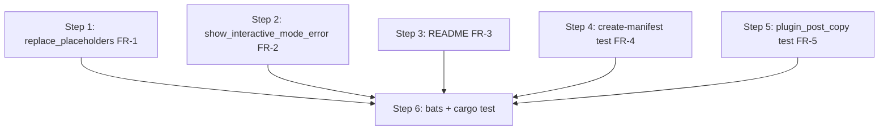

# Workflow: #269 Bring MySQL service templates to parity with PostgreSQL

## Implementation Steps

### Step 1: Extend `replace_placeholders()` file list (FR-1)

- **Action**: Insert `"${target_dir}/docker-compose.mysql.yml"` into the
  hardcoded `files=()` array.
- **Files**: `scripts/lib/common.sh` (around line 558, after the
  `docker-compose.postgresql.yml` entry)
- **Depends on**: none
- **Done when**:
  - `grep -n "docker-compose.mysql.yml" scripts/lib/common.sh` matches the
    `replace_placeholders()` block.
  - `bash -n scripts/lib/common.sh` passes (syntax check).

### Step 2: Extend `show_interactive_mode_error()` help block (FR-2)

- **Action**: Insert one `echo "  --mysql               Include MySQL database support"` line in the
  printed help, immediately after the `--postgresql` line.
- **Files**: `scripts/lib/common.sh` (around line 680)
- **Depends on**: none (independent of Step 1; can be parallelized in a single
  edit pass)
- **Done when**:
  - The help block contains both `--postgresql` and `--mysql`, with matching
    indentation and column alignment.
  - `bash -n scripts/lib/common.sh` passes.

### Step 3: Add MySQL quickstart example to README (FR-3)

- **Action**: In the monorepo non-interactive example block (`README.md:40-46`),
  surface MySQL as an alternative to PostgreSQL — either as a second example
  command or as an inline "or `--mysql`" annotation.
- **Files**: `README.md`
- **Depends on**: none
- **Done when**:
  - A reader scanning `README.md` sees both `--postgresql` and `--mysql`
    referenced in the quickstart prose.
  - Markdown lint / formatter (if any) is unchanged at the file level.

### Step 4: Add `--create-manifest --mysql` rejection test (FR-4)

- **Action**: Add a new `@test` block mirroring the existing postgresql
  rejection test (`tests/setup_create_manifest.bats:105-109`).
- **Files**: `tests/setup_create_manifest.bats`
- **Depends on**: none (the bats assertion checks an existing rejection that
  already covers `--mysql`; this test only documents it).
- **Done when**:
  - `bats tests/setup_create_manifest.bats` includes the new test and passes.

### Step 5: Add MySQL `plugin_post_copy` overlay-cleanup test (FR-5)

- **Action**: In the existing `# MySQL plugin_post_copy Integration Tests`
  section (`tests/setup_service_selection.bats:471-473`), add a `@test
  "plugin_post_copy does not add docker-compose.mysql.yml to dockerComposeFile"`
  block mirroring the postgresql test at line 238. Place it before the
  existing `adds DB service to runServices` test so the section's test pair
  ends up in the same order as the PostgreSQL section.
- **Files**: `tests/setup_service_selection.bats`
- **Depends on**: none
- **Done when**:
  - `bats tests/setup_service_selection.bats` includes the new test and
    passes.
  - The MySQL section now has two `plugin_post_copy` tests (matching the
    PostgreSQL section count).

### Step 6: Run full test suites

- **Action**:
  - `bats tests/` — all bats files pass (setup_service_selection,
    setup_create_manifest, plugin_idempotency, plugin_tracking, manifest,
    setup_upgrade, setup_language_selection).
  - `cargo test` — Rust integration tests still pass (we touched no Rust).
- **Files**: none (read-only verification)
- **Depends on**: Steps 1–5
- **Done when**:
  - `bats tests/` reports zero failures and the new MySQL tests appear in the
    output.
  - `cargo test` reports zero failures.

## Task Dependencies

- Steps 1, 2, 3, 4, 5 are independent — they touch different parts of
  different files (or different files entirely) and can be done in any order
  or in a single batched edit pass.
- Step 6 depends on all of Steps 1–5 to verify the merged outcome.



## Test Strategy

### Unit Tests

Not applicable — no new functions, no new types. The shell sites changed are
already covered by the existing test suites in scope.

### Integration Tests (new, this issue)

- `tests/setup_create_manifest.bats` :: `@test "--create-manifest rejects
  --mysql"` — guards against the rejection logic regressing for MySQL
  specifically.
- `tests/setup_service_selection.bats` :: `@test "plugin_post_copy does not
  add docker-compose.mysql.yml to dockerComposeFile"` — guards against the
  mysql plugin polluting `dockerComposeFile` with the overlay (mirror of the
  postgresql test).

### Existing Tests (must continue to pass)

- `tests/setup_service_selection.bats` — all PostgreSQL and MySQL plugin
  interface, template-file, and merge tests (~lines 121-468 + ~lines 357-531).
- `tests/setup_create_manifest.bats` — manifest mode flag-rejection tests
  (lines 80-115).
- `tests/plugin_tracking.bats` — `services/mysql` and `services/postgresql`
  plugin_copy tracking tests.
- `tests/plugin_idempotency.bats` — both DB plugins (currently `skip`-ed under
  the #265 follow-up TODO; unchanged here).
- `tests/setup_upgrade.bats`, `tests/manifest.bats`,
  `tests/setup_language_selection.bats` — unrelated paths; should be
  byte-identical outcomes.
- `cargo test` — Rust crate is untouched.

### Edge Cases

- **`replace_placeholders` against a target lacking the mysql overlay**: the
  `for f in files; if -f f; then …` guard makes the new entry a no-op when
  `docker-compose.mysql.yml` is not present (existing pattern for the other
  overlays — confirmed by the surrounding code).
- **Help-text column alignment**: the new `--mysql` line must align visually
  with `--postgresql`, `--redis`, etc. (target ~22-char left pad). Verify by
  visual diff of the printed `show_interactive_mode_error()` block.
- **README example ordering**: ensure the MySQL example does not break any
  existing internal-link anchors or headings.
- **Test placement order**: place the new MySQL tests adjacent to their
  PostgreSQL counterparts so future readers can audit parity at a glance.

### Verification commands

```bash
# Syntax sanity
bash -n scripts/lib/common.sh

# Targeted bats files (fast)
bats tests/setup_create_manifest.bats
bats tests/setup_service_selection.bats

# Full bats suite
bats tests/

# Rust suite (untouched but verifies no regression)
cargo test
```
