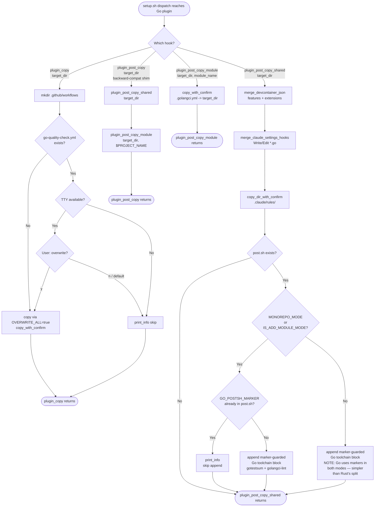
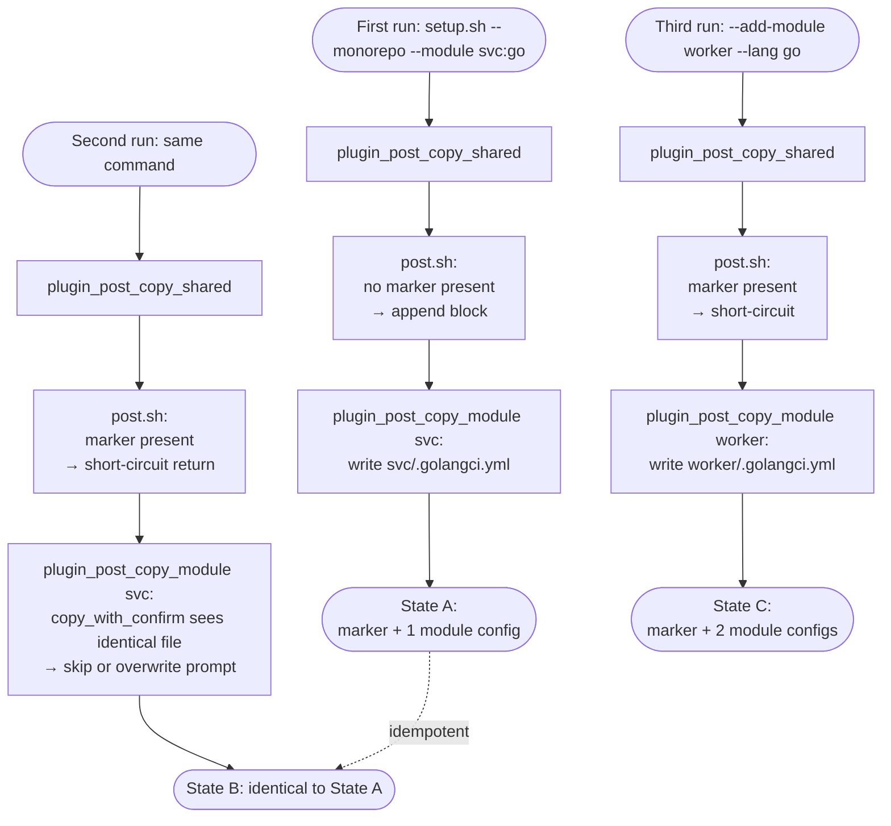
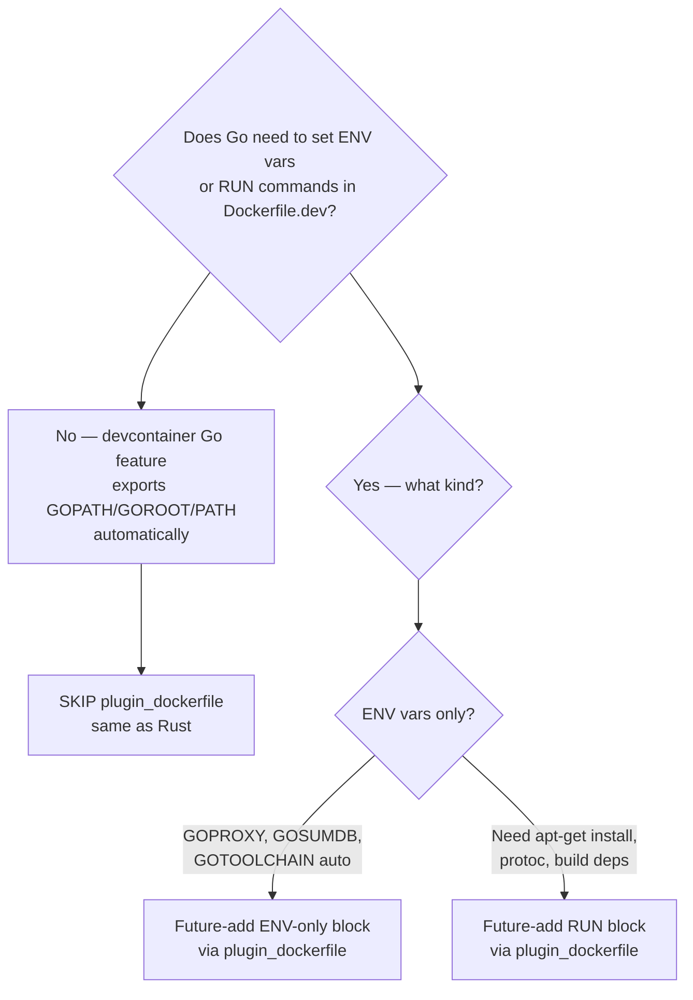

# Flowchart: #274 feat(templates): add Go language template

## Go plugin hook dispatch and idempotency

Captures the per-hook control flow inside `templates/languages/go/plugin.sh`
during one `setup.sh` invocation. The orchestrator dispatch
(`execute_plugin_post_copies` in `setup.sh`) is documented in
`../shared/api-spec.md` :: "Orchestrator dispatch"; this diagram zooms in on
what happens **inside** the Go plugin once the orchestrator hands off
control.

## Re-run idempotency at the project level

Captures what happens when the user runs `setup.sh` twice against the same
target — the property the marker guards protect.

## Decision: when to add `plugin_dockerfile`?

Documented for future reference. The Go plugin does **not** implement
`plugin_dockerfile` today; this diagram captures why and when the choice
might change.

Today the answer is "no", so `plugin_dockerfile` is omitted. If a downstream
project later needs `GOPROXY` pinning or `protoc` for protobuf generation,
add `plugin_dockerfile` following the Python/LaTeX precedent (awk-based
marker-guarded insertion) — the contract permits it without breaking
existing scaffolds.
