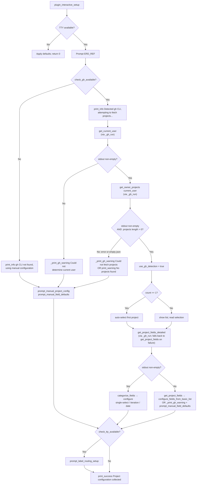

# Flowchart: #276 GitHub Project auto-detection and fallback

## Notes

- **Pre-fix root cause**: under `set -e`, `var=$(gh ... 2>/dev/null)`
  could abort the script when gh exited non-zero, skipping the `Manual`
  branch entirely. After this issue, every `_gh_run` returns 0, so the
  diamond `stdout non-empty?` is the sole branch point and the manual
  fallback is unconditionally reachable.
- The diamond `stdout non-empty?` at each gh helper covers four
  real-world cases:
  1. **Success** — non-empty JSON / login (proceed to next step)
  2. **Auth failure** — gh returns 1, stderr captured (empty stdout → fallback)
  3. **Network error** — same shape as auth failure (empty stdout → fallback)
  4. **No projects** — `{"projects":[]}` (non-empty stdout but `length == 0` → "No projects found" path)
- Auto-detection failure is non-fatal at every step. The user always
  reaches one of: an auto-selected project, an interactive selection
  list, or the manual prompt block.
- The remote-bootstrap stdin detach (`setup.sh:69`) is unrelated to
  this control flow but eliminates the `curl: (23)` symptom that
  appears interleaved with this flow in the user-visible output.
