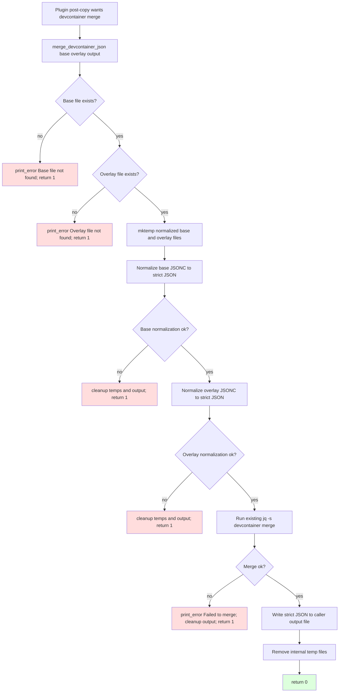
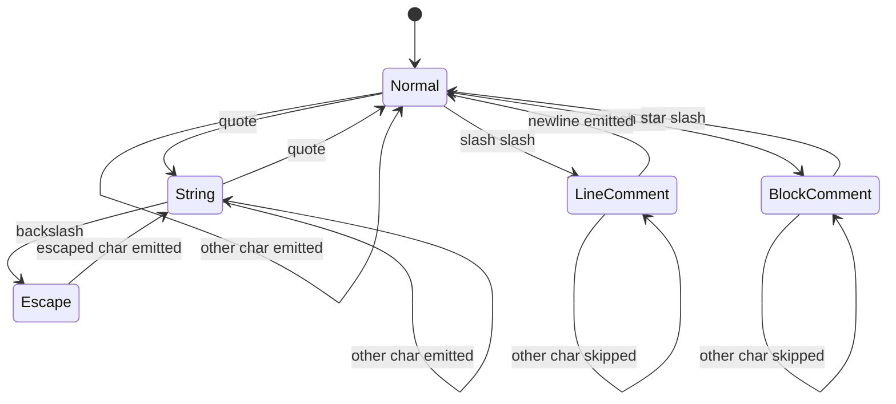

# Flowchart: #284 devcontainer JSONC merge path

## Comment Stripping State Machine

The state machine only treats comment markers as comments while in `Normal`.
That preserves URL strings and other string values that contain `//` or `/*`.
