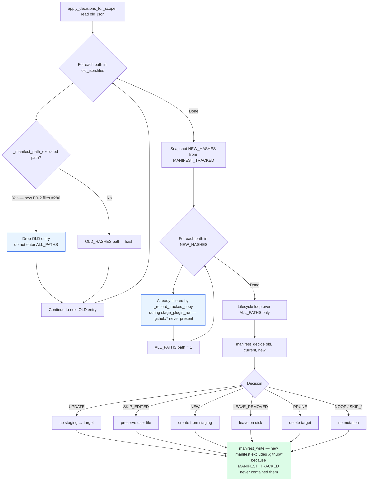

# Flowchart: #286 setup.sh --upgrade: exclude `.github/` from manifest tracking

## Decision flow inside `apply_decisions_for_scope`

The change adds one early-`continue` to the OLD_HASHES population loop and inherits a second early-`continue` (from `_record_tracked_copy`'s pre-existing EXCLUDE_GLOBS check) on the recording side. The diagram below shows where the two filters fire and what they collectively guarantee.



### Why both filters

The recording-side filter (already present, now extended) keeps `.github/*` out of `MANIFEST_TRACKED` — that means new scaffolds and post-#286 manifests never list those paths in the first place.

The OLD-side filter (new in #286) covers the migration window: a pre-#286 manifest still has `.github/*` hashes from when scaffold recorded them. Without this filter, the OLD entries would enter the lifecycle loop, and `--upgrade --prune` would decide `PRUNE` (the file is "in old, removed upstream, unedited") and delete it. With the filter, the OLD entries silently drop on the first post-#286 `--upgrade`; the new manifest written at end-of-scope no longer contains them, and subsequent upgrades take only the recording-side path.

### Boundary diagram — emission vs. tracking

Plugins still emit `.github/` files during scaffold. The EXCLUDE_GLOBS contract governs *tracking*, not *emission*. Initial scaffold continues to work; `--upgrade` simply opts out of touching these paths.

```mermaid
graph LR
    subgraph Emission (unchanged)
        E1[plugin_copy] -->|sed > target| E2[".github/workflows/*.yml"]
        E3[plugin_post_copy] -->|cat > target<br/>guarded by -f check| E4[".github/project.yml<br/>.github/versioning.yml"]
    end
    subgraph Tracking (delta #286)
        T1[manifest_track_file] --> T2{_manifest_path_excluded?}
        T2 -->|Yes — .github/*| T3[Return early<br/>MANIFEST_TRACKED unchanged]
        T2 -->|No| T4[Add to MANIFEST_TRACKED]
    end
    E2 -.-> T1
    E4 -.-> T1
    style T3 fill:#e8f4ff,stroke:#2563eb
```
