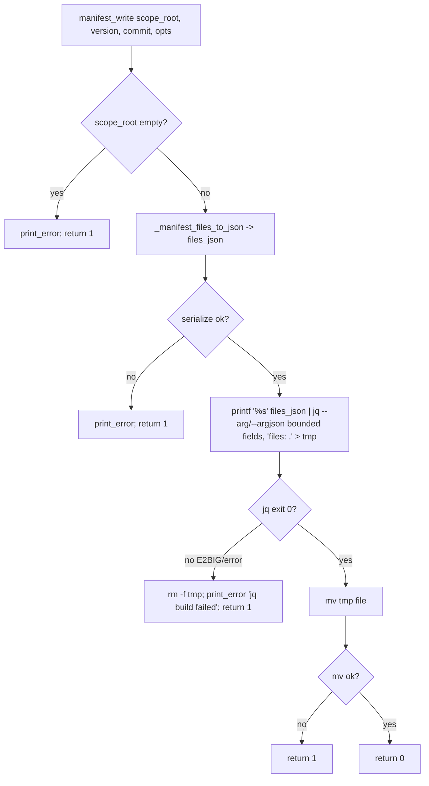
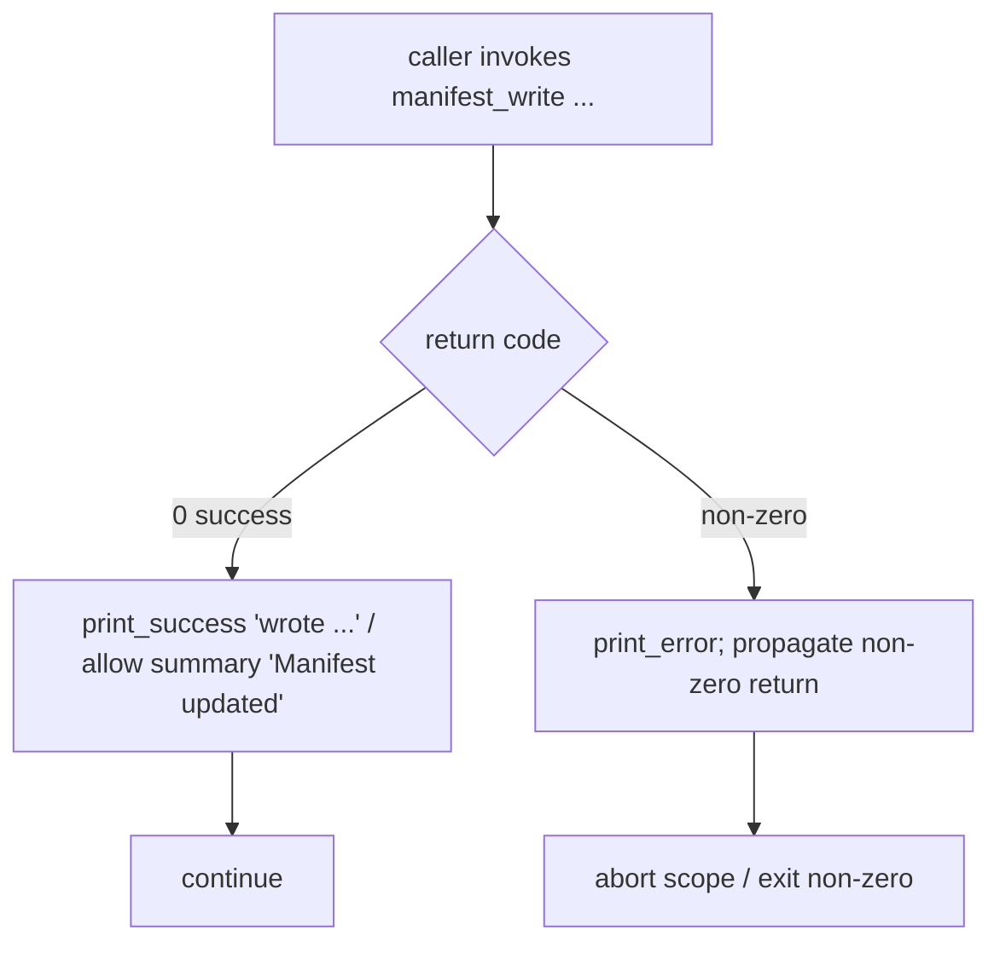

# Flowchart: #289 fix(manifest): jq ARG_MAX overflow in manifest_write

## `manifest_write` — corrected control flow (writer side)

The fix moves the unbounded files map off the `jq` argument vector and onto stdin,
removing the `E2BIG` ("Argument list too long") failure mode. The atomic tmp+mv and
the existing error guard are unchanged.

Key change is node **E**: previously `jq -n ... --argjson files "$files_json"` placed
the whole map in `argv`, which `execve` rejects with `E2BIG` once it exceeds `ARG_MAX`.
Streaming via stdin (`files: .`) makes the call size-independent.

## Caller guard — corrected success reporting (caller side)

Applies to all four `manifest_write` call sites (`setup.sh:1689`, `1709`, `1721`,
`2051`). Before the fix, the success/`summary` step ran regardless of exit status.

This guarantees the contradictory `"[ERROR] ... [OK] wrote ..."` output can no longer
occur: a failed write surfaces an error and a non-zero exit, never a false success.
