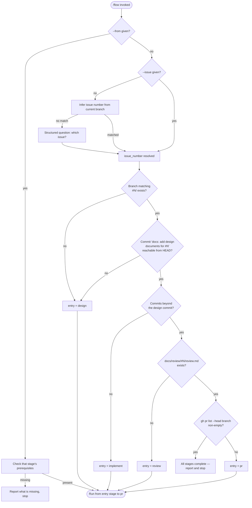
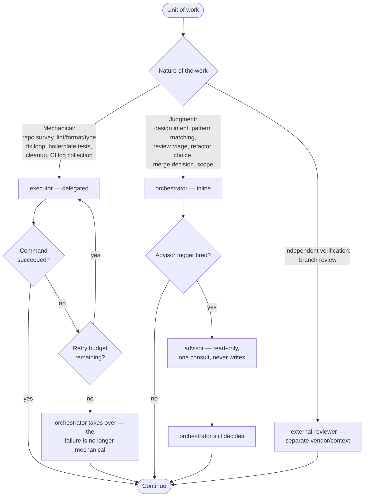

# Flowchart: #308 Rebase workflow skills on an Opus 5-class model policy

Two diagrams. The first is `/flow`'s stage-entry derivation — the only genuinely new control flow this issue introduces, and the reason `/flow` needs no state file. The second is the route-by-nature decision that replaces retry-then-escalate.

Class and system-wide sequence diagrams have no delta for this issue; the change surface is prompt documents plus one `setup.sh` helper.

## `/flow` stage-entry derivation

Evidence is read from git and GitHub, never from a persisted state file. A state file would go stale after a failed run, survive a branch reset, and need its own cleanup path; repository evidence is authoritative and survives context loss mid-run.

## Route-by-nature vs. retry-then-escalate

The retry budget applies only on the mechanical branch, and only to "the command errored". Judgment work is never retried on the theory that a second attempt lands better — it is routed to the orchestrator in the first place.

Advisor triggers are mechanical, not discretionary: issue size ≥ M at `/design`; an intent to leave a Critical or Major finding unfixed at `/flow` triage; unresolved scope ambiguity after `/issue` brainstorm. Without an objective trigger, "consult when unsure" becomes consulting on everything.
