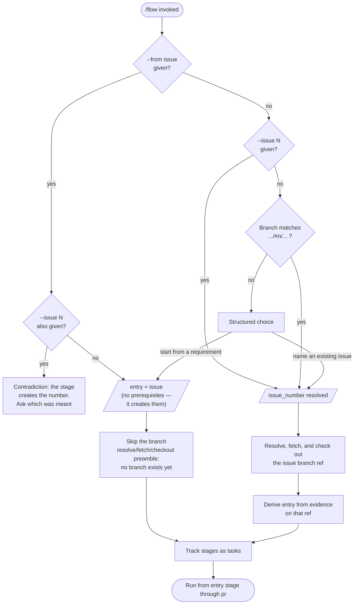
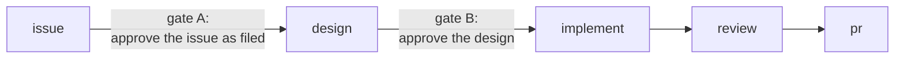

# Flowchart: #310 Make `/flow` reachable from a raw requirement

One diagram. The change is entirely a control-flow reordering, so the branch structure is the design — prose alone cannot show why rule 1 has to precede rule 4.

Class and sequence diagrams have no delta: no types change and no system-wide runtime flow is added.

## Stage 1 ordered resolution, and its handoff to entry derivation

**Rule 1 must come first.** A rule that only offers the choice "when no number resolves" would still prompt on `--from issue`, because no number resolves there either — which is precisely the defect this issue closes. Consulting the flag before asking the question is what makes the bug structurally impossible rather than merely fixed.

**The two dashed-box paths differ in one respect only:** the number-carrying path resolves and checks out the issue branch before deriving entry; the requirement-first path cannot, because `/design` creates that branch after `/issue` returns a number. Both converge on task tracking, so neither loses stage observability.

## Approval gates

| | Gate A (issue → design) | Gate B (design → implement) |
| --- | --- | --- |
| Covers | Estimation, approach, and tasks — produced *after* `/issue`'s own requirements approval and never re-presented | The committed design artifacts |
| Re-runs on resume | No | Yes |
| Why | A resumed run enters via `--issue N`, and re-asking would change behavior for runs that already carry a number. The issue exists on GitHub by then and is reviewable out of band | A design commit proves the artifacts were written, not that anyone approved them |

The asymmetry is deliberate and documented in the skill, so a later reader does not read it as an inconsistency.
