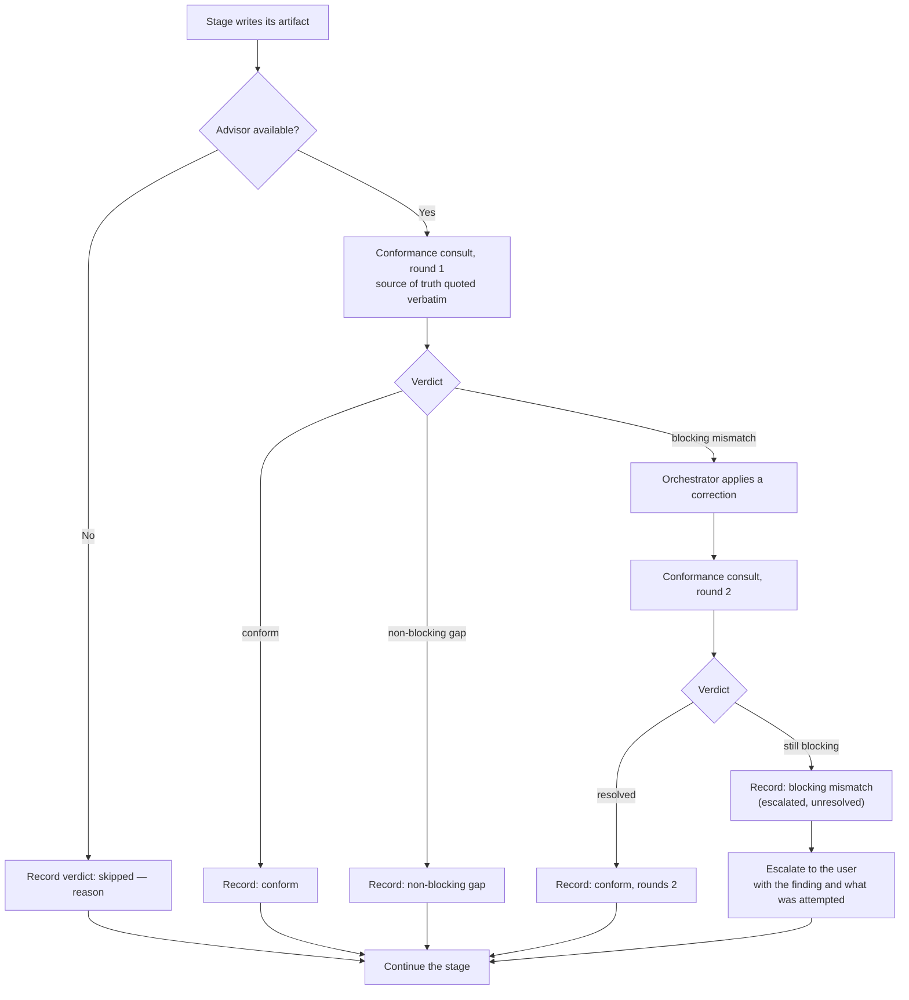
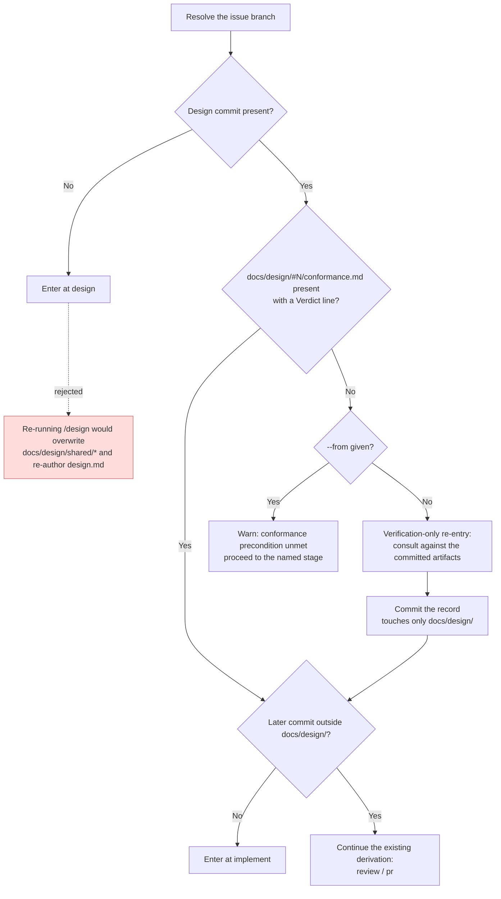

# Flowchart: #312 extend the advisor role to standing content review with fix proposals

## Conformance consult — the bounded loop

Identical in shape at both invocation points (`/issue` FR-13, `/design` FR-14). The two exits that are easy to get wrong are the skip path and the cap path: both must still write a record.

Every terminal path passes through a record. A record written only on the `conform` path deadlocks against NFR-2 and makes every resumed run redo the design stage destructively.

## `/flow` Stage 2 — where a missing conformance record leads

The rejected branch is drawn deliberately: sending a recordless design commit back into `/design` triggers Phase 7's overwrite of `docs/design/shared/*`, which is a destructive redesign on every resume of every branch designed before this change.

The record commit touching only `docs/design/` is what makes this compose with the existing table: the "no later commit outside `docs/design/`" row still resolves to `implement` on the next resume.
