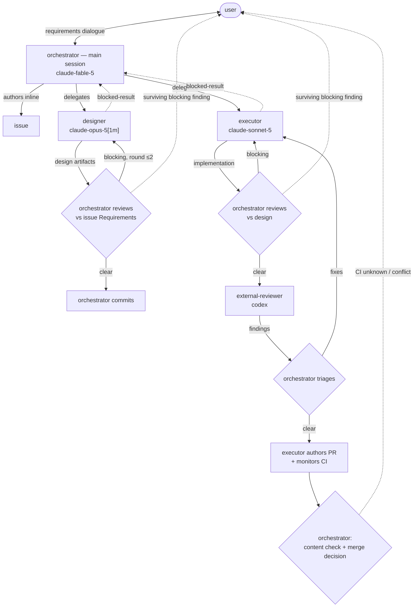
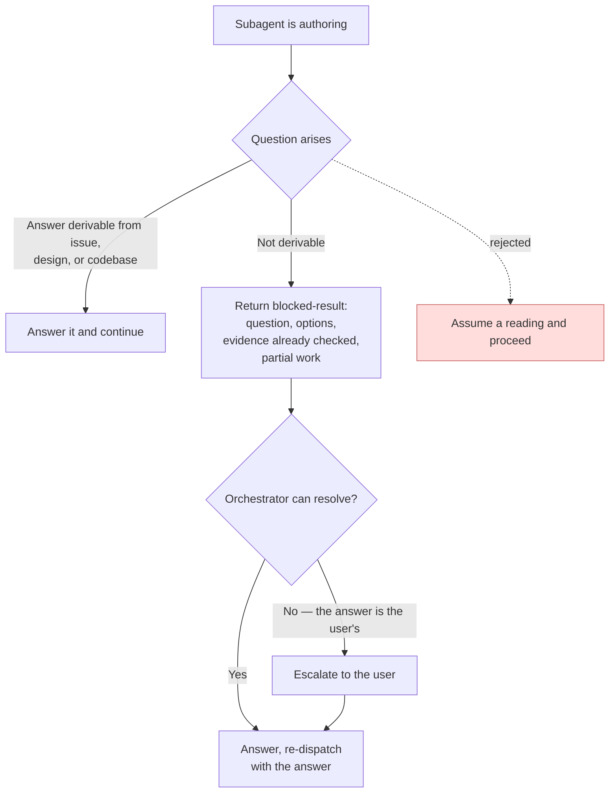
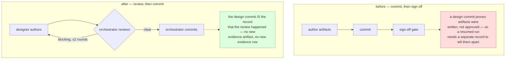

# Flowchart: #312 restructure lifecycle roles around a long-context orchestrator with delegated designer and executor

## Stage ownership across a `/flow` run

Who writes, who reviews, and where the user appears. The user is reachable from every delegated stage, but only through the orchestrator — subagents cannot reach the user directly, which is the constraint the whole structure is built around.

Dotted edges are the only paths that reach the user: an escalation the orchestrator cannot resolve, a blocking review finding surviving two rounds, and a `/pr` failure. Requirement gathering is the fourth, at the top.

## The blocked-result protocol

A subagent cannot ask the user, so the only correct response to an unanswerable question is to stop and return it. The rejected branch is drawn because it is the failure mode the whole protocol exists to prevent.

"Evidence already checked" is a required field rather than a courtesy: it is what distinguishes a genuine block from a question the subagent simply did not try to answer.

## Why the commit moved after the review

The left path is the current `/design`; the right is the new one. The old ordering is why a design commit could not be distinguished from an approved design, and why the previous revision of this issue needed a durable conformance record purely to tell the two apart.

An interrupted run leaves uncommitted files, which `/flow`'s existing evidence table already reads correctly as "no design commit → enter at `design`". That is why Stage 2 needs no change at all.
