# Flowchart: #316 Ownership before mutation

```mermaid
flowchart TD
    A[Candidate from distribution or prior state] --> B{Safe eligible path and mapping?}
    B -->|No| C[Warn and preserve]
    B -->|Yes| D{Trusted installed baseline?}
    D -->|No| E{Destination absent?}
    E -->|Yes| F[Create desired asset and record success]
    E -->|No| G{Exactly matches distribution?}
    G -->|Yes| H[Adopt without changing bytes]
    G -->|No| C
    D -->|Yes| I{Current equals desired?}
    I -->|Yes| H
    I -->|No| J{Current matches installed baseline?}
    J -->|No| C
    J -->|Yes| K{Desired asset exists?}
    K -->|Yes| L[Install atomically and advance baseline]
    K -->|No| M{Proven upstream removal and deletion eligible?}
    M -->|Yes| N[Delete only this file and its state entry]
    M -->|No| C
```

Manifest pruning additionally requires `--prune`. Runtime pruning excludes overlay-origin content. Missing destinations with prior state represent developer deletions and are preserved. Warnings/conflicts retain prior installed baselines.
