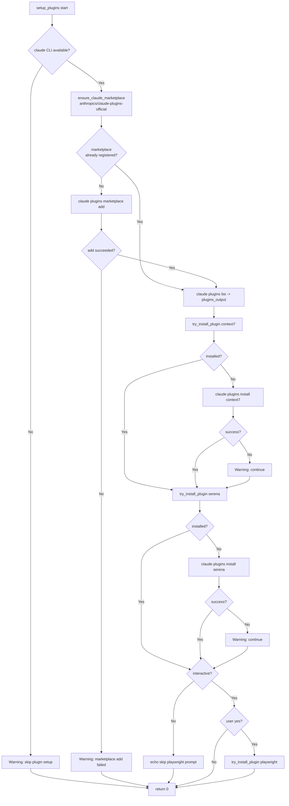

# Flowchart: #255 setup_plugins 制御フロー

`setup_plugins` 関数の実行フロー。各分岐は最終的に `return 0` で合流し、`set -e` 配下の post.sh を止めない。

## 主要分岐の意図

| 分岐 | 失敗時の挙動 | 理由 |
| --- | --- | --- |
| `claude` CLI 検出 | warning + return 0 | Claude Code 未インストール環境でも post.sh は他のセットアップを継続する。 |
| marketplace 登録チェック | スキップ | 冪等性。既登録なら add を呼ばない。 |
| marketplace add 失敗 | warning + setup_plugins 全体を return 0 | ネットワーク不通等で add が失敗しても post.sh の他の処理を巻き込まない。以降のプラグイン install は意味がないので即終了。 |
| 個別プラグイン install 失敗 | warning + 次プラグインへ進む | 1 プラグインの失敗が他のプラグインに波及しない。 |
| 非対話環境での playwright | プロンプトを出さずスキップ | 既存挙動を維持。CI 等で停止させない。 |
