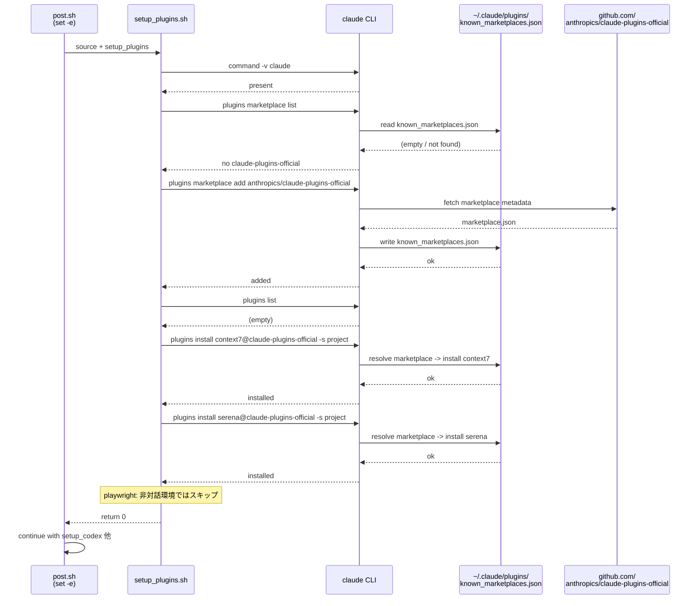
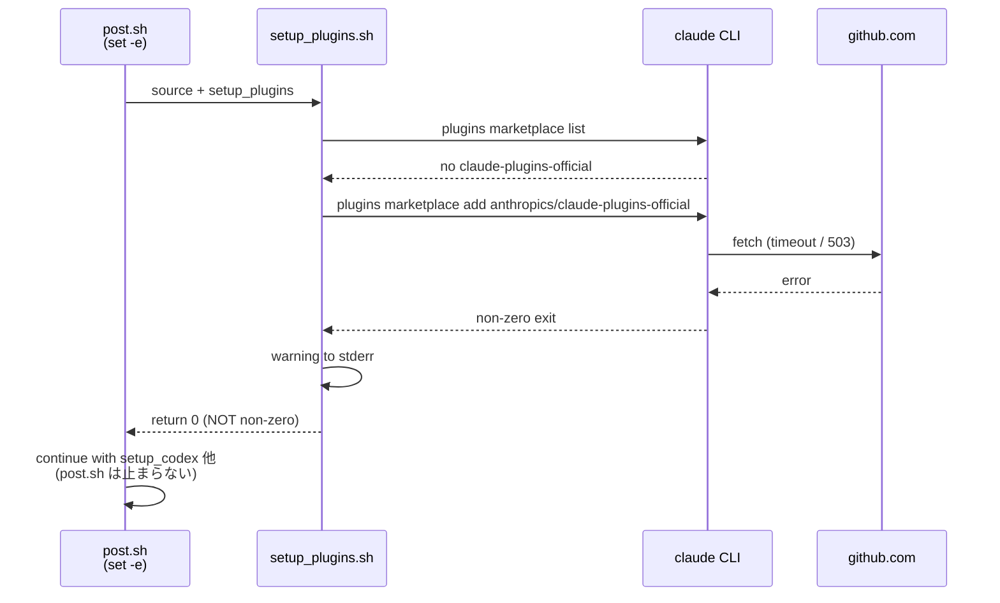

# Sequence Diagram: #255 fresh devcontainer での plugin install

新規 devcontainer (clean state) で post-create が走り、`setup_plugins.sh` がマーケットプレイスを登録した上で context7 / serena を install するまでの相互作用。

## 失敗時のシーケンス (network 不通で marketplace add が失敗)

`set -e` 配下では関数の非 0 戻り値もスクリプト全体を止める。`setup_plugins` は marketplace add の失敗を warning で報告した上で **必ず 0 を返す** ことで、post.sh 全体の継続性を保証する。
