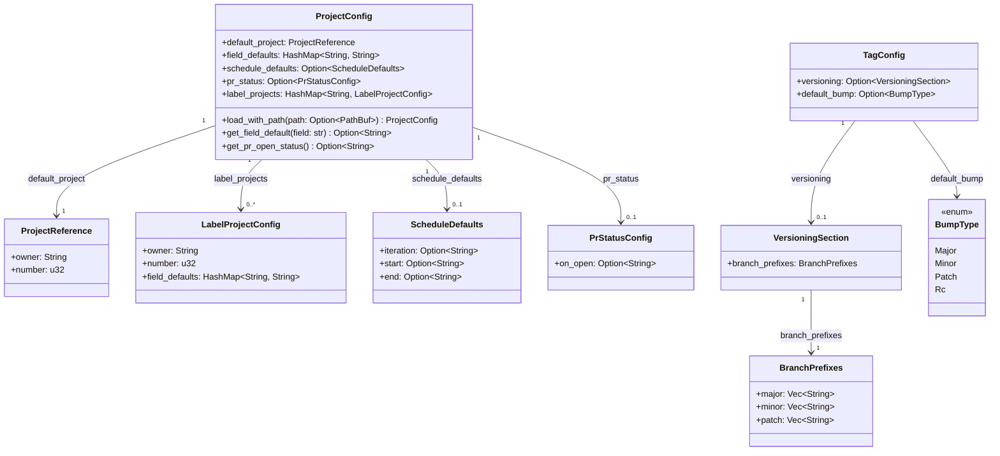
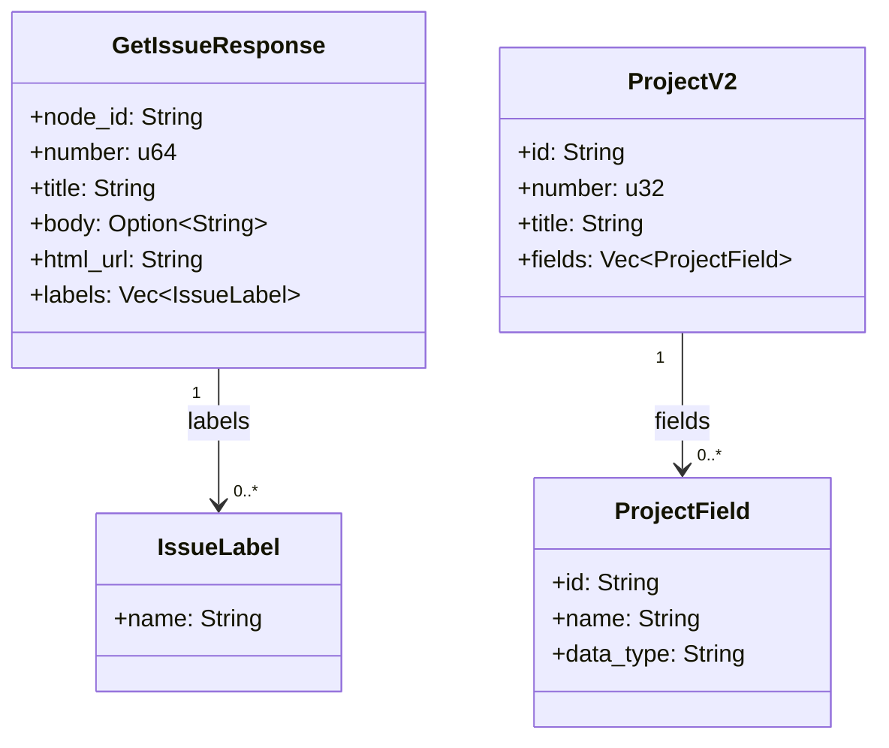
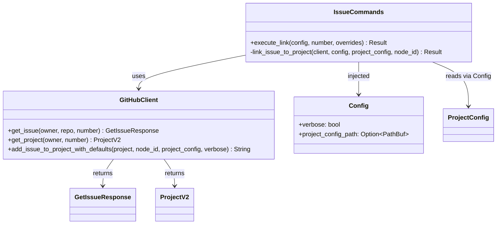
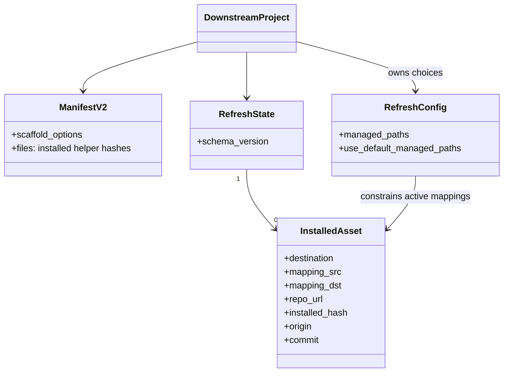

# Class Diagram (Project-wide)

Cumulative class/type diagram for the Rust CLI and shell maintenance metadata. Snapshot — overwritten on every `/design` (NFR-1).

## Configuration types

## GitHub types

## CLI command + clients

## Foundation ownership metadata

## Notes

- `LabelProjectConfig` keys (in `ProjectConfig.label_projects`) are issue-label names; values are independent project + field defaults (#230).
- `BranchPrefixes` is the canonical internal struct; `VersioningSection` (Format B) deserializes directly into it, while a custom deserializer collapses Format A (`branches: [{prefix, bump}]`) into the same shape (#228).
- `BumpType::Rc` is the default when no branch prefix matches.
- `IssueCommands::link_issue_to_project` accepts a `ProjectConfig` so it can be reused for both default and label-routed links (#230 refactor).
