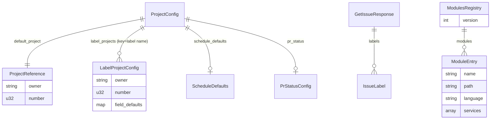

# Data Model

This is the cumulative project-wide data model. Per-issue deltas may add or modify entries; this file is regenerated as a snapshot on every `/design` (NFR-1).

## Entities

| Entity | Defined in | Description |
| --- | --- | --- |
| `Config` | `src/config.rs` | Global CLI config (verbose flag, paths) |
| `ProjectConfig` | `src/project_config.rs` | `.github/project.yml` schema |
| `ProjectReference` | `src/project_config.rs` | `{owner, number}` for a single GitHub Project V2 |
| `LabelProjectConfig` | `src/project_config.rs` | Label-keyed project routing entry (#230) |
| `ScheduleDefaults` | `src/project_config.rs` | `{iteration, start, end}` defaults for schedule fields |
| `PrStatusConfig` | `src/project_config.rs` | `{on_open}` PR status mapping |
| `TagConfig` / `Config` (tag) | `src/tag_config.rs` | `versioning.yml` schema |
| `BranchPrefixes` | `src/tag_config.rs` | Internal canonical struct: `{major, minor, patch}` lists. Built from either Format A (legacy template) or Format B (canonical), via custom serde deserializer (#228) |
| `BumpType` | `src/tag_config.rs` / `src/version.rs` | `Major | Minor | Patch | Rc` |
| `GetIssueResponse` | `src/github/types.rs` | GitHub REST issue payload (incl. `labels`, #230) |
| `IssueLabel` | `src/github/types.rs` | `{name}` from issue labels payload |
| `ProjectV2` | `src/github/types.rs` | GraphQL project node info |
| `ModulesRegistry` (logical) | downstream `<project>/modules.json` (#263) | Monorepo module registry — `{ version, modules: [{ name, path, language, services }] }` |

## Type Definitions

### `ProjectConfig` (project-wide canonical schema)

```rust
pub struct ProjectConfig {
    pub default_project: ProjectReference,                      // required
    #[serde(default)]
    pub field_defaults: HashMap<String, String>,
    #[serde(default)]
    pub schedule_defaults: Option<ScheduleDefaults>,
    #[serde(default)]
    pub pr_status: Option<PrStatusConfig>,
    #[serde(default)]
    pub label_projects: HashMap<String, LabelProjectConfig>,    // added in #230
}

pub struct LabelProjectConfig {
    pub owner: String,
    pub number: u32,
    #[serde(default)]
    pub field_defaults: HashMap<String, String>,
}
```

Backward compatibility: every additive field is `#[serde(default)]`, so old configs continue to parse.

### `BranchPrefixes` and dual-format deserialization (#228)

```rust
pub struct BranchPrefixes {
    pub major: Vec<String>,
    pub minor: Vec<String>,
    pub patch: Vec<String>,
}
```

Custom `Deserialize` accepts:

- **Format A (legacy template)**: `branches: [{prefix, bump}]` — coalesced into `BranchPrefixes` by grouping `prefix` by `bump`.
- **Format B (canonical)**: `versioning.branch_prefixes: {major: [...], minor: [...], patch: [...]}` — direct.

When neither is present, all branches default to `BumpType::Rc`.

### `IssueLabel` and `GetIssueResponse` (#230)

```rust
pub struct IssueLabel {
    pub name: String,
}

pub struct GetIssueResponse {
    pub node_id: String,
    pub number: u64,
    pub title: String,
    pub body: Option<String>,
    pub html_url: String,
    #[serde(default)]
    pub labels: Vec<IssueLabel>,
}
```

`labels` is `default` so older mocked payloads without labels still deserialize.

### `modules.json` schema (monorepo registry, #263)

JSON file at the root of a monorepo target produced by `setup.sh --monorepo`. Read and mutated by `scripts/lib/common.sh` helpers via `jq`. There is no Rust counterpart — `erd` does not consume this file today.

```json
{
  "version": 1,
  "modules": [
    { "name": "jing", "path": "jing", "language": "python", "services": [] },
    { "name": "kir",  "path": "kir",  "language": "node",   "services": [] }
  ]
}
```

| Field | Type | Required | Constraints / notes |
| --- | --- | --- | --- |
| `version` | integer | yes | Schema version; readers MUST reject unknown majors. Currently `1`. |
| `modules` | array | yes | May be empty after init if user accepted no modules; FR-2 enforces ≥1 in interactive flow. |
| `modules[].name` | string | yes | `^[a-z][a-z0-9_-]*$`, max 50 chars, unique within file. |
| `modules[].path` | string | yes | Relative path from repo root. Currently equals `name`; field is reserved for future flexibility (nested layouts). |
| `modules[].language` | string | yes | One of the `AVAILABLE_LANGUAGES` ids: `rust`, `python`, `node`, `deno`, `latex`. |
| `modules[].services` | array of string | yes (may be empty) | Informational record of services declared at registration. The actual compose runs project-wide using `{{PROJECT_NAME}}-<svc>` names, shared across modules. |

**Forward compatibility (NFR-2)**: Readers ignore unknown top-level keys and unknown per-module keys. Adding fields like `commands`, `version_file`, `package` (à la elsur) is non-breaking. The `version` field is the breaking-change escape hatch — bumping to `version: 2` allows incompatible changes that older `setup.sh` versions correctly reject with a clear error.

**Idempotency**: `add_module_entry <name> ...` returns exit `2` on duplicate `name`, which the caller (interactive add-module flow) translates into the FR-9 overwrite prompt.

## Relationships



## Schemas / Migrations

This project is a single-binary CLI with no persistent database. The "schemas" are YAML config files, the JSON modules registry (#263), and a few generated text artifacts. Their evolution:

| File | Migration | Issue |
| --- | --- | --- |
| `versioning.yml` | Dual-format deserializer added; both Format A and Format B accepted, Format B canonical going forward | #228 |
| `.github/project.yml` | `label_projects` map added (optional) | #230 |
| `setup.sh` completion message | Expanded to 5 commands + workflow line | #246 |
| `setup_plugins.sh` (templates/claude/.devcontainer/scripts/) | `setup_mcp.sh` renamed; `claude mcp add` → `claude plugins install`; per-plugin failure isolation; marketplace registration helper added | #249, #255 |
| `_shared/{branch,issue}/SKILL.md` | Common branch & issue creation logic extracted | #242 |
| `_shared/design-migration/SKILL.md` | One-shot migration of `docs/design/#{issue}/` → `docs/design/shared/*` | #257 |
| `docs/design/shared/*` | New layer for cumulative project truth | #257 |
| `.claude/commands/erd/*.md` | Internalized SuperClaude front-half skills as `/erd:*` slash commands | #240 |
| `.gitignore` (downstream-project seed) | Per-file blacklist (`.claude/settings.local.json`, `.codex/config.local.toml`) replaced with marker-guarded whitelist blocks for `.claude/*` and `.codex/*`; always-ignore added for `.serena/` and `screenshots/` | #259 |
| `.codex/config.toml` (workspace + template) | Workspace gains the file (new); template bumps `model` from `gpt-5.3-codex` → `gpt-5.4` and adds `model_reasoning_effort = "high"`. Workspace and template kept in sync. | #261 |
| `.gitignore` (workspace) | Codex whitelist block (`# Codex CLI (track shared config only)` + `.codex/*` + `!.codex/config.toml`) appended to the workspace's own `.gitignore` so `.codex/auth.json` etc. are never committed | #261 |
| `.claude/settings.json` (workspace) | `permissions.allow` gains `Bash(codex:*)` so `/review` can invoke the Codex CLI without per-call approval | #261 |
| `modules.json` (downstream monorepo target) | New schema introduced for monorepo support; `version: 1` with a `modules: []` array. Forward-compatible via unknown-key tolerance and a `version` escape hatch. | #263 |
| Language plugin contract (`templates/languages/<lang>/plugin.sh`) | `plugin_post_copy` split into `plugin_post_copy_shared(target_dir)` + `plugin_post_copy_module(target_dir, module_name)`. Existing `plugin_post_copy` retained as a backward-compat shim. | #263 |
| `Dockerfile.dev` and `.devcontainer/scripts/post.sh` language toolchain blocks | Now wrapped in marker comments (`# >>> <lang> toolchain >>>` … `<<< <lang> toolchain <<<`) and gated by `grep -q` checks for block-level idempotency, so `setup.sh --add-module` re-runs are no-ops for shared assets. | #263 |

No SQL, no database migrations — config files, the JSON modules registry, and the seeded `.gitignore` are the only schemas.

### `.codex/config.toml` schema (project-level Codex CLI config, #261)

Flat top-level TOML. All keys optional from Codex's perspective; tarnished sets all four to lock in deterministic behavior across machines.

| Key | Type | Value (workspace + template) | Purpose |
| --- | --- | --- | --- |
| `model` | string | `"gpt-5.4"` | Always-latest reasoning model |
| `model_reasoning_effort` | string | `"high"` | Higher cost, deeper review (paid only when `/review` runs) |
| `approval_policy` | string | `"on-request"` | Codex prompts before destructive actions |
| `sandbox_mode` | string | `"workspace-write"` | File writes restricted to workspace |

## Generated-Artifact Contracts

The `.gitignore` produced by `update_gitignore()` and Codex's `plugin_post_copy` is structured as a sequence of **marker-guarded blocks**. The marker (a comment line) is the keyed-on identity of the block; rewriting it without coordination would re-trigger the block-append on existing projects (a benign but visible side effect). The exact marker strings and block contents are defined in [api-spec.md](./api-spec.md) :: "Setup / Plugin Surface".

The same marker-guarded-block pattern (#263) governs the language toolchain blocks appended to `Dockerfile.dev` and `post.sh` by language plugins — see api-spec.md :: "Language plugin contract".
