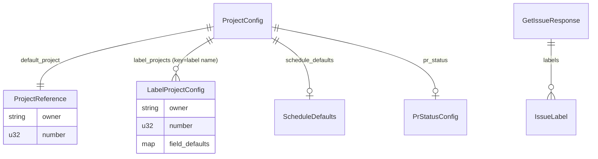

# Data Model

This is the cumulative project-wide data model. Per-issue deltas may add or modify entries; this file is regenerated as a snapshot on every `/design` (NFR-1).

## Entities

| Entity | Defined in | Description |
| --- | --- | --- |
| `Config` | `src/config.rs` | Global CLI config (verbose flag, paths) |
| `ProjectConfig` | `src/project_config.rs` | `.github/project.yml` schema |
| `ProjectReference` | `src/project_config.rs` | `{owner, number}` for a single GitHub Project V2 |
| `LabelProjectConfig` | `src/project_config.rs` | Label-keyed project routing entry (#230) |
| `ScheduleDefaults` | `src/project_config.rs` | `{iteration, start, end}` defaults for schedule fields |
| `PrStatusConfig` | `src/project_config.rs` | `{on_open}` PR status mapping |
| `TagConfig` / `Config` (tag) | `src/tag_config.rs` | `versioning.yml` schema |
| `BranchPrefixes` | `src/tag_config.rs` | Internal canonical struct: `{major, minor, patch}` lists. Built from either Format A (legacy template) or Format B (canonical), via custom serde deserializer (#228) |
| `BumpType` | `src/tag_config.rs` / `src/version.rs` | `Major | Minor | Patch | Rc` |
| `GetIssueResponse` | `src/github/types.rs` | GitHub REST issue payload (incl. `labels`, #230) |
| `IssueLabel` | `src/github/types.rs` | `{name}` from issue labels payload |
| `ProjectV2` | `src/github/types.rs` | GraphQL project node info |

## Type Definitions

### `ProjectConfig` (project-wide canonical schema)

```rust
pub struct ProjectConfig {
    pub default_project: ProjectReference,                      // required
    #[serde(default)]
    pub field_defaults: HashMap<String, String>,
    #[serde(default)]
    pub schedule_defaults: Option<ScheduleDefaults>,
    #[serde(default)]
    pub pr_status: Option<PrStatusConfig>,
    #[serde(default)]
    pub label_projects: HashMap<String, LabelProjectConfig>,    // added in #230
}

pub struct LabelProjectConfig {
    pub owner: String,
    pub number: u32,
    #[serde(default)]
    pub field_defaults: HashMap<String, String>,
}
```

Backward compatibility: every additive field is `#[serde(default)]`, so old configs continue to parse.

### `BranchPrefixes` and dual-format deserialization (#228)

```rust
pub struct BranchPrefixes {
    pub major: Vec<String>,
    pub minor: Vec<String>,
    pub patch: Vec<String>,
}
```

Custom `Deserialize` accepts:

- **Format A (legacy template)**: `branches: [{prefix, bump}]` — coalesced into `BranchPrefixes` by grouping `prefix` by `bump`.
- **Format B (canonical)**: `versioning.branch_prefixes: {major: [...], minor: [...], patch: [...]}` — direct.

When neither is present, all branches default to `BumpType::Rc`.

### `IssueLabel` and `GetIssueResponse` (#230)

```rust
pub struct IssueLabel {
    pub name: String,
}

pub struct GetIssueResponse {
    pub node_id: String,
    pub number: u64,
    pub title: String,
    pub body: Option<String>,
    pub html_url: String,
    #[serde(default)]
    pub labels: Vec<IssueLabel>,
}
```

`labels` is `default` so older mocked payloads without labels still deserialize.

## Relationships



## Schemas / Migrations

This project is a single-binary CLI with no persistent database. The "schemas" are YAML config files and a few generated text artifacts. Their evolution:

| File | Migration | Issue |
| --- | --- | --- |
| `versioning.yml` | Dual-format deserializer added; both Format A and Format B accepted, Format B canonical going forward | #228 |
| `.github/project.yml` | `label_projects` map added (optional) | #230 |
| `setup.sh` completion message | Expanded to 5 commands + workflow line | #246 |
| `setup_plugins.sh` (templates/claude/.devcontainer/scripts/) | `setup_mcp.sh` renamed; `claude mcp add` → `claude plugins install`; per-plugin failure isolation; marketplace registration helper added | #249, #255 |
| `_shared/{branch,issue}/SKILL.md` | Common branch & issue creation logic extracted | #242 |
| `_shared/design-migration/SKILL.md` | One-shot migration of `docs/design/#{issue}/` → `docs/design/shared/*` | #257 |
| `docs/design/shared/*` | New layer for cumulative project truth | #257 |
| `.claude/commands/erd/*.md` | Internalized SuperClaude front-half skills as `/erd:*` slash commands | #240 |
| `.gitignore` (downstream-project seed) | Per-file blacklist (`.claude/settings.local.json`, `.codex/config.local.toml`) replaced with marker-guarded whitelist blocks for `.claude/*` and `.codex/*`; always-ignore added for `.serena/` and `screenshots/` | #259 |

No SQL, no database migrations — config files and the seeded `.gitignore` are the only schemas.

## Generated-Artifact Contracts

The `.gitignore` produced by `update_gitignore()` and Codex's `plugin_post_copy` is structured as a sequence of **marker-guarded blocks**. The marker (a comment line) is the keyed-on identity of the block; rewriting it without coordination would re-trigger the block-append on existing projects (a benign but visible side effect). The exact marker strings and block contents are defined in [api-spec.md](./api-spec.md) :: "Setup / Plugin Surface".
