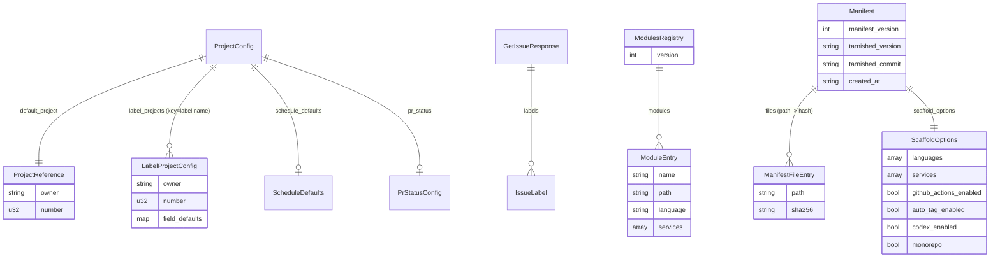

# Data Model

This is the cumulative project-wide data model. Per-issue deltas may add or modify entries; this file is regenerated as a snapshot on every `/design` (NFR-1).

## Entities

| Entity | Defined in | Description |
| --- | --- | --- |
| `Config` | `src/config.rs` | Global CLI config (verbose flag, paths) |
| `ProjectConfig` | `src/project_config.rs` | `.github/project.yml` schema |
| `ProjectReference` | `src/project_config.rs` | `{owner, number}` for a single GitHub Project V2 |
| `LabelProjectConfig` | `src/project_config.rs` | Label-keyed project routing entry (#230) |
| `ScheduleDefaults` | `src/project_config.rs` | `{iteration, start, end}` defaults for schedule fields |
| `PrStatusConfig` | `src/project_config.rs` | `{on_open}` PR status mapping |
| `TagConfig` / `Config` (tag) | `src/tag_config.rs` | `versioning.yml` schema |
| `BranchPrefixes` | `src/tag_config.rs` | Internal canonical struct: `{major, minor, patch}` lists. Built from either Format A (legacy template) or Format B (canonical), via custom serde deserializer (#228) |
| `BumpType` | `src/tag_config.rs` / `src/version.rs` | `Major | Minor | Patch | Rc` |
| `GetIssueResponse` | `src/github/types.rs` | GitHub REST issue payload (incl. `labels`, #230) |
| `IssueLabel` | `src/github/types.rs` | `{name}` from issue labels payload |
| `ProjectV2` | `src/github/types.rs` | GraphQL project node info |
| `ModulesRegistry` (logical) | downstream `<project>/modules.json` (#263) | Monorepo module registry — `{ version, modules: [{ name, path, language, services }] }` |
| `Manifest` (logical) | downstream `<scope>/.tarnished-manifest.json` (#265) | Installed-baseline manifest of eligible runtime helper files for one upgrade scope (root or per-module) — `{ manifest_version, tarnished_version, tarnished_commit, created_at, scaffold_options, files: { path: "sha256:<hex>" } }` |
| `LifecycleDecision` (internal) | `scripts/lib/manifest.sh` (#265) | Pure enum used by `manifest_decide` to tag each file's upgrade outcome — `NOOP \| UPDATE \| SKIP_EDITED \| NEW \| SKIP_NEW_CONFLICT \| LEAVE_REMOVED \| PRUNE \| SKIP_USER_DELETED` |
| `RefreshConfig` (logical) | downstream `<project>/.tarnished/refresh.json` (#279) | Always-latest sync whitelist + overlay declaration — `{ schema_version, upstream: { repo_url, branch }, clone_dir, managed_paths: [{ src, dst, overlay }] }` |

## Type Definitions

### `ProjectConfig` (project-wide canonical schema)

```rust
pub struct ProjectConfig {
    pub default_project: ProjectReference,                      // required
    #[serde(default)]
    pub field_defaults: HashMap<String, String>,
    #[serde(default)]
    pub schedule_defaults: Option<ScheduleDefaults>,
    #[serde(default)]
    pub pr_status: Option<PrStatusConfig>,
    #[serde(default)]
    pub label_projects: HashMap<String, LabelProjectConfig>,    // added in #230
}

pub struct LabelProjectConfig {
    pub owner: String,
    pub number: u32,
    #[serde(default)]
    pub field_defaults: HashMap<String, String>,
}
```

Backward compatibility: every additive field is `#[serde(default)]`, so old configs continue to parse.

### `BranchPrefixes` and dual-format deserialization (#228)

```rust
pub struct BranchPrefixes {
    pub major: Vec<String>,
    pub minor: Vec<String>,
    pub patch: Vec<String>,
}
```

Custom `Deserialize` accepts:

- **Format A (legacy template)**: `branches: [{prefix, bump}]` — coalesced into `BranchPrefixes` by grouping `prefix` by `bump`.
- **Format B (canonical)**: `versioning.branch_prefixes: {major: [...], minor: [...], patch: [...]}` — direct.

When neither is present, all branches default to `BumpType::Rc`.

### `IssueLabel` and `GetIssueResponse` (#230)

```rust
pub struct IssueLabel {
    pub name: String,
}

pub struct GetIssueResponse {
    pub node_id: String,
    pub number: u64,
    pub title: String,
    pub body: Option<String>,
    pub html_url: String,
    #[serde(default)]
    pub labels: Vec<IssueLabel>,
}
```

`labels` is `default` so older mocked payloads without labels still deserialize.

### `modules.json` schema (monorepo registry, #263)

JSON file at the root of a monorepo target produced by `setup.sh --monorepo`. Read and mutated by `scripts/lib/common.sh` helpers via `jq`. There is no Rust counterpart — `erd` does not consume this file today.

```json
{
  "version": 1,
  "modules": [
    { "name": "jing", "path": "jing", "language": "python", "services": [] },
    { "name": "kir",  "path": "kir",  "language": "node",   "services": [] }
  ]
}
```

| Field | Type | Required | Constraints / notes |
| --- | --- | --- | --- |
| `version` | integer | yes | Schema version; readers MUST reject unknown majors. Currently `1`. |
| `modules` | array | yes | May be empty after init if user accepted no modules; FR-2 enforces ≥1 in interactive flow. |
| `modules[].name` | string | yes | `^[a-z][a-z0-9_-]*$`, max 50 chars, unique within file. |
| `modules[].path` | string | yes | Relative path from repo root. Currently equals `name`; field is reserved for future flexibility (nested layouts). |
| `modules[].language` | string | yes | One of the `AVAILABLE_LANGUAGES` ids: `rust`, `python`, `node`, `deno`, `latex`, `go` (#274). |
| `modules[].services` | array of string | yes (may be empty) | Informational record of services declared at registration. The actual compose runs project-wide using `{{PROJECT_NAME}}-<svc>` names, shared across modules. |

**Forward compatibility (NFR-2)**: Readers ignore unknown top-level keys and unknown per-module keys. Adding fields like `commands`, `version_file`, `package` (à la elsur) is non-breaking. The `version` field is the breaking-change escape hatch — bumping to `version: 2` allows incompatible changes that older `setup.sh` versions correctly reject with a clear error.

**Idempotency**: `add_module_entry <name> ...` returns exit `2` on duplicate `name`, which the caller (interactive add-module flow) translates into the FR-9 overwrite prompt.

### `.tarnished-manifest.json` schema (downstream upgrade provenance)

Each root/module scope has `manifest_version: 2`, existing version/commit/timestamp/options metadata, and `files: {relative_path: "sha256:<64 lowercase hex>"}`. Empty maps are valid. Files are eligible copied runtime helpers under `.devcontainer/scripts/`, excluding `post.sh`, sidecars and all project-owned seeds/settings. Hashes describe last successfully installed or exactly distribution-matched bytes. Conflicts, failed writes, user deletions and unpruned removals retain old hashes. Only successful prune drops a removal entry. Equivalent writes preserve timestamps/state bytes.

Version-1 entries are untrusted. Bootstrap compares eligible staged distribution candidates without scanning the downstream repository; only exact matches establish provenance without mutation. A supplied historical ref selects comparison content, not permission to trust legacy observed hashes. Re-bootstrap preserves trusted edited/deleted entries. Validate schema, hash format, scope-relative path components and absence of symlinks before all target access.

### `.tarnished/refresh-state.json` schema

Versioned local metadata: `{schema_version: 1, files: {destination: entry}}`. Each entry records `repo_url`, `mapping_src`, `mapping_dst`, `installed_hash`, `origin` (`upstream` or `overlay`), and diagnostic source `commit`. It binds a successful installation or exact match to a specific source/destination mapping. Mapping changes preserve old destinations rather than granting deletion authority. Advance entries only after success; retain old baseline on conflict/failure/deletion. Overlay-origin content is never automatically pruned. Malformed or symlink state cannot authorize updates. State is excluded from distribution and manifests.

## Relationships



## Schemas / Migrations

This project is a single-binary CLI with no persistent database. The "schemas" are YAML config files, the JSON modules registry (#263), and a few generated text artifacts. Their evolution:

| File | Migration | Issue |
| --- | --- | --- |
| `versioning.yml` | Dual-format deserializer added; both Format A and Format B accepted, Format B canonical going forward | #228 |
| `.github/project.yml` | `label_projects` map added (optional) | #230 |
| `setup.sh` completion message | Expanded to 5 commands + workflow line | #246 |
| `setup_plugins.sh` (templates/claude/.devcontainer/scripts/) | `setup_mcp.sh` renamed; `claude mcp add` → `claude plugins install`; per-plugin failure isolation; marketplace registration helper added | #249, #255 |
| `setup_plugins.sh` (workspace + template) | `is_claude_authenticated` pre-flight gate added (`[[ -s "$HOME/.claude/.credentials.json" ]]`); skips with guidance when unauthenticated so first-run `post.sh` no longer aborts. Template variant also adopts `ensure_claude_marketplace` + `try_install_plugin` from the workspace variant; the two files are now structurally aligned. | #273 |
| `_shared/{branch,issue}/SKILL.md` | Common branch & issue creation logic extracted | #242 |
| `_shared/design-migration/SKILL.md` | One-shot migration of `docs/design/#{issue}/` → `docs/design/shared/*` | #257 |
| `docs/design/shared/*` | New layer for cumulative project truth | #257 |
| `.claude/commands/erd/*.md` | Internalized SuperClaude front-half skills as `/erd:*` slash commands | #240 |
| `.gitignore` (downstream-project seed) | Per-file blacklist (`.claude/settings.local.json`, `.codex/config.local.toml`) replaced with marker-guarded whitelist blocks for `.claude/*` and `.codex/*`; always-ignore added for `.serena/` and `screenshots/` | #259 |
| `.agents/skills/*` (Codex projects) | Repo-local Codex skills for `issue`, `design`, `implement`, `review`, `pr`, and (from #308) `flow`; copied by `templates/codex/plugin.sh` and allow-listed by the Codex skills gitignore block | Codex workflow parity / #308 |
| `.codex/config.toml` (workspace + template) | Workspace gains the file (new); template bumps `model` from `gpt-5.3-codex` → `gpt-5.4` and adds `model_reasoning_effort = "high"`. Workspace and template kept in sync. | #261 |
| `.codex/config.toml` (workspace + template) | `model` bumped `gpt-5.4` → `gpt-5.5`. Repairs the invalid `"gpt-5.5/"` value accidentally committed to the workspace copy in #288 and restores workspace/template parity. | #292 |
| `.codex/config.toml` (workspace + template) | `model` pinned to `gpt-5.6-sol` and `model_reasoning_effort` raised to `ultra`. `/review` now reads both back and records them in the review artifact header, so a config change is attributable rather than silent. | #308 |
| `.claude/skills/flow/`, `.tarnished/workflows/flow.md`, `.agents/skills/flow/` | New lifecycle orchestration entrypoint across all three altitudes. `workflows/flow.md` joins the central refresh distribution; old installations may still lack it, so the SKILL tolerates its absence. | #308 |
| `.claude/skills/_shared/delegation/SKILL.md` | Role vocabulary, stage/role matrix, model binding, and the subagent escalation protocol. Refresh-managed, so it arrives downstream on the next container start. #312 replaces the role vocabulary and the routing principle. | #308 / #312 |
| `.claude/agents/designer.md`, `.claude/agents/executor.md` | Writing subagents for the `design` and `implement` stages, each carrying a pinned model and the blocked-result protocol. Refresh-managed. `advisor.md` is removed in the same change. | #312 |
| `docs/design/#{issue}/orchestrator-review.md` | Audit trail of the orchestrator's review of the designer's artifacts — findings, rounds used, and what was revised. Committed with the design artifacts. Deliberately **not** an evidence key: because the commit follows the review, the design commit itself records that the review happened. | #312 |
| `.gitignore` (workspace) | Codex whitelist block (`# Codex CLI (track shared config only)` + `.codex/*` + `!.codex/config.toml`) and Codex agent skills block (`.agents/*` + `!.agents/skills/` + `!.agents/skills/**`) appended to the workspace's own `.gitignore` so local agent/auth files are never committed | #261 / Codex workflow parity |
| `.claude/settings.json` (workspace) | `permissions.allow` gains `Bash(codex:*)` so `/review` can invoke the Codex CLI without per-call approval | #261 |
| `modules.json` (downstream monorepo target) | New schema introduced for monorepo support; `version: 1` with a `modules: []` array. Forward-compatible via unknown-key tolerance and a `version` escape hatch. | #263 |
| `modules.json :: modules[].language` accepted values | Widened from `{rust, python, node, deno, latex}` to add `go`. Schema `version` unchanged (additive widening is non-breaking per NFR-2: tolerant readers ignore unknown values). | #274 |
| Language plugin contract (`templates/languages/<lang>/plugin.sh`) | `plugin_post_copy` split into `plugin_post_copy_shared(target_dir)` + `plugin_post_copy_module(target_dir, module_name)`. Existing `plugin_post_copy` retained as a backward-compat shim. | #263 |
| `templates/languages/go/` (downstream Go scaffold) | New plugin following the Rust shape: gofmt + golangci-lint + gotestsum, per-module `.golangci.yml`, marker-guarded `post.sh` block keyed on `GO_POSTSH_MARKER`. `go mod init` and `src/` scaffolding intentionally omitted (user retains control). | #274 |
| `Dockerfile.dev` and `.devcontainer/scripts/post.sh` language toolchain blocks | Now wrapped in marker comments (`# >>> <lang> toolchain >>>` … `<<< <lang> toolchain <<<`) and gated by `grep -q` checks for block-level idempotency, so `setup.sh --add-module` re-runs are no-ops for shared assets. | #263 |
| `.tarnished-manifest.json` (downstream target) | New schema introduced for upgrade tracking; `manifest_version: 1`. Lives at the scope root (one root manifest in single-mode, root + per-module in monorepo). Forward-compatible via unknown-key tolerance and a `manifest_version` escape hatch. | #265 |
| `copy_with_confirm` / `copy_dir_with_confirm` (`scripts/lib/common.sh`) | Extended to opportunistically record `(<rel_path>, sha256)` into a global `MANIFEST_TRACKED` map when `MANIFEST_RECORDING=true`. Default off — pre-#265 callers see byte-equivalent behavior (NFR-1). | #265 |
| `templates/core/plugin.sh` and `templates/languages/<lang>/plugin.sh` | Direct `cp` calls migrated to `copy_with_confirm` so manifest recording captures every verbatim file. The plugin contract itself is unchanged. | #265 |
| `.github/workflows/*.yml` JS-action pins (root) | Migrated to Node-24-native majors: `actions/checkout@v5`, `actions/cache@v5`, `actions/github-script@v8`, `actions/upload-artifact@v6`, `softprops/action-gh-release@v3`. Composite actions (`dtolnay/rust-toolchain@stable`, `taiki-e/install-action`) unchanged. Selection rule: earliest major with `action.yml` `runs.using: node24` as default. Driven by GitHub's 2026-06-02 forced cutover and 2026-09-16 removal of Node 20 from runners. Templates under `templates/github-actions/*` and `templates/languages/*/.github/workflows/` are out of scope here and will be migrated in a follow-up issue. | #267 |
| `templates/agent-workflows/.tarnished/refresh.json` (downstream + workspace) | New file introduced for always-latest asset sync; `schema_version: 1`. Distributed verbatim with the rest of `.tarnished/` by `templates/agent-workflows/plugin.sh`. Forward-compatible via unknown-key tolerance and a `schema_version` escape hatch. | #279 |
| `templates/claude/.claude/rules/shell.md` | New file in the Claude template — moved from `/workspace/.claude/rules/shell.md` so the language-agnostic shell rules are distributed to every Claude-enabled scaffold (and refreshed always-latest by `refresh-assets.sh`). The workspace copy is kept in sync as dogfooding (#261-style). | #279 |
| `templates/core/.devcontainer/scripts/refresh-assets.sh` (downstream + workspace) | New script that performs the always-latest sync. Wired into `post.sh` by `templates/core/plugin.sh::plugin_post_copy` (marker-guarded block `# Tarnished Asset Refresh`) and into `templates/core/.devcontainer/devcontainer.json` as `postStartCommand`. Always returns `0` (FR-5). | #279 |
| `MANIFEST_EXCLUDE_GLOBS` (`scripts/lib/common.sh:126`) | Extended with always-latest `.claude/{commands,skills,scripts}` directories, file-managed `.claude/rules/shell.md`, and their `.local` overlay sidecars. Excludes always-latest paths from manifest tracking — keeps `--create-manifest` from hashing them and keeps `--upgrade` from applying lifecycle decisions to them. Pre-#279 manifests that already contain hashes for these paths become inert; the next `--create-manifest` produces a clean manifest. | #279, #281 |
| `MANIFEST_EXCLUDE_GLOBS` (`scripts/lib/common.sh:126`) | Further extended with directory-managed `.github{,/*}` so CI workflow / GitHub-side configuration files (`.github/project.yml`, `.github/versioning.yml`, `.github/workflows/*.yml` including the per-language `*-quality-check.yml`) are user-owned: scaffold still emits them, but `--upgrade` never records, decides, or prunes them. `apply_decisions_for_scope` (`setup.sh`) gains a defensive filter on `OLD_HASHES` that drops excluded paths before the lifecycle loop, so pre-#286 manifests still listing `.github/*` are migrated silently on the first post-#286 `--upgrade` (the new manifest written at end-of-scope no longer lists them). | #286 |
| `.claude/settings.json` + `.claude/scripts/deny-check.sh` (workspace + `templates/claude` + `templates/languages/*`) | Hook/permission repair: `deny-check.sh` reads the Bash command from the hook's stdin JSON (`.tool_input.command`) instead of the nonexistent `CLAUDE_BASH_COMMAND` env var; language-template PostToolUse hooks move file patterns from `matcher` (tool-name-only per Claude Code docs) to per-handler `if` rules and read the file path from stdin JSON (quoted) instead of the nonexistent `$CLAUDE_FILE_PATH`; deny rules normalized to canonical `Bash(prefix:*)` form and aligned with the script's regex list (`git config` deny narrowed to `--global`, `apt-get` / `sudo rm -rf` added); PreToolUse hook path is `$CLAUDE_PROJECT_DIR`-relative; node hook invokes `pnpm exec biome`. Prior to this fix none of the PostToolUse hooks or deny-check patterns had ever fired. | #299 |
| `templates/languages/latex/.claude/rules/latex.md` (downstream LaTeX scaffold) | New rules file — LaTeX gains `rules/latex.md` for parity with the other five languages; `latex/plugin.sh::plugin_post_copy_shared` copies the rules dir like the rust/node plugins. Also: `setup.sh::load_selected_plugins` warns when `node` and `deno` are both selected (their `*.ts`/`*.tsx` format hooks compete), and all `templates/**/plugin.sh` file modes normalized to 644 (they are sourced, never executed). | #301 |

No SQL, no database migrations — config files, the JSON modules registry, and the seeded `.gitignore` are the only schemas.

### `.tarnished/refresh.json` schema (AI distribution)

Project-owned schema 1 retains `upstream: {repo_url, branch}`, `clone_dir`, and `managed_paths: [{src, dst, overlay}]`. Paths are relative to the upstream/project roots, contain no traversal or symlink components, and destination mappings do not overlap. Empty explicit mappings are a valid no-op. Optional `use_default_managed_paths` defaults false; shipped defaults set true. True reads the validated default `managed_paths` catalog from the current upstream cache, falling back with a warning to the project snapshot. It never replaces project upstream/cache/profile choices. A custom whitelist remains authoritative unless the developer explicitly opts into defaults.

The default catalog covers Claude commands/skills/scripts/agents and shared shell rules, applicable Codex `.agents/skills`, shared `.tarnished/workflows/*.md` file mappings, and the separate `.tarnished/workflows/erd` projection. Corresponding `.local` sidecars provide explicit overrides. Profiles and CLI settings are not distributed defaults. Every destination/sidecar is excluded from manifests; directory exclusions include both the root and `root/*` forms.

Refresh enumerates source and overlay regular files plus prior state, compares hashes, and preserves unknown/edited/deleted destination files. Existing identical distribution bytes can establish a baseline without mutation. Removal requires a trusted upstream-origin baseline, unchanged current bytes and proven upstream disappearance; overlay-origin content is preserved. Same-SHA invocations still reconcile local state/config/overlays. Dry-run never writes target or persistent cache. Runtime errors warn and exit 0 except unknown CLI flags.

Existing config is never refresh-overwritten. Current setup can create missing config or migrate an exactly recognized old default mapping list while preserving other fields. Custom/empty lists receive migration guidance. Legacy differing assets require one-time conflict review; no arbitrary baseline inference is allowed.

### `.codex/config.toml` schema (project-level Codex CLI config, #261)

Flat top-level TOML. All keys optional from Codex's perspective; tarnished sets all four to lock in deterministic behavior across machines.

| Key | Type | Value (workspace + template) | Purpose |
| --- | --- | --- | --- |
| `model` | string | `"gpt-6-astra"` | Default Codex session and review model |
| `model_reasoning_effort` | string | `"high"` | Default effort for Codex sessions, including reviews |
| `approval_policy` | string | `"on-request"` | Codex prompts before destructive actions |
| `sandbox_mode` | string | `"workspace-write"` | File writes restricted to workspace |

`model` and `model_reasoning_effort` are read back by `/review` at review time and recorded in the artifact metadata header (#308, task 2-5), so a config change is visible in the artifact instead of silently changing review quality. Unset or unreadable keys are recorded as `default`.

### `.tarnished/agent-profile.json` schema (agent and role binding, #261, extended #308)

Flat JSON object. Written by `templates/agent-workflows/plugin.sh` and rendered by `replace_placeholders`. Not refresh-managed, so a downstream edit survives every container start — the property that lets a project retarget models without forking skill files.

| Key | Type | Required | Description |
| --- | --- | --- | --- |
| `ai_profile` | string | Yes | `claude-main` \| `codex-main` \| `dual`. Read back by `setup.sh::detect_scaffold_options`. |
| `primary_agent` | string | Yes | Human display name, e.g. `"Claude Code"`. Rendered from `{{AI_PRIMARY_AGENT}}`. |
| `review_agent` | string | Yes | Human display name, e.g. `"Codex CLI"`. Rendered from `{{AI_REVIEW_AGENT}}`. |
| `workflow_source` | string | Yes | Path to the agent-neutral workflow contracts, `.tarnished/workflows`. |
| `roles` | object | No | Role→binding map (#308). Absent on projects scaffolded before #308. |

`roles` recognizes four role keys — `orchestrator`, `designer`, `executor`, `external-reviewer` (#312 replaced `advisor` with `designer`):

| Field | Type | Description |
| --- | --- | --- |
| `roles.<role>.agent` | string | `"primary"` / `"review"` (indirections to the sibling fields), or a concrete agent identifier |
| `roles.<role>.model` | string \| null | Read only for `designer` and `executor`. A non-null value must be supported by the actual dispatcher. `null` uses Claude agent frontmatter then session inheritance for Claude dispatch, or active session model/effort for Codex-native dispatch. Absent on `external-reviewer`. |

`roles` values are deliberately **placeholder-free**. `primary_agent` / `review_agent` render to display strings — including `"Claude Code + Codex CLI"` and `"Manual review"` for the `dual` and non-Codex profiles (`setup.sh::derive_agent_names`) — which are not dispatchable identifiers.

**Resolution contract** (identical across every consumer): resolve each role independently. An absent `roles` map or missing role uses the primary agent, except `external-reviewer`, which uses `review_agent`. Treat an unrendered `{{...}}` field as absent; do not discard valid sibling bindings. Unknown roles are ignored. Consumers report the binding source. The display strings above are not dispatcher IDs: resolve the actual tool before applying a model override.

**Model binding by role**: the following table describes Claude-primary dispatch. Codex-native primary roles use the active Codex session (`gpt-6-astra` / `high` by repository default); designer/executor inherit it unless a supported profile override is provided.

| Role | Execution | Channel | Shipped value |
| --- | --- | --- | --- |
| `orchestrator` | Inline — it *is* the session | `.claude/settings.json :: model` | `claude-fable-5` |
| `executor` | Delegated subagent | `.claude/agents/executor.md` frontmatter | `claude-sonnet-5` |
| `designer` | Delegated subagent | `.claude/agents/designer.md` frontmatter | `claude-opus-5[1m]` |
| `external-reviewer` | Separate vendor CLI or fresh context | Reviewer's own configuration | Codex default: `gpt-6-astra` / `high` |

For Claude-dispatched designer and executor roles the precedence is `roles.<role>.model` when non-null → agent frontmatter → session inheritance. For Codex-native dispatch it is supported profile override → active Codex session model and reasoning effort. Overrides are vendor-specific; in `dual` mode keep them `null` when the profile is shared by both dispatchers. Reject an incompatible explicit override rather than passing a Claude model ID to Codex or translating it. Profile values are not refresh-managed; Claude agent defaults are refresh-managed.

The `orchestrator` is the active session, outside the subagent override chain. Claude session defaults come from `.claude/settings.json`; Codex session defaults come from `.codex/config.toml`. The Claude settings file is neither parity-checked nor manifest-tracked (`MANIFEST_EXCLUDE_GLOBS` treats it as user-owned), so its workspace and template values may diverge and `--upgrade` does not revisit its scaffold-time default.

The `external-reviewer` is outside the subagent override chain: `roles.external-reviewer` carries no `model` or `reasoning_effort`. The selected reviewer owns those settings; for Codex, `/review` reads `.codex/config.toml`. Record runtime-confirmed values when available and label configuration-only values as configured. Unknown legacy model fields are ignored.

The shipped defaults use pinned model IDs. The Claude designer's `[1m]` suffix belongs to its Claude frontmatter configuration and is never passed to Codex. Availability of any configured model or suffix must be checked in the dispatcher runtime; a static configuration snapshot does not establish backend support.

**Parity constraint on the workspace copy**: `scripts/verify-mirrors.sh` enforces byte-identity of the workspace profile and `templates/agent-workflows/.tarnished/agent-profile.json`. The shipped primary-role model overrides remain `null`; unresolved display-name placeholders use the per-field fallback above. In-repo defaults come from the actual dispatcher: Claude agent frontmatter for delegated Claude roles and the active Codex session for Codex-native roles. Rendered downstream profiles can set supported vendor-specific overrides without changing refreshed skills.

**Forward compatibility**: unknown top-level keys are ignored, so adding roles or per-role fields is non-breaking.

## Generated-Artifact Contracts

The `.gitignore` produced by `update_gitignore()` and Codex's `plugin_post_copy` is structured as a sequence of **marker-guarded blocks**. The marker (a comment line) is the keyed-on identity of the block; rewriting it without coordination would re-trigger the block-append on existing projects (a benign but visible side effect). The exact marker strings and block contents are defined in [api-spec.md](./api-spec.md) :: "Setup / Plugin Surface".

The same marker-guarded-block pattern (#263) governs the language toolchain blocks appended to `Dockerfile.dev` and `post.sh` by language plugins — see api-spec.md :: "Language plugin contract".
