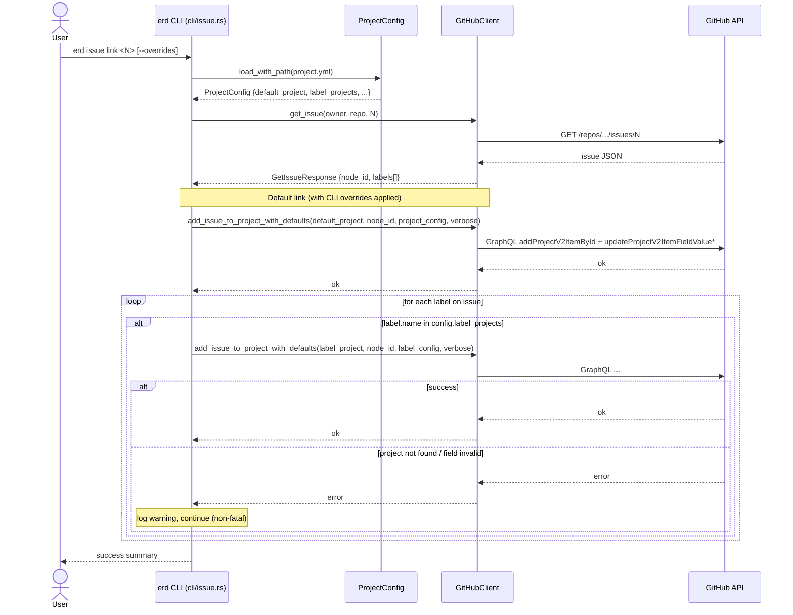
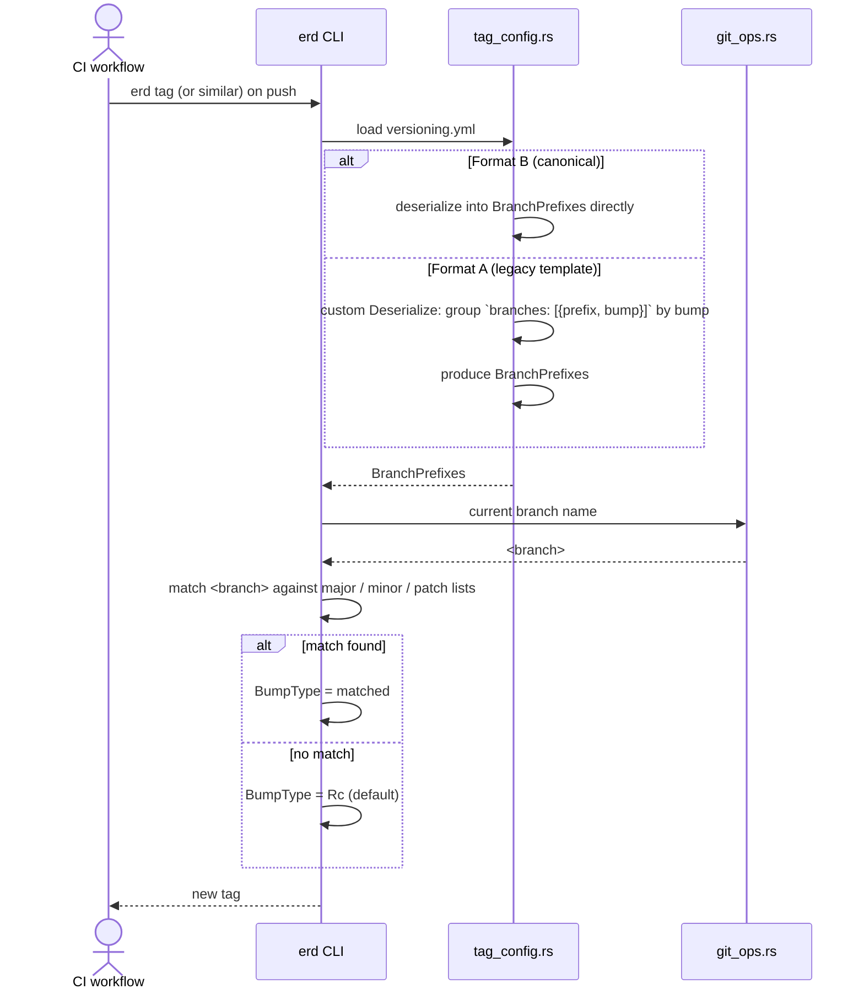
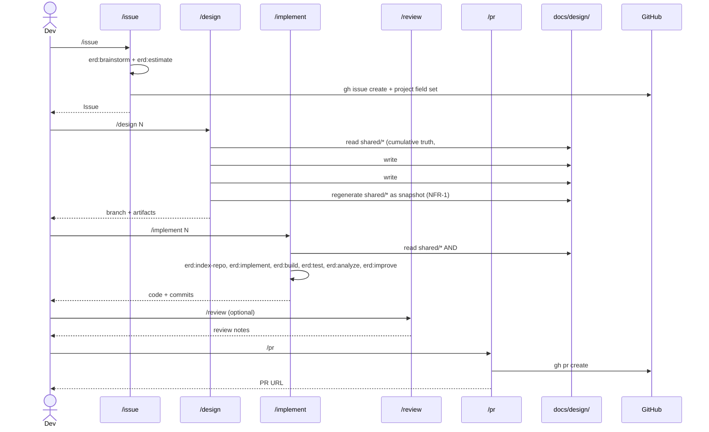

# Sequence Diagram (System-wide)

Cumulative system-wide flows. Each `##` section is a named flow. Snapshot — regenerated on every `/design` (NFR-1).

## `erd issue link` — default + label routing (#230)



## Tag bump computation from branch prefix (#228)



## devcontainer plugin install (#249, #255)

```mermaid
sequenceDiagram
    participant Container as devcontainer onCreate
    participant Post as post.sh (set -e)
    participant Setup as setup_plugins.sh
    participant Claude as claude CLI

    Container->>Post: source post.sh
    Post->>Setup: source setup_plugins.sh
    Setup->>Setup: ensure_claude_marketplace()
    Setup->>Claude: claude plugins marketplace add anthropics/claude-plugins-official
    alt marketplace registration ok
        Claude-->>Setup: ok
    else registration fails
        Claude-->>Setup: error
        Setup->>Post: warning + return 0
        Note over Post: set -e is respected; post.sh continues
    end

    loop each plugin in [context7, serena, optionally playwright]
        Setup->>Setup: try_install_plugin(name)
        Setup->>Claude: claude plugins install <name>@claude-plugins-official -s project
        alt install ok
            Claude-->>Setup: installed
        else install fails
            Claude-->>Setup: error
            Note over Setup: log warning, continue with next plugin
        end
    end

    Setup-->>Post: return 0
    Post-->>Container: post-create complete
```

## Claude Code skill workflow (`/issue` → `/design` → `/implement` → `/review` → `/pr`)



## Design-artifact migration (one-shot, #257)

```mermaid
sequenceDiagram
    participant Design as /design
    participant Migration as _shared/design-migration
    participant Issue as docs/design/#{old}/
    participant Shared as docs/design/shared/

    Design->>Migration: shared/ missing AND prior #{issue}/ exist
    Migration->>Issue: list directories (#NNN and NNN forms)
    Migration->>Issue: read each design.md (chronological; api-spec/class/sequence opportunistically)
    Issue-->>Migration: cumulative content
    Migration->>Migration: synthesize architecture, data-model, api-spec, class, sequence
    Migration->>Shared: write 5 shared files
    Note over Migration,Issue: existing #{old}/ files are PRESERVED unchanged (FR-5)
    Migration-->>Design: shared/ seeded; resume normal flow
```
