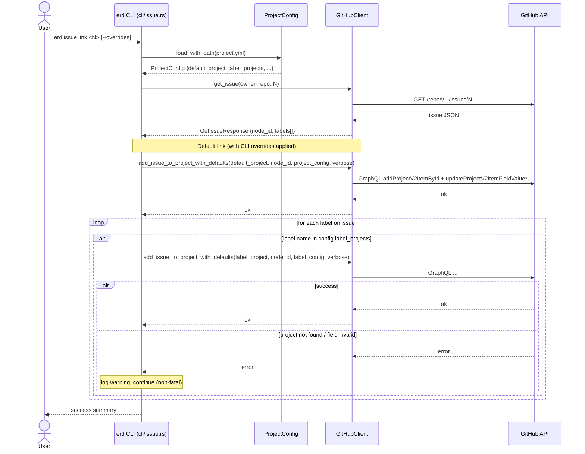
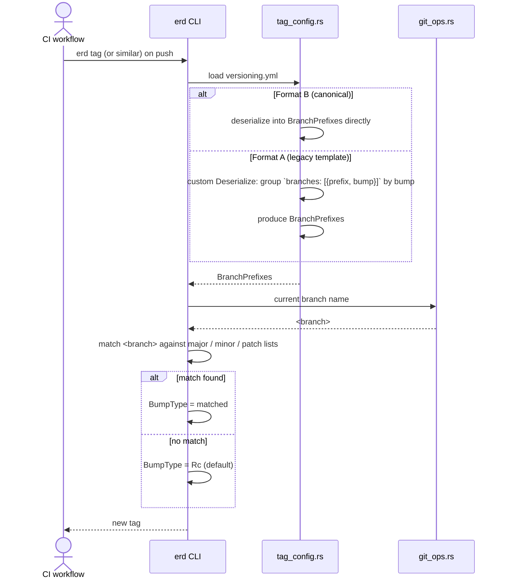
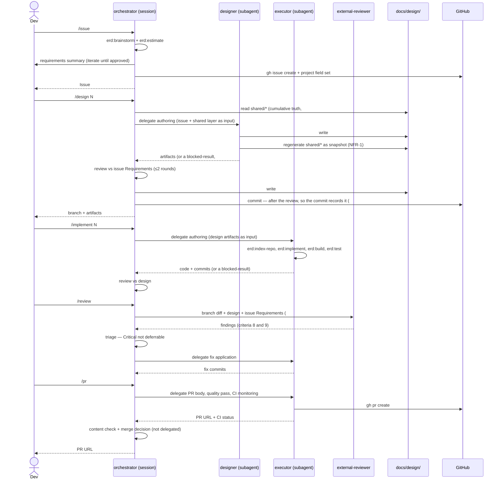
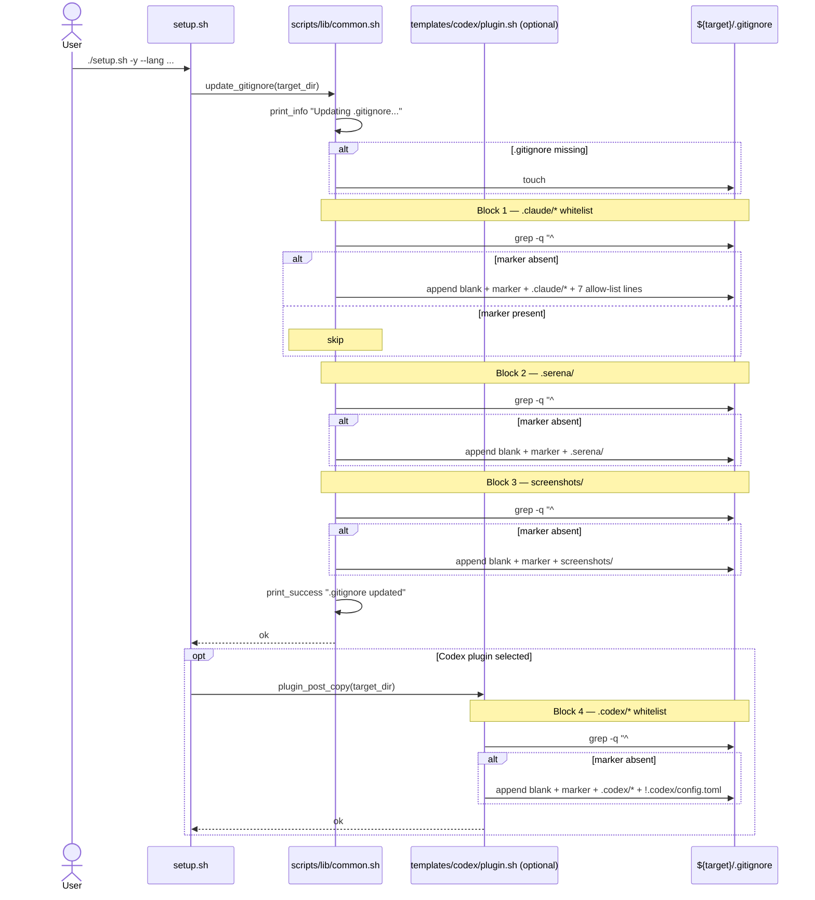
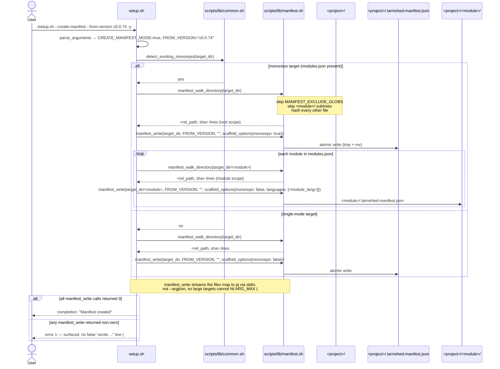
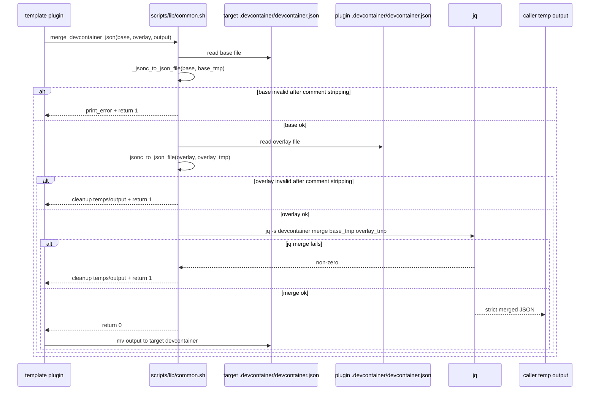

# Sequence Diagram (System-wide)

Cumulative system-wide flows. Each `##` section is a named flow. Snapshot — regenerated on every `/design` (NFR-1).

## `erd issue link` — default + label routing (#230)



## Tag bump computation from branch prefix (#228)



## devcontainer plugin install (#249, #255, #273)

`setup_plugins.sh` is sourced by `post.sh` (which runs under `set -e`) and is contractually required to `return 0`. The flow has three early-exit gates before any `claude plugins …` invocation: (a) the `claude` CLI must be present, (b) the user must be authenticated (`~/.claude/.credentials.json` exists and is non-empty — added in #273), (c) the marketplace must register successfully. Only after all three pass does the per-plugin install loop run, and even then each install failure is isolated by `try_install_plugin` so siblings continue.

```mermaid
sequenceDiagram
    participant Container as devcontainer onCreate
    participant Post as post.sh (set -e)
    participant Setup as setup_plugins.sh
    participant Creds as ~/.claude/.credentials.json
    participant Claude as claude CLI

    Container->>Post: source post.sh
    Post->>Setup: source setup_plugins.sh; setup_plugins
    Setup->>Setup: command -v claude
    alt claude missing
        Setup-->>Post: warning + return 0
    else claude present
        Setup->>Setup: is_claude_authenticated()
        Setup->>Creds: [[ -s ~/.claude/.credentials.json ]]
        alt credentials missing or empty (first run, #273)
            Creds-->>Setup: false
            Setup-->>Post: guidance ("run claude to log in,<br/>then re-run setup_plugins.sh") + return 0
            Note over Post: set -e respected; post.sh proceeds to setup_codex
        else credentials present
            Creds-->>Setup: true
            Setup->>Setup: ensure_claude_marketplace()
            Setup->>Claude: claude plugins marketplace add anthropics/claude-plugins-official
            alt registration ok
                Claude-->>Setup: ok
            else registration fails
                Claude-->>Setup: error
                Setup-->>Post: warning + return 0
                Note over Post: set -e respected; post.sh continues
            end

            Setup->>Claude: claude plugins list (if-guarded, #273 review)
            alt query ok
                Claude-->>Setup: plugins_output
            else query fails
                Claude-->>Setup: error
                Setup-->>Post: warning + return 0
                Note over Post: set -e respected; post.sh continues
            end

            loop each plugin in [context7, serena, optionally playwright]
                Setup->>Setup: try_install_plugin(name)
                Setup->>Claude: claude plugins install <name>@claude-plugins-official -s project
                alt install ok
                    Claude-->>Setup: installed
                else install fails
                    Claude-->>Setup: error
                    Note over Setup: log warning, continue with next plugin
                end
            end

            Setup-->>Post: return 0
        end
    end
    Post-->>Container: post-create complete
```

The `is_claude_authenticated` gate (#273) is identical in the workspace `setup_plugins.sh` and the `templates/claude/.devcontainer/scripts/setup_plugins.sh` template variant — those two files are now structurally aligned (the template variant also adopted `ensure_claude_marketplace` + `try_install_plugin` from the workspace variant in #273), mirroring the workspace-Codex dogfooding convention from #261.

## Claude Code skill workflow (`/issue` → `/design` → `/implement` → `/review` → `/pr`)

Role ownership per stage follows the #312 restructure: the orchestrator **is** the session, authoring is delegated to `designer` and `executor`, and the orchestrator reviews each delegated artifact before it is committed.



Under `/flow` the same sequence runs in one pass with **no approval gates** (#312). The two human confirmations that formerly sat before `design` and before `implement` are gone, because the party that reviews each artifact is now the session itself rather than a subagent that cannot reach the user. A run stops for the user in exactly four places: requirement gathering, an escalation the orchestrator cannot resolve (a subagent blocked-result, or a blocking review finding surviving two rounds), argument resolution, and a `/pr` failure.

## Design-artifact migration (one-shot, #257)

```mermaid
sequenceDiagram
    participant Design as /design
    participant Migration as _shared/design-migration
    participant Issue as docs/design/#{old}/
    participant Shared as docs/design/shared/

    Design->>Migration: shared/ missing AND prior #{issue}/ exist
    Migration->>Issue: list directories (#NNN and NNN forms)
    Migration->>Issue: read each design.md (chronological; api-spec/class/sequence opportunistically)
    Issue-->>Migration: cumulative content
    Migration->>Migration: synthesize architecture, data-model, api-spec, class, sequence
    Migration->>Shared: write 5 shared files
    Note over Migration,Issue: existing #{old}/ files are PRESERVED unchanged (FR-5)
    Migration-->>Design: shared/ seeded; resume normal flow
```

## Codex CLI: install in devcontainer + `/review` execution (#261)

Two phases: (a) `setup_codex` runs once during devcontainer post-create to make `codex` available on `$PATH`; (b) every subsequent `/review` invocation streams a prompt to `codex exec` and captures the result. Phase (a) is system-wide for any project that ships `setup_codex.sh` (workspace + downstream Codex-flavor projects); phase (b) is invoked per `/review` call. The decision tree inside `setup_codex` itself lives in `docs/design/#261/flowchart.md`.

```mermaid
sequenceDiagram
    participant Container as devcontainer onCreate
    participant Post as post.sh (set -e)
    participant SetupCodex as setup_codex.sh
    participant Npm as npm
    participant Codex as codex CLI

    Container->>Post: source post.sh
    Note over Post: ... earlier blocks (git/SSH/Rust/codespell/setup_plugins) ...
    Post->>SetupCodex: source setup_codex.sh; setup_codex
    alt npm missing
        SetupCodex-->>Post: [WARN] + return 0
    else codex already installed
        SetupCodex->>Codex: codex --version
        Codex-->>SetupCodex: <version>
        SetupCodex-->>Post: log + return 0
    else needs install
        SetupCodex->>Npm: npm root -g
        Npm-->>SetupCodex: <prefix or empty>
        SetupCodex->>SetupCodex: decide sudo (see flowchart.md)
        SetupCodex->>Npm: [sudo -E] npm install -g @openai/codex
        alt install ok
            Npm-->>SetupCodex: installed
        else install fails
            Npm-->>SetupCodex: error
            Note over SetupCodex: [WARN] + manual recovery hint
        end
        SetupCodex-->>Post: return 0
    end
    Post-->>Container: post-create complete

    actor Dev
    participant Claude as Claude Code (/review skill)
    participant ConfTOML as .codex/config.toml
    participant Agents as AGENTS.md

    Dev->>Claude: /review
    Claude->>Claude: prerequisites: command -v codex
    alt codex missing
        Claude-->>Dev: refuse with install instructions
    else codex present
        Claude->>Claude: collect git diff + design.md + prompt
        Claude->>Codex: codex exec - --sandbox read-only<br/>(or codex review --base develop)
        Codex->>ConfTOML: read model / approval / sandbox
        Codex->>Agents: read review-agent role
        Codex-->>Claude: structured review (Critical/Warnings/Suggestions/Positive)
        Claude->>Claude: save to docs/review/#{issue}/review.md
        Claude->>Claude: apply fixes; commit
        Claude-->>Dev: review summary + applied fixes
    end
```

## `update_gitignore` — block-level idempotent appends (#259)



## `setup.sh --monorepo` — one-shot monorepo init (#263)

Runs against an empty target directory. Generates root assets + per-module sub-directories + `modules.json`. The mode-selection portion of `main()` is captured separately in `docs/design/#263/flowchart.md`; this sequence focuses on the post-copy dispatch.

```mermaid
sequenceDiagram
    actor User
    participant Setup as setup.sh
    participant Common as scripts/lib/common.sh
    participant Lang as language plugins (e.g. python, node)
    participant Core as core plugin
    participant Svc as service plugins (optional)
    participant Root as <project>/ (root)
    participant Mods as <project>/modules.json
    participant SubDir as <project>/<module>/

    User->>Setup: ./setup.sh --monorepo --module jing:python --module kir:node --postgresql -y
    Setup->>Setup: parse_arguments → MONOREPO_MODE=true, MODULES=("jing:python","kir:node")
    Setup->>Setup: derive SELECTED_LANGUAGES = ("python","node")
    Setup->>Setup: load_selected_plugins (core, claude, python, node, postgres, ...)
    Setup->>Setup: execute_plugin_copies(root)
    Note over Setup,Root: copies .devcontainer/, .claude/, docker/, docker-compose.yml, etc.
    Setup->>Setup: execute_plugin_dockerfiles(root)
    Note over Setup,Root: appends marker-guarded python + node toolchain blocks (FR-5)

    Setup->>Setup: execute_plugin_post_copies (monorepo mode)
    loop for each loaded plugin
        alt plugin in templates/languages/* (e.g. python)
            Setup->>Lang: plugin_post_copy_shared(root)
            Lang->>Root: patch .devcontainer/devcontainer.json (idempotent merge)
            Lang->>Root: patch .claude/settings.json (idempotent merge)
            Lang->>Root: append marker-guarded post.sh language block
            loop for each module with language == python (e.g. jing)
                Setup->>Lang: plugin_post_copy_module(root/jing, "jing")
                Lang->>SubDir: write pyproject.toml, ruff.toml, src/jing/__init__.py, tests/
            end
        else plugin in templates/services/* (e.g. postgres) or core/claude/codex/github-actions
            Setup->>Svc: plugin_post_copy(root)
            Svc->>Root: merge docker-compose.yml service "<project>-db" (project-name prefix; existing convention)
            Svc->>Root: append marker-guarded post.sh service block
        end
    end

    Setup->>Core: plugin_post_copy(root) [monorepo branch]
    Core->>Mods: write modules.json from MODULES (FR-4)
    loop for each module
        Core->>SubDir: write <module>/CLAUDE.md from template
    end

    Setup->>Common: replace_placeholders(root, project_name)
    Setup->>Common: update_gitignore(root)
    Setup-->>User: completion message
```

## `setup.sh --create-manifest` — bootstrap a manifest for an existing project (#265)

One-shot mode that scans the current state of an already-scaffolded project and writes `.tarnished-manifest.json` (root + per-module if monorepo). Required before the first `--upgrade` on legacy projects. Idempotent — safe to re-run.



## `setup.sh --upgrade` — refresh tracked files of an existing project (#265)

The core upgrade flow. Loads the existing manifest, clones upstream tarnished at `--target-version`, runs the same plugin pipeline against a per-scope staging directory with `MANIFEST_RECORDING` enabled, then dispatches the FR-4 lifecycle decision per file. The 8-case `manifest_decide` state machine is detailed in `docs/design/#265/flowchart.md`. Only verbatim-copy files participate in tracking; merge logic (`update_gitignore`, JSON merges) is re-applied directly to the target by re-running `plugin_post_copy` (FR-5).

```mermaid
sequenceDiagram
    actor User
    participant Setup as setup.sh
    participant Common as scripts/lib/common.sh
    participant Manifest as scripts/lib/manifest.sh
    participant Git as git
    participant Tmp as TMP_DIR (cloned tarnished)
    participant Plugins as plugin pipeline
    participant Stage as STAGING_DIR
    participant Target as <project>/
    participant ManFile as .tarnished-manifest.json

    User->>Setup: ./setup.sh --upgrade --target-version v0.0.76 -y
    Setup->>Setup: parse_arguments → UPGRADE_MODE=true, TARGET_VERSION="v0.0.76"
    Setup->>Manifest: manifest_exists(target_dir)
    alt manifest absent
        Manifest-->>Setup: no
        Setup-->>User: error 1 — "run --create-manifest first"
    else manifest present
        Manifest-->>Setup: yes
        Setup->>Setup: check_git_clean(target_dir)
        alt dirty + no --force
            Setup-->>User: error 1 — "commit/stash or --force"
        else clean OR --force
            Setup->>Manifest: manifest_read(target_dir)
            Manifest-->>Setup: OLD_MANIFEST {tarnished_version, scaffold_options, files}
            Setup->>Setup: compute_upgrade_scopes (--shared-only / --module filtering)

            Setup->>Git: clone --depth 1 --branch <ref> upstream/tarnished
            Git->>Tmp: TMP_DIR populated
            Tmp-->>Setup: ok

            loop each scope (shared, then per-module)
                Setup->>Manifest: manifest_recording_start(STAGING_DIR_<scope>)
                Setup->>Plugins: execute_plugin_copies(STAGING_DIR_<scope>)
                Setup->>Plugins: execute_plugin_dockerfiles(STAGING_DIR_<scope>)
                Setup->>Plugins: execute_plugin_post_copies(STAGING_DIR_<scope>)
                Note over Plugins,Stage: copy_with_confirm intercept records<br/>(rel_path, sha256) into MANIFEST_TRACKED
                Setup->>Manifest: manifest_recording_stop
                Note over Setup,Manifest: NEW_HASHES := MANIFEST_TRACKED snapshot

                loop each path in OLD_MANIFEST.files ∪ NEW_HASHES
                    Setup->>Common: sha256_file(target/path)
                    Common-->>Setup: current_h (or "" if missing)
                    Setup->>Manifest: manifest_decide(old_h, current_h, new_h)
                    Manifest-->>Setup: decision (NOOP/UPDATE/SKIP_EDITED/NEW/...)
                    Setup->>Manifest: manifest_apply(decision, stage_path, target_path)
                    alt --dry-run
                        Note over Manifest,Target: skip mutation; tally only
                    else live run
                        Manifest->>Target: cp / rm per decision
                    end
                end

                Setup->>Plugins: rerun plugin_post_copy on Target (FR-5: merge logic)
                Note over Plugins,Target: idempotent re-application of<br/>update_gitignore / merge_devcontainer_json /<br/>merge_claude_settings_hooks
                Setup->>Manifest: manifest_write(scope_root, TARGET_VERSION, target_commit, scaffold_options)
                alt --dry-run
                    Note over Manifest,ManFile: skip write
                else live run
                    alt manifest_write returned 0
                        Manifest->>ManFile: update manifest with new version + hashes (files map via stdin, #289)
                    else manifest_write returned non-zero
                        Setup-->>User: abort scope, error 1 — no "Manifest updated" (#289)
                    end
                end
            end

            Setup->>Manifest: manifest_summary_print(old, new)
            Manifest-->>User: Updated/Skipped/New/Removed/...  summary
        end
    end
```

## `setup.sh` remote bootstrap (`curl | bash`) (#276)

The primary distribution path. The bootstrap block at `setup.sh:29-69` detects pipe execution, clones the upstream repo into a temp dir, then `exec`s the local copy. The `< /dev/null` on the `exec` line is what keeps the outer curl from emitting a spurious `curl: (23)` to the user terminal.

```mermaid
sequenceDiagram
    actor User
    participant Curl as curl
    participant BootBash as bash (bootstrap; reads script from curl's stdout)
    participant Git as git
    participant Tmp as $BOOTSTRAP_TEMP_DIR
    participant NewBash as bash (exec'd; reads script from disk)

    User->>Curl: curl -fsSL .../setup.sh | bash
    Curl->>BootBash: stream setup.sh bytes
    BootBash->>BootBash: detect [[ -z BASH_SOURCE[0] || == "-" || ! -f ... ]]
    BootBash->>Git: git clone --depth 1 --branch develop ... $BOOTSTRAP_TEMP_DIR
    Git->>Tmp: populated
    Tmp-->>BootBash: ok

    Note over BootBash,NewBash: exec replaces the process image; pre-#276 the<br/>outer curl pipe was inherited and curl hit EPIPE,<br/>printing "curl: (23) Failure writing output to destination"<br/>at a non-deterministic point during the rest of the setup.

    BootBash->>NewBash: exec bash "$BOOTSTRAP_TEMP_DIR/setup.sh" "$@" < /dev/null
    Note over Curl,NewBash: stdin redirected to /dev/null; the curl pipe is<br/>NOT inherited; curl exits cleanly with no terminal noise.

    NewBash->>Tmp: read setup.sh from disk
    NewBash->>NewBash: parse_arguments + run modes (single / monorepo / upgrade / ...)
    NewBash-->>User: completion message
```

## GitHub Project Integration — auto-detection and fallback (#276)

`plugin_interactive_setup` (in `templates/github-actions/project-integration/plugin.sh`) attempts `gh` CLI auto-detection of GitHub Projects and falls back to manual prompts on failure. Pre-#276 the fallback could be skipped when `gh` failed under `set -e`; post-#276 every gh invocation goes through `_gh_run`, which always returns 0 and writes the first line of gh's stderr to `GH_LAST_ERROR_FILE_FILE` (a process-wide `mktemp`'d path) so the parent shell can surface it after the `$(...)` subshell returns.

```mermaid
sequenceDiagram
    actor User
    participant Setup as plugin_interactive_setup
    participant GhRun as _gh_run
    participant Gh as gh CLI
    participant Warn as print_warning / _print_gh_warning
    participant Manual as prompt_manual_project_config + prompt_manual_field_defaults

    User->>Setup: enter "y" to enable Project integration
    Setup->>Setup: prompt ERD_REF (read /dev/tty)
    Setup->>Setup: check_gh_available
    alt gh missing
        Setup->>Warn: print_info "gh CLI not found, using manual configuration"
        Setup->>Manual: invoke manual prompts
    else gh present
        Setup->>Warn: print_info "Detected gh CLI, attempting to fetch projects..."

        Setup->>GhRun: get_current_user
        GhRun->>Gh: gh api user --jq '.login' </dev/null 2>tmp
        alt gh ok
            Gh-->>GhRun: stdout=<login>, stderr empty, exit 0
            GhRun-->>Setup: stdout=<login>, GH_LAST_ERROR_FILE=""
        else gh fails
            Gh-->>GhRun: stdout="", stderr="gh: not logged in...", exit 1
            GhRun-->>Setup: stdout="", GH_LAST_ERROR_FILE="gh: not logged in..."
        end

        alt current_user empty
            Setup->>Warn: _print_gh_warning "Could not determine current user"
            Setup->>Manual: invoke manual prompts
        else current_user non-empty
            Setup->>GhRun: get_owner_projects current_user
            GhRun->>Gh: gh project list --owner <user> --format json
            Gh-->>GhRun: stdout=<JSON or empty>, GH_LAST_ERROR_FILE set if failed
            GhRun-->>Setup: stdout, GH_LAST_ERROR_FILE
            alt projects fetched and length > 0
                Setup->>Setup: use_gh_detection=true
                Setup->>Setup: select project (auto if 1, list if many)
                Setup->>GhRun: get_project_fields_detailed (GraphQL; fallback to basic on empty)
                GhRun->>Gh: gh api graphql -f ...
                Gh-->>GhRun: detailed JSON or empty
                GhRun-->>Setup: stdout, GH_LAST_ERROR_FILE
                Setup->>Setup: categorize + configure single-select / iteration / date fields
            else fetch failed or empty
                Setup->>Warn: _print_gh_warning "Could not fetch projects" or "No projects found"
                Setup->>Manual: invoke manual prompts
            end
        end
    end

    Setup->>Setup: prompt_label_routing_setup (if TTY)
    Setup-->>User: print_success "Project configuration collected"
```

## Always-latest asset refresh — `refresh-assets.sh` (#279)

`refresh-assets.sh` is a complementary distribution mechanism to `setup.sh --upgrade`. The manifest-driven upgrade path (#265) is opt-in and rarely run; for high-update-frequency operational assets (`.claude/commands/`, `.claude/skills/`, `.claude/scripts/`, and file-managed shared rules such as `.claude/rules/shell.md`) the script runs **on every container start** so a project scaffolded a month ago still picks up the latest skill/command/script/shared-rule revisions automatically. Two invocation paths converge on the same entry: (a) on the very first container boot, `post.sh` calls it via the marker-guarded block (`# Tarnished Asset Refresh`); (b) on every subsequent container start, `templates/core/.devcontainer/devcontainer.json`'s `postStartCommand` invokes it directly. The double-call on first boot is benign — the second invocation hits the SHA cache and exits early. The script always returns 0 (FR-5: container start MUST NOT block on it). The full decision tree (15 leaves, 11 of which are non-fatal warning paths) is documented in `docs/design/#279/flowchart.md`.

```mermaid
sequenceDiagram
    participant Container as devcontainer onStart
    participant Refresh as refresh-assets.sh
    participant Cfg as <project>/.tarnished/refresh.json
    participant Cache as /opt/tarnished (cache)
    participant Upstream as github.com/.../tarnished
    participant Project as <project>/

    Container->>Refresh: postStartCommand
    Refresh->>Cfg: jq parse refresh.json
    alt missing or malformed or schema_version > 1
        Cfg-->>Refresh: error
        Refresh-->>Container: print_warning + exit 0
    else parse ok
        Cfg-->>Refresh: {upstream, clone_dir, managed_paths}

        alt clone_dir absent
            Refresh->>Cache: mkdir -p $(dirname clone_dir)
            alt parent not writable
                Cache-->>Refresh: EPERM
                Refresh->>Refresh: clone_dir := $HOME/.cache/tarnished<br/>(print_warning fallback)
            end
            Refresh->>Upstream: git clone --depth 1 --branch <ref> <url> <clone_dir>
            alt clone fails (network/DNS)
                Upstream-->>Refresh: error
                Refresh-->>Container: print_warning + exit 0<br/>(project keeps original scaffolded bytes)
            else clone ok
                Upstream-->>Cache: populated
                Note over Refresh,Cache: skip ls-remote (just cloned)
            end
        else clone_dir present
            alt clone_dir/.git absent (corrupted)
                Refresh-->>Container: print_error + exit 0<br/>(refuse to silently delete)
            else .git present
                alt --force-pull
                    Note over Refresh: skip ls-remote
                else default
                    Refresh->>Upstream: git ls-remote origin <branch>
                    alt ls-remote fails
                        Upstream-->>Refresh: error
                        Refresh-->>Container: print_warning + exit 0<br/>(use cached as-is)
                    else ls-remote ok
                        Upstream-->>Refresh: remote_sha
                        Refresh->>Cache: git rev-parse HEAD
                        Cache-->>Refresh: local_sha
                        alt remote_sha == local_sha
                            Refresh-->>Container: print_info "upstream unchanged" + exit 0
                        end
                    end
                end
                Refresh->>Cache: git fetch origin <branch>
                alt fetch fails
                    Refresh-->>Container: print_warning + exit 0
                else fetch ok
                    Refresh->>Cache: git reset --hard origin/<branch><br/>(cache is treated as immutable mirror)
                end
            end
        end

        loop each managed_paths entry
            Refresh->>Project: rsync -a --delete<br/>cache/<src>/ project/<dst>/
            alt rsync fails
                Note over Refresh,Project: print_warning per path; continue with siblings
            end
            alt project/<overlay>/ exists
                Refresh->>Project: rsync -a (no --delete)<br/>project/<overlay>/ project/<dst>/
                Note over Refresh,Project: overlay wins; user customizations<br/>survive across refreshes
            end
        end

        Refresh->>Container: print_summary "[OK] N paths synced (...)" + exit 0
    end
```

The cache `/opt/tarnished` is owned by `vscode` (the default `remoteUser` in `templates/core/.devcontainer/devcontainer.json:37`); the script falls back to `${HOME}/.cache/tarnished` when `/opt` is not writable. Always-latest paths are excluded from `--upgrade`'s manifest tracking via the `MANIFEST_EXCLUDE_GLOBS` extension in `scripts/lib/common.sh:126-138`, so the two mechanisms never fight per path.

## `setup.sh --add-module` — incremental add to existing monorepo (#263)

Detects an existing `modules.json` in CWD (or accepts `--add-module` flag) and adds a single module. Idempotent against shared assets via marker-guarded blocks and JSON merge helpers.

```mermaid
sequenceDiagram
    actor User
    participant Setup as setup.sh
    participant Common as scripts/lib/common.sh
    participant Lang as language plugin (e.g. python)
    participant Core as core plugin
    participant Mods as <project>/modules.json
    participant Root as <project>/ (root)
    participant SubDir as <project>/<module>/

    User->>Setup: ./setup.sh --add-module anisette --lang python -y
    Setup->>Common: detect_existing_monorepo(cwd)
    Common-->>Setup: ok (modules.json present)
    Setup->>Common: find_module_by_name(cwd, "anisette")
    Common-->>Setup: not present (else: prompt overwrite, FR-9)

    Setup->>Common: list_existing_compose_services(cwd) → diff vs AVAILABLE_SERVICES
    Note over Setup,Common: only un-added services are offered (FR-10)

    Setup->>Setup: load python plugin (+ any newly-selected service plugin)
    Setup->>Setup: execute_plugin_dockerfiles(root)
    Note over Setup,Root: marker-guard skips re-append if python toolchain block already present
    Setup->>Lang: plugin_post_copy_shared(root) [idempotent: merge / marker-guards skip on re-run]

    Setup->>SubDir: mkdir -p root/anisette
    Setup->>Lang: plugin_post_copy_module(root/anisette, "anisette")
    Lang->>SubDir: write pyproject.toml, ruff.toml, src/anisette/__init__.py, tests/

    Setup->>Core: plugin_post_copy(root) [monorepo branch]
    Core->>Common: add_module_entry(cwd, "anisette", "python", services=[])
    Common->>Mods: append entry (atomic jq | mv); on duplicate → exit 2 (caller handled above)
    Core->>SubDir: write root/anisette/CLAUDE.md from template (skip if exists, unless --overwrite)

    Setup->>Common: update_gitignore(root) [idempotent]
    Setup-->>User: completion: "Module 'anisette' added"
```

## Devcontainer JSON merge with comment normalization

Language and service plugins call `merge_devcontainer_json` to merge
devcontainer features, VS Code extensions, and VS Code settings. The helper
accepts strict JSON or comment-bearing devcontainer JSON, normalizes comments
away in private temp files, and then runs the structural `jq` merge. The output
is strict JSON.


