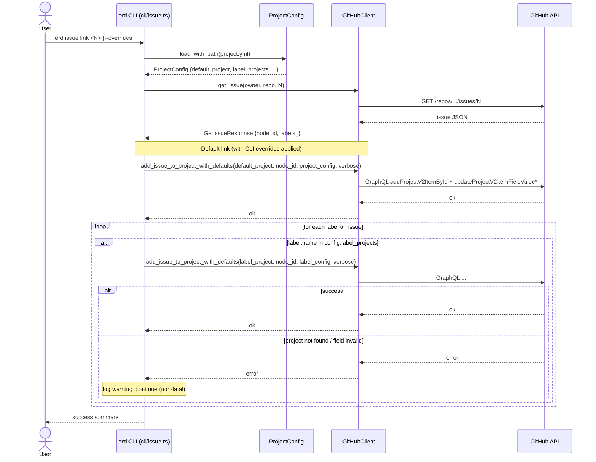
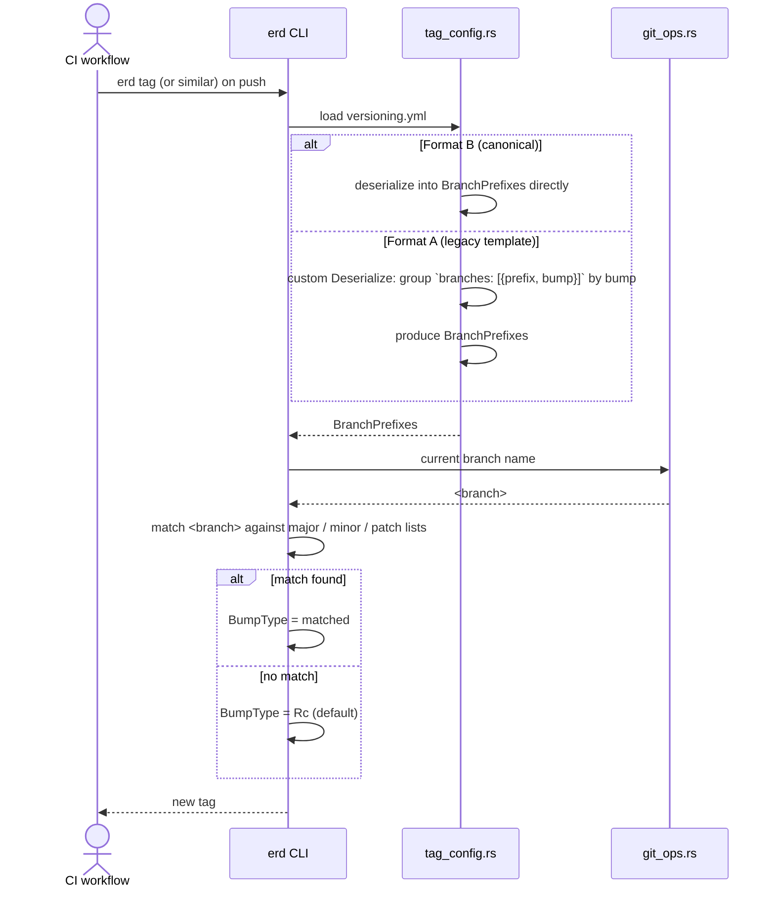
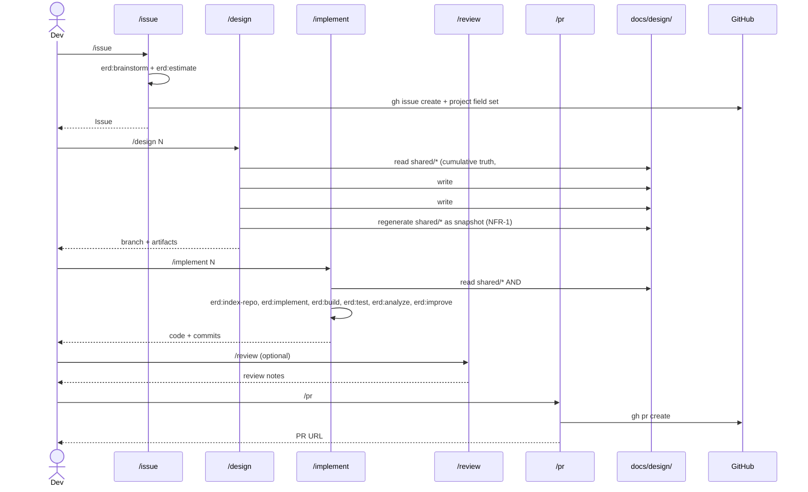
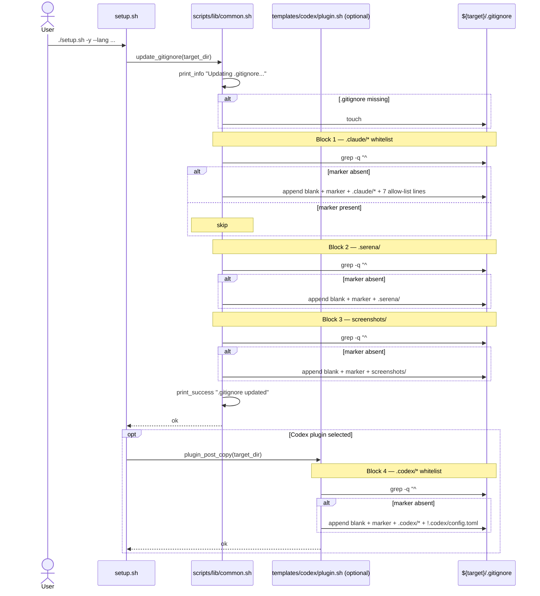
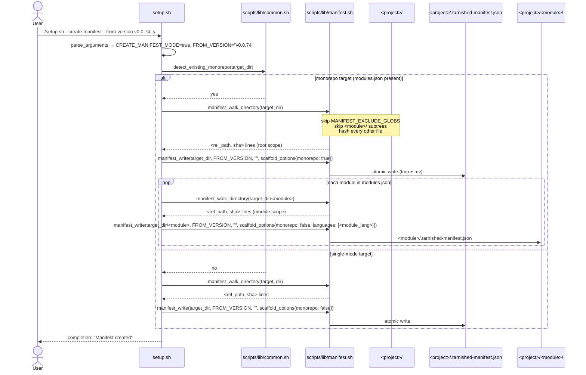

# Sequence Diagram (System-wide)

Cumulative system-wide flows. Each `##` section is a named flow. Snapshot — regenerated on every `/design` (NFR-1).

## `erd issue link` — default + label routing (#230)



## Tag bump computation from branch prefix (#228)



## devcontainer plugin install (#249, #255)

```mermaid
sequenceDiagram
    participant Container as devcontainer onCreate
    participant Post as post.sh (set -e)
    participant Setup as setup_plugins.sh
    participant Claude as claude CLI

    Container->>Post: source post.sh
    Post->>Setup: source setup_plugins.sh
    Setup->>Setup: ensure_claude_marketplace()
    Setup->>Claude: claude plugins marketplace add anthropics/claude-plugins-official
    alt marketplace registration ok
        Claude-->>Setup: ok
    else registration fails
        Claude-->>Setup: error
        Setup->>Post: warning + return 0
        Note over Post: set -e is respected; post.sh continues
    end

    loop each plugin in [context7, serena, optionally playwright]
        Setup->>Setup: try_install_plugin(name)
        Setup->>Claude: claude plugins install <name>@claude-plugins-official -s project
        alt install ok
            Claude-->>Setup: installed
        else install fails
            Claude-->>Setup: error
            Note over Setup: log warning, continue with next plugin
        end
    end

    Setup-->>Post: return 0
    Post-->>Container: post-create complete
```

## Claude Code skill workflow (`/issue` → `/design` → `/implement` → `/review` → `/pr`)



## Design-artifact migration (one-shot, #257)

```mermaid
sequenceDiagram
    participant Design as /design
    participant Migration as _shared/design-migration
    participant Issue as docs/design/#{old}/
    participant Shared as docs/design/shared/

    Design->>Migration: shared/ missing AND prior #{issue}/ exist
    Migration->>Issue: list directories (#NNN and NNN forms)
    Migration->>Issue: read each design.md (chronological; api-spec/class/sequence opportunistically)
    Issue-->>Migration: cumulative content
    Migration->>Migration: synthesize architecture, data-model, api-spec, class, sequence
    Migration->>Shared: write 5 shared files
    Note over Migration,Issue: existing #{old}/ files are PRESERVED unchanged (FR-5)
    Migration-->>Design: shared/ seeded; resume normal flow
```

## Codex CLI: install in devcontainer + `/review` execution (#261)

Two phases: (a) `setup_codex` runs once during devcontainer post-create to make `codex` available on `$PATH`; (b) every subsequent `/review` invocation streams a prompt to `codex exec` and captures the result. Phase (a) is system-wide for any project that ships `setup_codex.sh` (workspace + downstream Codex-flavor projects); phase (b) is invoked per `/review` call. The decision tree inside `setup_codex` itself lives in `docs/design/#261/flowchart.md`.

```mermaid
sequenceDiagram
    participant Container as devcontainer onCreate
    participant Post as post.sh (set -e)
    participant SetupCodex as setup_codex.sh
    participant Npm as npm
    participant Codex as codex CLI

    Container->>Post: source post.sh
    Note over Post: ... earlier blocks (git/SSH/Rust/codespell/setup_plugins) ...
    Post->>SetupCodex: source setup_codex.sh; setup_codex
    alt npm missing
        SetupCodex-->>Post: [WARN] + return 0
    else codex already installed
        SetupCodex->>Codex: codex --version
        Codex-->>SetupCodex: <version>
        SetupCodex-->>Post: log + return 0
    else needs install
        SetupCodex->>Npm: npm root -g
        Npm-->>SetupCodex: <prefix or empty>
        SetupCodex->>SetupCodex: decide sudo (see flowchart.md)
        SetupCodex->>Npm: [sudo -E] npm install -g @openai/codex
        alt install ok
            Npm-->>SetupCodex: installed
        else install fails
            Npm-->>SetupCodex: error
            Note over SetupCodex: [WARN] + manual recovery hint
        end
        SetupCodex-->>Post: return 0
    end
    Post-->>Container: post-create complete

    actor Dev
    participant Claude as Claude Code (/review skill)
    participant ConfTOML as .codex/config.toml
    participant Agents as AGENTS.md

    Dev->>Claude: /review
    Claude->>Claude: prerequisites: command -v codex
    alt codex missing
        Claude-->>Dev: refuse with install instructions
    else codex present
        Claude->>Claude: collect git diff + design.md + prompt
        Claude->>Codex: codex exec - --sandbox read-only<br/>(or codex review --base develop)
        Codex->>ConfTOML: read model / approval / sandbox
        Codex->>Agents: read review-agent role
        Codex-->>Claude: structured review (Critical/Warnings/Suggestions/Positive)
        Claude->>Claude: save to docs/review/#{issue}/review.md
        Claude->>Claude: apply fixes; commit
        Claude-->>Dev: review summary + applied fixes
    end
```

## `update_gitignore` — block-level idempotent appends (#259)



## `setup.sh --monorepo` — one-shot monorepo init (#263)

Runs against an empty target directory. Generates root assets + per-module sub-directories + `modules.json`. The mode-selection portion of `main()` is captured separately in `docs/design/#263/flowchart.md`; this sequence focuses on the post-copy dispatch.

```mermaid
sequenceDiagram
    actor User
    participant Setup as setup.sh
    participant Common as scripts/lib/common.sh
    participant Lang as language plugins (e.g. python, node)
    participant Core as core plugin
    participant Svc as service plugins (optional)
    participant Root as <project>/ (root)
    participant Mods as <project>/modules.json
    participant SubDir as <project>/<module>/

    User->>Setup: ./setup.sh --monorepo --module jing:python --module kir:node --postgresql -y
    Setup->>Setup: parse_arguments → MONOREPO_MODE=true, MODULES=("jing:python","kir:node")
    Setup->>Setup: derive SELECTED_LANGUAGES = ("python","node")
    Setup->>Setup: load_selected_plugins (core, claude, python, node, postgres, ...)
    Setup->>Setup: execute_plugin_copies(root)
    Note over Setup,Root: copies .devcontainer/, .claude/, docker/, docker-compose.yml, etc.
    Setup->>Setup: execute_plugin_dockerfiles(root)
    Note over Setup,Root: appends marker-guarded python + node toolchain blocks (FR-5)

    Setup->>Setup: execute_plugin_post_copies (monorepo mode)
    loop for each loaded plugin
        alt plugin in templates/languages/* (e.g. python)
            Setup->>Lang: plugin_post_copy_shared(root)
            Lang->>Root: patch .devcontainer/devcontainer.json (idempotent merge)
            Lang->>Root: patch .claude/settings.json (idempotent merge)
            Lang->>Root: append marker-guarded post.sh language block
            loop for each module with language == python (e.g. jing)
                Setup->>Lang: plugin_post_copy_module(root/jing, "jing")
                Lang->>SubDir: write pyproject.toml, ruff.toml, src/jing/__init__.py, tests/
            end
        else plugin in templates/services/* (e.g. postgres) or core/claude/codex/github-actions
            Setup->>Svc: plugin_post_copy(root)
            Svc->>Root: merge docker-compose.yml service "<project>-db" (project-name prefix; existing convention)
            Svc->>Root: append marker-guarded post.sh service block
        end
    end

    Setup->>Core: plugin_post_copy(root) [monorepo branch]
    Core->>Mods: write modules.json from MODULES (FR-4)
    loop for each module
        Core->>SubDir: write <module>/CLAUDE.md from template
    end

    Setup->>Common: replace_placeholders(root, project_name)
    Setup->>Common: update_gitignore(root)
    Setup-->>User: completion message
```

## `setup.sh --create-manifest` — bootstrap a manifest for an existing project (#265)

One-shot mode that scans the current state of an already-scaffolded project and writes `.tarnished-manifest.json` (root + per-module if monorepo). Required before the first `--upgrade` on legacy projects. Idempotent — safe to re-run.



## `setup.sh --upgrade` — refresh tracked files of an existing project (#265)

The core upgrade flow. Loads the existing manifest, clones upstream tarnished at `--target-version`, runs the same plugin pipeline against a per-scope staging directory with `MANIFEST_RECORDING` enabled, then dispatches the FR-4 lifecycle decision per file. The 8-case `manifest_decide` state machine is detailed in `docs/design/#265/flowchart.md`. Only verbatim-copy files participate in tracking; merge logic (`update_gitignore`, JSON merges) is re-applied directly to the target by re-running `plugin_post_copy` (FR-5).

```mermaid
sequenceDiagram
    actor User
    participant Setup as setup.sh
    participant Common as scripts/lib/common.sh
    participant Manifest as scripts/lib/manifest.sh
    participant Git as git
    participant Tmp as TMP_DIR (cloned tarnished)
    participant Plugins as plugin pipeline
    participant Stage as STAGING_DIR
    participant Target as <project>/
    participant ManFile as .tarnished-manifest.json

    User->>Setup: ./setup.sh --upgrade --target-version v0.0.76 -y
    Setup->>Setup: parse_arguments → UPGRADE_MODE=true, TARGET_VERSION="v0.0.76"
    Setup->>Manifest: manifest_exists(target_dir)
    alt manifest absent
        Manifest-->>Setup: no
        Setup-->>User: error 1 — "run --create-manifest first"
    else manifest present
        Manifest-->>Setup: yes
        Setup->>Setup: check_git_clean(target_dir)
        alt dirty + no --force
            Setup-->>User: error 1 — "commit/stash or --force"
        else clean OR --force
            Setup->>Manifest: manifest_read(target_dir)
            Manifest-->>Setup: OLD_MANIFEST {tarnished_version, scaffold_options, files}
            Setup->>Setup: compute_upgrade_scopes (--shared-only / --module filtering)

            Setup->>Git: clone --depth 1 --branch <ref> upstream/tarnished
            Git->>Tmp: TMP_DIR populated
            Tmp-->>Setup: ok

            loop each scope (shared, then per-module)
                Setup->>Manifest: manifest_recording_start(STAGING_DIR_<scope>)
                Setup->>Plugins: execute_plugin_copies(STAGING_DIR_<scope>)
                Setup->>Plugins: execute_plugin_dockerfiles(STAGING_DIR_<scope>)
                Setup->>Plugins: execute_plugin_post_copies(STAGING_DIR_<scope>)
                Note over Plugins,Stage: copy_with_confirm intercept records<br/>(rel_path, sha256) into MANIFEST_TRACKED
                Setup->>Manifest: manifest_recording_stop
                Note over Setup,Manifest: NEW_HASHES := MANIFEST_TRACKED snapshot

                loop each path in OLD_MANIFEST.files ∪ NEW_HASHES
                    Setup->>Common: sha256_file(target/path)
                    Common-->>Setup: current_h (or "" if missing)
                    Setup->>Manifest: manifest_decide(old_h, current_h, new_h)
                    Manifest-->>Setup: decision (NOOP/UPDATE/SKIP_EDITED/NEW/...)
                    Setup->>Manifest: manifest_apply(decision, stage_path, target_path)
                    alt --dry-run
                        Note over Manifest,Target: skip mutation; tally only
                    else live run
                        Manifest->>Target: cp / rm per decision
                    end
                end

                Setup->>Plugins: rerun plugin_post_copy on Target (FR-5: merge logic)
                Note over Plugins,Target: idempotent re-application of<br/>update_gitignore / merge_devcontainer_json /<br/>merge_claude_settings_hooks
                Setup->>Manifest: manifest_write(scope_root, TARGET_VERSION, target_commit, scaffold_options)
                alt --dry-run
                    Note over Manifest,ManFile: skip write
                else live run
                    Manifest->>ManFile: update manifest with new version + hashes
                end
            end

            Setup->>Manifest: manifest_summary_print(old, new)
            Manifest-->>User: Updated/Skipped/New/Removed/...  summary
        end
    end
```

## `setup.sh --add-module` — incremental add to existing monorepo (#263)

Detects an existing `modules.json` in CWD (or accepts `--add-module` flag) and adds a single module. Idempotent against shared assets via marker-guarded blocks and JSON merge helpers.

```mermaid
sequenceDiagram
    actor User
    participant Setup as setup.sh
    participant Common as scripts/lib/common.sh
    participant Lang as language plugin (e.g. python)
    participant Core as core plugin
    participant Mods as <project>/modules.json
    participant Root as <project>/ (root)
    participant SubDir as <project>/<module>/

    User->>Setup: ./setup.sh --add-module anisette --lang python -y
    Setup->>Common: detect_existing_monorepo(cwd)
    Common-->>Setup: ok (modules.json present)
    Setup->>Common: find_module_by_name(cwd, "anisette")
    Common-->>Setup: not present (else: prompt overwrite, FR-9)

    Setup->>Common: list_existing_compose_services(cwd) → diff vs AVAILABLE_SERVICES
    Note over Setup,Common: only un-added services are offered (FR-10)

    Setup->>Setup: load python plugin (+ any newly-selected service plugin)
    Setup->>Setup: execute_plugin_dockerfiles(root)
    Note over Setup,Root: marker-guard skips re-append if python toolchain block already present
    Setup->>Lang: plugin_post_copy_shared(root) [idempotent: merge / marker-guards skip on re-run]

    Setup->>SubDir: mkdir -p root/anisette
    Setup->>Lang: plugin_post_copy_module(root/anisette, "anisette")
    Lang->>SubDir: write pyproject.toml, ruff.toml, src/anisette/__init__.py, tests/

    Setup->>Core: plugin_post_copy(root) [monorepo branch]
    Core->>Common: add_module_entry(cwd, "anisette", "python", services=[])
    Common->>Mods: append entry (atomic jq | mv); on duplicate → exit 2 (caller handled above)
    Core->>SubDir: write root/anisette/CLAUDE.md from template (skip if exists, unless --overwrite)

    Setup->>Common: update_gitignore(root) [idempotent]
    Setup-->>User: completion: "Module 'anisette' added"
```
