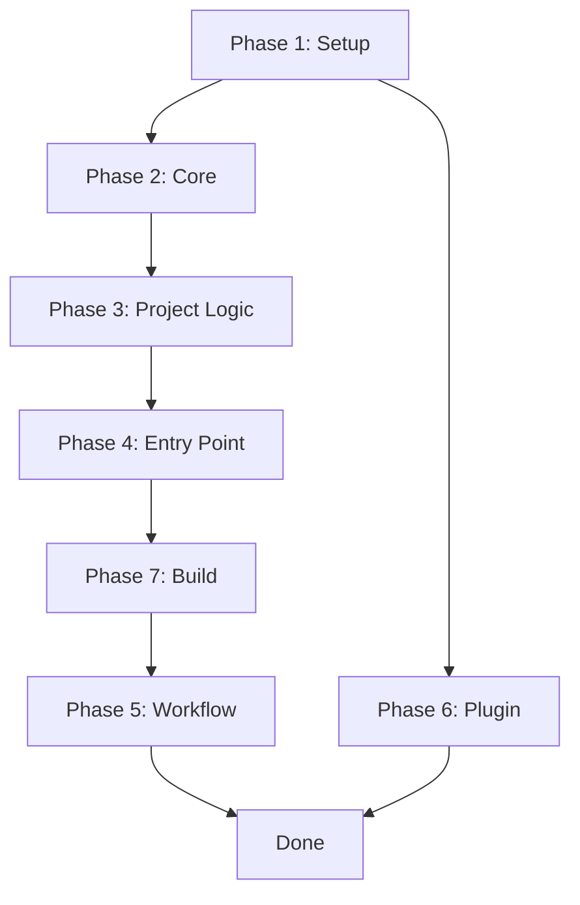

# Implementation Workflow: Project Automation GitHub Action

**Issue**: #43 - Add project-automation GitHub Action for automatic issue-to-project linking
**Author**: Claude Code
**Date**: 2026-01-16

## Overview

This document outlines the step-by-step implementation workflow for the `project-automation` GitHub Action.

## Phase 1: TypeScript Project Setup

### 1.1 Create Directory Structure

```bash
mkdir -p templates/github-actions/.github/actions/project-automation/src/graphql
mkdir -p templates/github-actions/.github/actions/project-automation/src/project
```

**Files to create:**
- [ ] `action.yml` - Action metadata
- [ ] `package.json` - Dependencies
- [ ] `tsconfig.json` - TypeScript config

### 1.2 Initialize Package

**package.json dependencies:**
- `@actions/core` - ^1.10.1
- `@actions/github` - ^6.0.0
- `@octokit/graphql` - ^7.0.0
- `js-yaml` - ^4.1.0

**Dev dependencies:**
- `typescript` - ^5.3.0
- `@vercel/ncc` - ^0.38.0
- `@types/node` - ^20.0.0
- `@types/js-yaml` - ^4.0.0

### 1.3 Create action.yml

```yaml
name: 'Project Automation'
description: 'Automatically add issues to GitHub Project and set field values'
inputs:
  token:
    description: 'GitHub token with project permissions'
    required: true
  config-path:
    description: 'Path to configuration file'
    required: false
    default: '.github/project-automation.yml'
outputs:
  item-id:
    description: 'The project item ID'
  project-id:
    description: 'The project ID'
  already-exists:
    description: 'Whether item already existed'
runs:
  using: 'node20'
  main: 'dist/index.js'
```

## Phase 2: Core Implementation

### 2.1 Type Definitions (`src/types.ts`)

- [ ] `ProjectConfig` interface
- [ ] `ProjectInfo` interface
- [ ] `FieldInfo` interface
- [ ] `FieldValue` types

### 2.2 Configuration Loader (`src/config.ts`)

- [ ] `loadConfig(path: string): ProjectConfig`
- [ ] `validateConfig(config: unknown): ProjectConfig`
- [ ] Error handling for invalid/missing config

### 2.3 GraphQL Queries (`src/graphql/queries.ts`)

- [ ] `GET_ORGANIZATION_PROJECT` query
- [ ] `GET_USER_PROJECT` query (for repository projects)
- [ ] `GET_PROJECT_ITEMS` query (for idempotency check)

### 2.4 GraphQL Mutations (`src/graphql/mutations.ts`)

- [ ] `ADD_PROJECT_ITEM` mutation
- [ ] `UPDATE_SINGLE_SELECT_FIELD` mutation
- [ ] `UPDATE_TEXT_FIELD` mutation
- [ ] `UPDATE_NUMBER_FIELD` mutation
- [ ] `UPDATE_ITERATION_FIELD` mutation

### 2.5 GraphQL Client (`src/graphql/client.ts`)

- [ ] `GraphQLClient` class
- [ ] `query<T>(query: string, variables: object): Promise<T>`
- [ ] `mutate<T>(mutation: string, variables: object): Promise<T>`
- [ ] Error handling and retry logic

## Phase 3: Project Logic

### 3.1 Project Finder (`src/project/finder.ts`)

- [ ] `findProject(config: ProjectConfig): Promise<ProjectInfo>`
- [ ] Handle organization vs repository projects
- [ ] Extract field information

### 3.2 Item Manager (`src/project/item.ts`)

- [ ] `isItemInProject(projectId: string, issueId: string): Promise<boolean>`
- [ ] `addItemToProject(projectId: string, issueId: string): Promise<string>`

### 3.3 Field Setter (`src/project/fields.ts`)

- [ ] `setFieldValue(params: SetFieldParams): Promise<void>`
- [ ] `mapFieldValue(field: FieldInfo, value: string): FieldValueInput`
- [ ] Handle different field types (SingleSelect, Text, Number, Iteration)

## Phase 4: Entry Point

### 4.1 Main Entry (`src/index.ts`)

```typescript
async function run(): Promise<void> {
  // 1. Get inputs
  // 2. Load and validate config
  // 3. Get issue context from event
  // 4. Find project and fields
  // 5. Check if already in project
  // 6. Add to project if needed
  // 7. Set field values
  // 8. Set outputs
}
```

**Implementation steps:**
- [ ] Parse action inputs
- [ ] Load configuration file
- [ ] Get issue ID from event context
- [ ] Initialize GraphQL client
- [ ] Execute project automation flow
- [ ] Handle errors and set outputs

## Phase 5: Workflow File

### 5.1 Create Workflow (`project-automation.yml`)

```yaml
name: Project Automation
on:
  issues:
    types: [opened, labeled, reopened]
jobs:
  add-to-project:
    runs-on: ubuntu-latest
    steps:
      - uses: actions/checkout@v4
      - uses: ./.github/actions/project-automation
        with:
          token: ${{ secrets.PROJECT_TOKEN }}
```

## Phase 6: Plugin Integration

### 6.1 Update plugin.sh

- [ ] Add `project-automation` to `AVAILABLE_ACTIONS` array
- [ ] Implement `setup_project_automation()` function
- [ ] Add interactive prompts for configuration
- [ ] Generate `.github/project-automation.yml`

### 6.2 Interactive Setup Functions

```bash
# Functions to implement:
- prompt_project_type()     # Organization or Repository
- prompt_project_owner()    # Owner name
- prompt_project_number()   # Project number
- fetch_project_fields()    # API call to get fields
- prompt_field_defaults()   # Select default values
- generate_config_file()    # Write YAML config
```

## Phase 7: Build and Bundle

### 7.1 Build Process

```bash
# Install dependencies
npm install

# Compile TypeScript
npx tsc

# Bundle with ncc
npx ncc build src/index.ts -o dist
```

### 7.2 Commit Artifacts

- [ ] `dist/index.js` - Bundled JavaScript
- [ ] `dist/package.json` - Module type declaration

## Task Checklist

### Phase 1: Setup
- [ ] Create directory structure
- [ ] Create `package.json`
- [ ] Create `tsconfig.json`
- [ ] Create `action.yml`
- [ ] Install dependencies

### Phase 2: Core
- [ ] Implement `types.ts`
- [ ] Implement `config.ts`
- [ ] Implement `graphql/queries.ts`
- [ ] Implement `graphql/mutations.ts`
- [ ] Implement `graphql/client.ts`

### Phase 3: Project Logic
- [ ] Implement `project/finder.ts`
- [ ] Implement `project/item.ts`
- [ ] Implement `project/fields.ts`

### Phase 4: Entry Point
- [ ] Implement `index.ts`

### Phase 5: Workflow
- [ ] Create `project-automation.yml`

### Phase 6: Plugin
- [ ] Update `plugin.sh` AVAILABLE_ACTIONS
- [ ] Implement interactive setup

### Phase 7: Build
- [ ] Build and bundle
- [ ] Commit dist files

## Dependencies



## Critical Path

1. **Setup** → Must complete first
2. **Core + Project Logic** → Can be done in parallel modules
3. **Entry Point** → Depends on all modules
4. **Build** → Depends on entry point
5. **Workflow + Plugin** → Can be done in parallel after build

## Rollback Plan

If issues are found:
1. Revert to previous commit
2. Fix issues in isolation
3. Re-run build process
4. Verify with local testing

## Testing Checkpoints

| Checkpoint | Test |
|------------|------|
| After Phase 1 | `npm install` succeeds |
| After Phase 4 | `npm run build` succeeds |
| After Phase 7 | `dist/index.js` exists and is valid |
| After Phase 5 | `actionlint` passes on workflow |
| After Phase 6 | `shellcheck` passes on plugin.sh |
